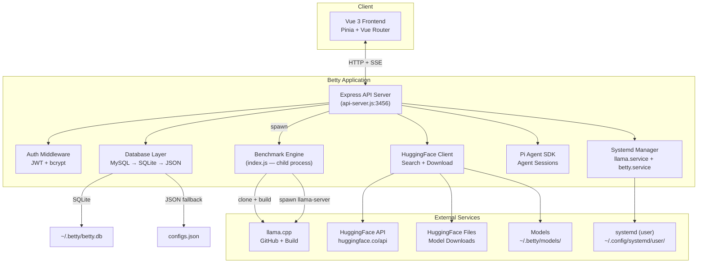
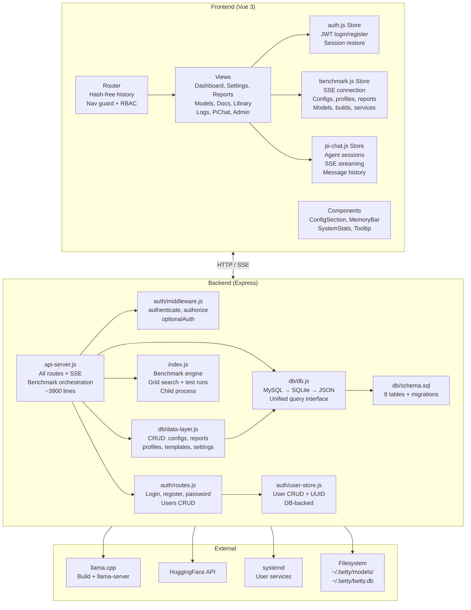
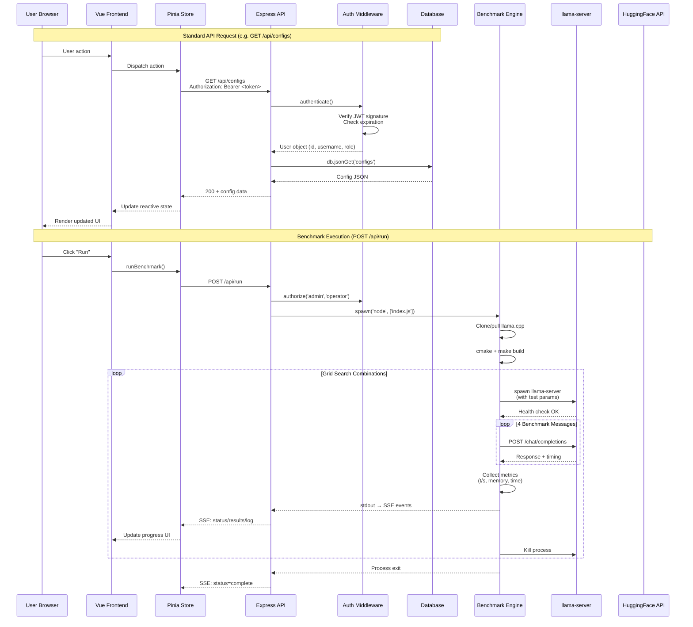
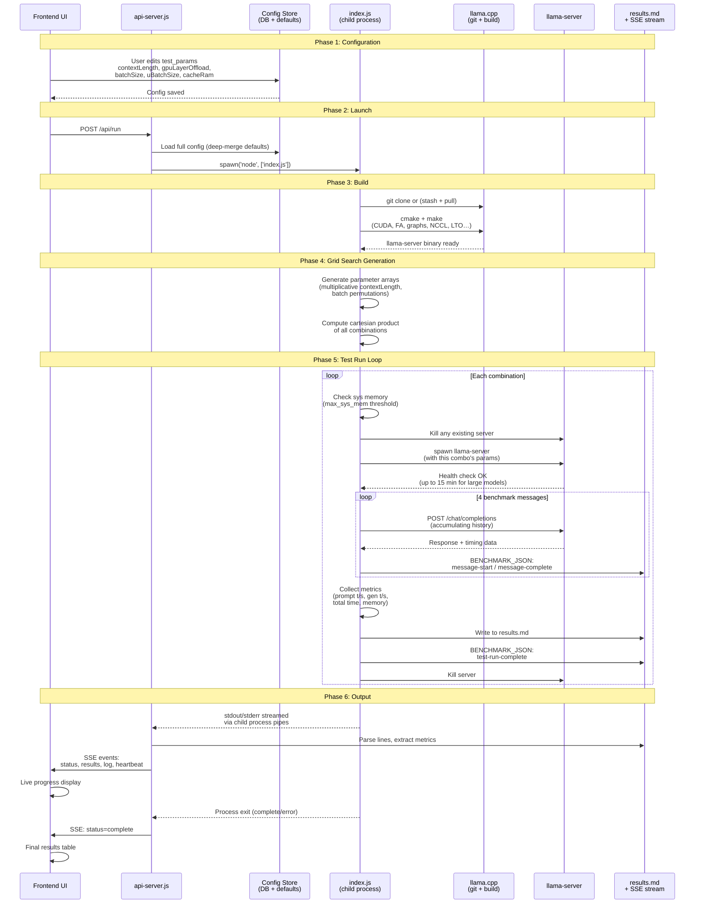
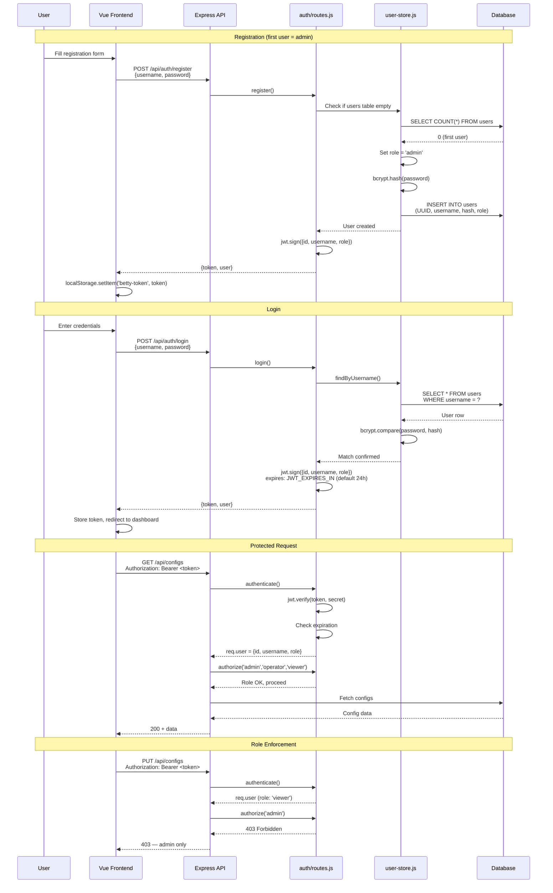

# Betty Architecture

> **Purpose:** Definitive reference for the Betty system architecture. Entry point for developers and engineers who need to understand how the entire platform works.

---

## Table of Contents

- [System Overview](#system-overview)
- [Component Architecture](#component-architecture)
- [Data Flow](#data-flow)
- [Database Schema](#database-schema)
- [Benchmark Lifecycle](#benchmark-lifecycle)
- [Authentication Flow](#authentication-flow)
- [Configuration System](#configuration-system)
- [Cross-References](#cross-references)

---

## System Overview

Betty is a self-hosted **llama.cpp benchmarking and management platform**. It builds llama.cpp from source, runs grid-search benchmarks against GGUF models, manages persistent inference services via systemd, integrates with HuggingFace for model management, and includes a Pi coding agent chat interface.

### Key Characteristics

| Aspect | Detail |
|--------|--------|
| **Frontend** | Vue 3 + Pinia stores + Vue Router (SPA) |
| **Backend** | Express.js (api-server.js, ~3900 lines) |
| **Database** | Three-tier fallback: MySQL → SQLite → JSON files |
| **Auth** | JWT tokens, bcrypt passwords, role-based (admin/operator/viewer) |
| **Benchmark Engine** | Separate child process (index.js), spawned on demand |
| **Streaming** | SSE for benchmark progress, logs, Pi agent events |
| **Services** | systemd user services (llama.service, betty.service) |
| **Port** | 3456 (configurable via `API_PORT`) |

---

## Component Architecture

### Component Responsibilities

#### Frontend

| Component | Responsibility |
|-----------|---------------|
| **Router** | Hash-free SPA routing, session restore on load, redirects unauthenticated users, role-based access control |
| **auth.js** | JWT storage (`localStorage: betty-token`), login/register/logout, role checks (`isAdmin`, `isOperator`, `isViewer`) |
| **benchmark.js** | Central store — SSE connection management, configs CRUD, profiles, reports, models, HF downloads, builds, service control, chat templates, mmproj files, git updates |
| **pi-chat.js** | Pi agent session lifecycle, SSE event mapping, message history, tool call tracking, session persistence |
| **Views** | Dashboard (benchmark UI), Settings (config editor), Reports, Models, Docs, Library, Logs, PiChat, Admin, Account, ChatTemplates, MmprojModels |

#### Backend

| Module | Responsibility |
|--------|---------------|
| **api-server.js** | Express server, all ~70 API routes, SSE streaming, benchmark spawn/stop, HF proxy, Pi agent proxy, systemd control |
| **auth/middleware.js** | `authenticate()` — JWT validation, `authorize(...roles)` — role check, `optionalAuth` — allow unauthenticated access |
| **auth/routes.js** | `/api/auth/*` — login, register, password change, users CRUD |
| **auth/user-store.js** | User CRUD operations, UUID generation, bcrypt hashing, DB-backed |
| **db/db.js** | Three-tier database abstraction — MySQL (connection pool) → SQLite (WAL mode) → JSON files, unified `query`/`get`/`all`/`run` interface |
| **db/data-layer.js** | High-level CRUD for configs, reports, profiles, service profiles, chat templates, settings |
| **db/schema.sql** | 8 tables, auto-applied on init, ENUM→TEXT migration for SQLite compatibility |
| **index.js** | Benchmark engine — llama.cpp clone/build, grid search generation, test run loop, llama-server lifecycle, metrics collection, results.md output |

---

## Data Flow

Request/response lifecycle from frontend to backend and external services:

### Streaming Architecture

Betty uses **Server-Sent Events (SSE)** for real-time updates:

| Endpoint | Events |
|----------|--------|
| `GET /api/stream` | `status`, `results`, `log`, `message-start`, `message-complete`, `test-run-complete`, `heartbeat` |
| `GET /api/pi/session/:id/stream` | `pi-text`, `pi-thinking`, `pi-tool-start`, `pi-tool-update`, `pi-tool-end`, `pi-agent-start`, `pi-agent-end` |
| `POST /api/build` | Build progress (cmake/make output) |
| `POST /api/hf/download` | Download progress (bytes, percentage) |

SSE connections authenticate via `?token=` query parameter (headers not supported in EventSource API).

---

## Database Schema

```mermaid
erDiagram
    users {
        varchar36 id PK
        varchar255 username UK
        varchar255 password_hash
        varchar20 role "admin | operator | viewer"
        datetime created_at
        datetime updated_at
    }

    configs {
        int id PK "always 1"
        text value "full JSON config"
        datetime updated_at
    }

    reports {
        varchar255 name PK
        datetime saved_at
        text md_content
        text live_results "JSON snapshot"
        text configs_per_run "JSON array"
        text configs "JSON snapshot"
        datetime created_at
        datetime updated_at
    }

    profiles {
        varchar255 name PK
        text data "JSON config subset"
        datetime created_at
        datetime updated_at
    }

    service_profiles {
        varchar255 name PK
        text data "JSON service config"
        datetime created_at
        datetime updated_at
    }

    chat_templates {
        varchar255 filename PK
        text content
        int size
        datetime modified_at
        datetime created_at
        datetime updated_at
    }

    settings {
        varchar255 key PK "e.g. jwt-secret"
        text value
        datetime updated_at
    }

    migrations {
        int version PK
        datetime applied_at
    }
```

### Table Descriptions

| Table | Purpose | Access Pattern |
|-------|---------|---------------|
| **users** | User accounts with roles and bcrypt-hashed passwords | CRUD via auth routes, first user auto-promoted to admin |
| **configs** | Single-row storage for the full benchmark configuration JSON | Read frequently, deep-merged with defaults on load |
| **reports** | Saved benchmark results with markdown content and config snapshots | Created from current results via `/api/save-report` |
| **profiles** | Named config subsets for quick switching (e.g., "fast test", "full grid") | Load into active config via `/api/profile/:name/load` |
| **service_profiles** | Named llama-server configurations for systemd deployments | Apply to running service via `/api/service-profile/:name/load` |
| **chat_templates** | Chat template files for models | Download via wget, stored with content in DB |
| **settings** | Key-value store for application settings (JWT secret, etc.) | Read/write via data-layer |
| **migrations** | Schema version tracking | Auto-managed by db.js |

### Three-Tier Database Strategy

The database layer (`db.js`) implements a fallback chain:

1. **MySQL** — Connection pool via `mysql2/promise`, configured via `DB_HOST`, `DB_PORT`, `DB_USER`, `DB_PASSWORD`, `DB_NAME`, `DB_POOL_SIZE` env vars
2. **SQLite** — `better-sqlite3`, WAL mode, foreign keys enabled, path `~/.betty/betty.db`
3. **JSON files** — `json-store.js`, file-based key-value storage as last resort

All tiers share a unified interface: `db.init()`, `db.query()`, `db.get()`, `db.all()`, `db.run()`, `db.jsonGet()`, `db.jsonAll()`, `db.jsonRun()`.

---

## Benchmark Lifecycle

End-to-end flow from configuration to results:

### Grid Search Details

The benchmark engine generates test combinations from these configurable parameters:

| Parameter | Generation Strategy |
|-----------|-------------------|
| `contextLength` | Multiplicative range (e.g., 512, 1024, 2048, 4096, 8192) |
| `gpuLayerOffload` | Linear range or specific values |
| `batchSize` | Linear range |
| `uBatchSize` | Linear range |
| `cacheRam` | Linear range |

**Constraint:** Batch permutations ensure `batchSize >= uBatchSize` for all combinations. The cartesian product of all valid combinations determines total test runs.

### Metrics Collected Per Test Run

- Prompt tokens/second
- Generation tokens/second
- Total response time
- System memory usage
- Per-message timing breakdown

---

## Authentication Flow

### Auth Details

| Aspect | Implementation |
|--------|---------------|
| **Token format** | JWT (HS256), stored in `localStorage: betty-token` |
| **Token delivery** | `Authorization: Bearer <token>` header, or `?token=` query param (for SSE/EventSource) |
| **Secret storage** | DB `settings` table (key `jwt-secret`) → file `~/.betty/jwt-secret` → auto-generate 96-char hex |
| **Password hashing** | bcrypt |
| **Expiration** | `JWT_EXPIRES_IN` env var, default `24h` |
| **Roles** | `admin` (full access), `operator` (run benchmarks/save reports), `viewer` (read-only) |
| **Default admin** | `admin`/`admin` or `ADMIN_PASSWORD` env var, created on first startup |
| **Public routes** | `/auth/login`, `/auth/register`, `/health`, `/docs/*`, `/library/*`, `/pi/skills` |

---

## Configuration System

### Storage and Loading

Configuration is stored in the `configs` database table (single row, `id=1`) with JSON file fallback at `configs.json`. On every load, the stored config is **deep-merged** with `DEFAULT_CONFIGS` so new keys are auto-added without overwriting user values.

### Configuration Sections

| Section | Purpose |
|---------|---------|
| `export_configs` | CUDA environment variables (unified memory, launch queues, P2P, LLAMA_ARG_FIT) |
| `test_params` | Grid search parameters (contextLength, gpuLayerOffload, batchSize, uBatchSize, cacheRam) |
| `build_make_params` | CMake build flags (CUDA, flash attention, graphs, NCCL, LTO, ccache, FP16) |
| `cuda_configs` | CUDA version, NVCC path |
| `model_configs` | Sampling parameters (temperature, top_p, min_p, top_k) |
| `server_params` | llama-server flags (cont-batching, flash-attn, reasoning, rope-scaling, parallel, gpu-layers) |
| `gpu_selection` | Multi-GPU selection and device indices |
| `split_params` | Layer/tensor split configuration for multi-GPU |
| `spec_params` | Speculative decoding configuration |
| `benchmark_messages` | Array of 4 messages sent sequentially per test run |
| `max_sys_mem` | System memory threshold percentage |
| `llama_port` / `llama_host` | llama-server address |
| `model` | Model filename (resolved from `~/.betty/models/`) |

### Profiles

Config profiles (stored in the `profiles` table) allow saving and loading named subsets of configuration. Loading a profile merges its data into the active config without replacing unrelated keys. Service profiles (`service_profiles` table) serve the same purpose for systemd service configurations.

---

## Cross-References

### QA Guides
- qa/getting-started]] — Installation and first run
- qa/benchmark-workflow]] — Running benchmarks step by step
- qa/model-management]] — Managing GGUF models
- qa/service-management]] — systemd service control
- qa/profile-workflow]] — Config and service profiles
- qa/report-workflow]] — Saving and viewing benchmark reports
- qa/api-usage]] — API reference and examples

### Concepts
- concepts/data-flow]] — Detailed data flow analysis
- concepts/config-schema]] — Full configuration schema reference
- concepts/grid-search]] — Grid search parameter generation
- concepts/auth-flow]] — Authentication and authorization deep dive

### Related Documentation
- USER-MANUAL]] — User-facing guide
- configuration-reference]] — Configuration reference
- config]] — Configuration overview
- api-reference]] — API documentation
- models]] — Model documentation
- dashboard]] — Dashboard details
- reports]] — Reports documentation
- troubleshooting]] — Common issues and fixes
- CHANGELOG]] — Version history
