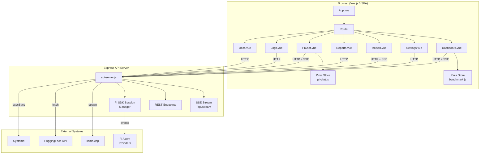
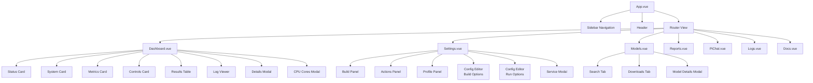
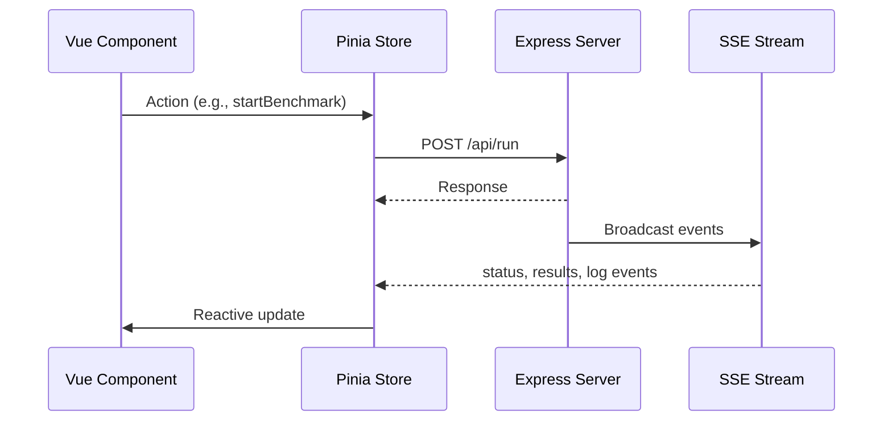
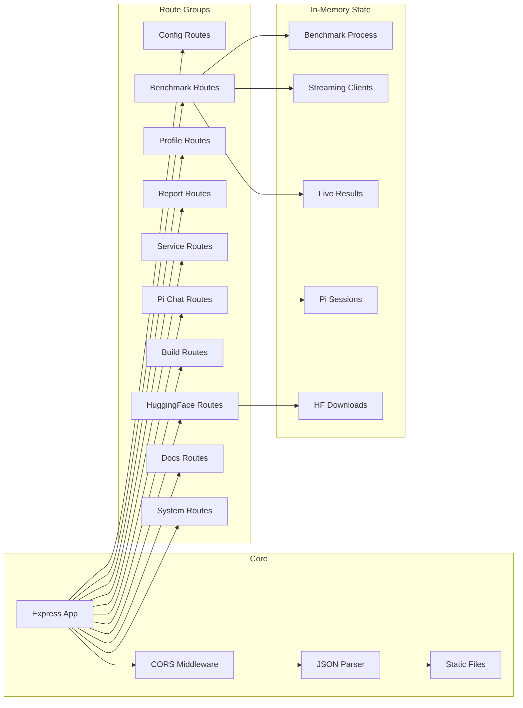
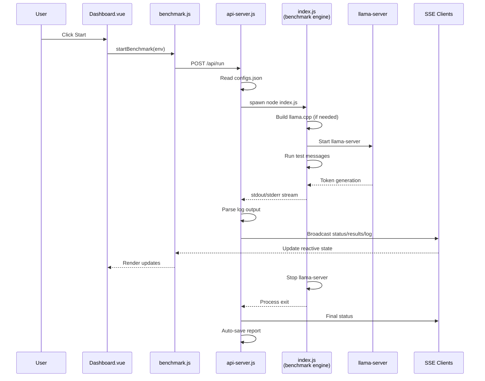
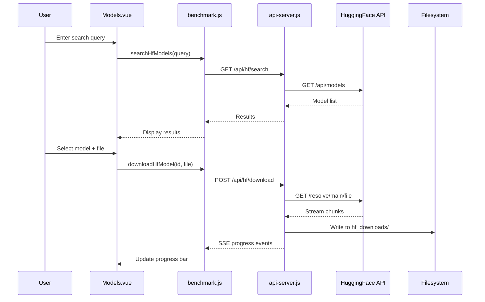
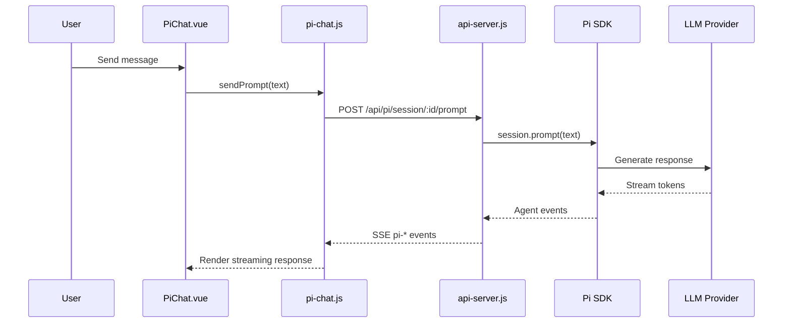
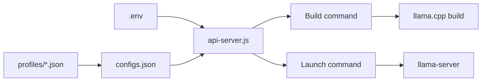

# Architecture Deep-Dive

Comprehensive overview of Betty's system design, component relationships, and data flows.

See also: [[index]] • [[api-reference]] • [[USER-MANUAL]]

## High-Level Architecture



## Frontend Architecture

### Component Hierarchy



### State Management (Pinia)

Two stores manage application state:

| Store | File | Responsibility |
|-------|------|----------------|
| `benchmark` | `stores/benchmark.js` | Benchmark state, configs, reports, SSE events, system status, HuggingFace downloads, build state, profiles |
| `piChat` | `stores/pi-chat.js` | Pi SDK session, messages, streaming state, tool calls, slash commands |

### State Flow



## Backend Architecture

### Server Modules



### SSE Event System

The server uses Server-Sent Events for real-time communication:

| Event Type | Source | Payload | Purpose |
|------------|--------|---------|---------|
| `status` | Benchmark | `{ status, testRun, liveResults }` | Benchmark state changes |
| `results` | Benchmark | `{ liveResults }` | New result data |
| `log` | Benchmark | `{ type, text, status, testRun, liveResults }` | Log output |
| `message-start` | Benchmark | `{ testRunId, messageIndex, prompt }` | Message begins |
| `message-complete` | Benchmark | `{ testRunId, messageIndex, prompt, response, ... }` | Message ends |
| `test-run-complete` | Benchmark | `{ testRunId, messages }` | Test run ends |
| `heartbeat` | Server | `{ ts }` | Keep-alive (15s) |
| `build-log` | Build | `PROGRESS:n` or log line | Build progress |
| `hf-download` | HuggingFace | `PROGRESS:n`, `STATUS:`, `FILE:` | Download progress |
| `pi-*` | Pi Chat | Various | Agent events |

## Data Flow: Benchmark Execution



## Data Flow: Model Download



## Data Flow: Pi Chat



## File System Layout

```
betty/
├── src/backend/
│   ├── api-server.js          # Express API server (entry point)
│   ├── configs.json           # Benchmark configuration
│   ├── results.md             # Raw benchmark output
│   ├── profiles/              # Saved config profiles (stored in ~/.betty/profiles/)
│   ├── reports/               # Saved benchmark reports
│   ├── models/                # Downloaded GGUF models (~/.betty/models)
│   ├── llama_cache/           # Llama.cpp cache
│   ├── llama.cpp/             # Cloned llama.cpp repository
│   └── frontend/
│       ├── src/
│       │   ├── App.vue        # Root component
│       │   ├── main.js        # Vue entry point
│       │   ├── router/        # Vue Router config
│       │   ├── stores/        # Pinia stores
│       │   ├── views/         # Page components
│       │   ├── components/    # Reusable components
│       │   └── styles/        # CSS variables
│       └── dist/              # Built frontend (served by Express)
├── docs/                      # Documentation
├── ~/.betty/library/          # Research library
├── scripts/                   # Install scripts
├── package.json
└── install.sh
```

## Configuration System

Configuration flows through three layers:

1. **Environment variables** — Server-level settings (port, host, CORS)
2. **configs.json** — Benchmark settings managed via the Config page
3. **Profiles** — Named snapshots of configs.json for quick switching



## Security Considerations

- **CORS**: Configurable via `CORS_ORIGIN`. Wildcard `*` disables credentials; explicit origins enable them
- **Rate limiting**: Uses `express-rate-limit` middleware
- **Input sanitization**: Profile and report names are sanitized to alphanumeric + underscore + hyphen
- **No authentication**: The server is designed for local/trusted network use. Deploy behind a reverse proxy with auth for remote access

## Deployment Options

| Mode | Description |
|------|-------------|
| **Local** | `npm start` — Development and personal use |
| **Remote** | `API_HOST=0.0.0.0 npm start` — Access from network |
| **Systemd** | Install as `llama.service` for persistent llama-server instances |
| **Reverse proxy** | Place behind Nginx/Caddy with TLS and authentication |
