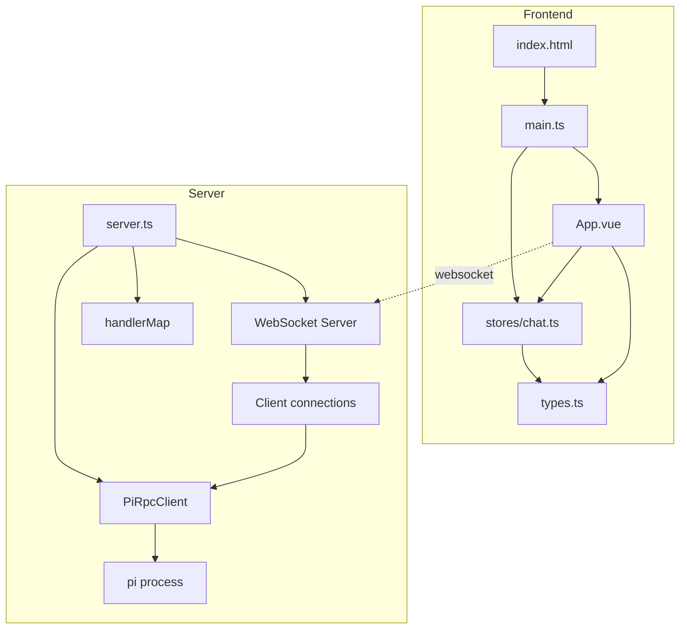
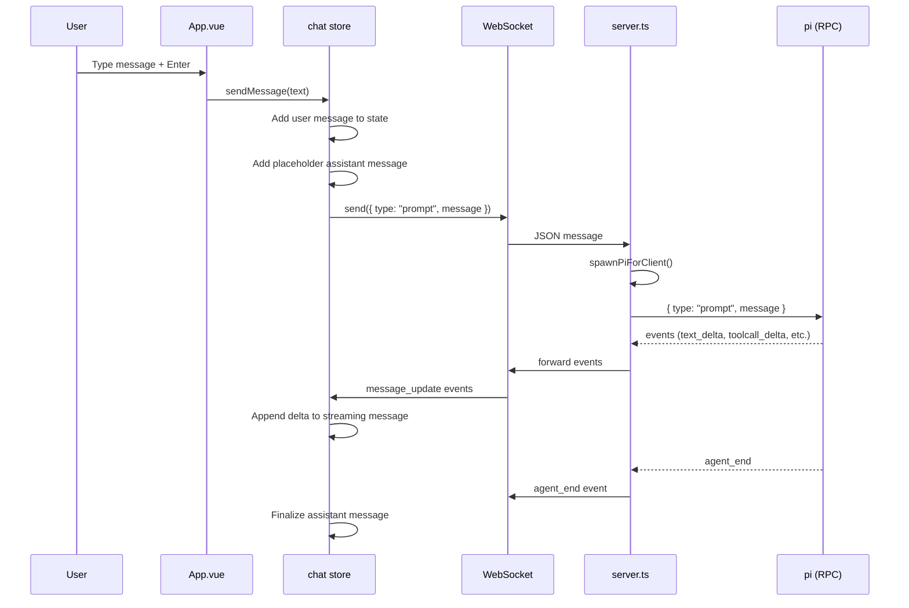
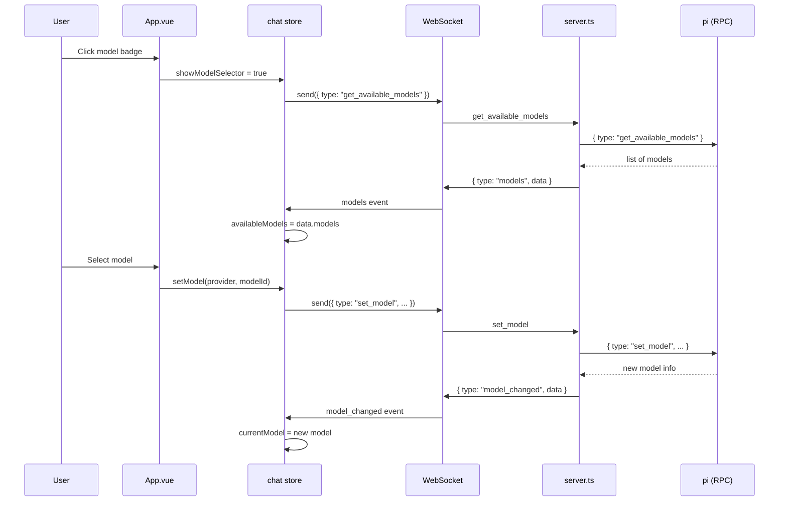

# Architecture Deep Dive

## Overview

**Betty** is a web-based AI coding assistant built as a thin UI layer over [pi](https://pi.dev), the minimal terminal coding harness. It translates pi's RPC mode into a real-time WebSocket chat interface.

```
┌─────────────────────┐       WebSocket (JSON)       ┌──────────────────────┐
│   Vue 3 Frontend     │ ◄──────────────────────────► │  Node.js Server      │
│   (Vite dev / build) │                              │  (Express + WebSocket)│
│                      │                              │                      │
│  ┌────────────────┐  │                              │  ┌────────────────┐  │
│  │ App.vue        │  │                              │  │ handlerMap     │  │
│  │  - Chat UI     │  │    message / abort / model   │  │  - prompt      │  │
│  │  - Modals      │  │◄────────────────────────────►│  │  - abort       │  │
│  │  - Settings    │  │    message_update / state    │  │  - set_model   │  │
│  └────────────────┘  │                              │  │  - steer       │  │
│  ┌────────────────┐  │                              │  │  - bash        │  │
│  │ Pinia Store    │  │                              │  │  ...           │  │
│  │  - chat        │  │    agent_start / agent_end   │  └──────┬─────────┘
│  │  - WebSocket   │  │◄────────────────────────────►│         │
│  └────────────────┘  │                              │    stdin/stdout (JSONL)
└─────────────────────┘                              │         │
                                                     │    ┌────▼─────┐
                                                     │    │  pi RPC  │
                                                     │    │ --mode   │
                                                     │    │  rpc     │
                                                     │    └──────────┘
                                                     └──────────┘
```

## Component Relationships



## Data Flow

### Message Sending (User → AI)



### Model Switching



## Key Design Decisions

### One pi Process Per WebSocket Client

Each connected WebSocket client gets its own `PiRpcClient` instance, which spawns a separate `pi --mode rpc` child process. This provides:

- **Session isolation**: Each client has independent session state
- **Model independence**: Each client can use a different model
- **Failure containment**: One client's pi process crashing doesn't affect others

### Streaming via Event Forwarding

The server acts as a transparent proxy for pi's JSONL event stream. Events flow:

```
pi stdout (JSONL) → PiRpcClient.handleOutput() → PiRpcClient.onEvent() → WebSocket.send() → Frontend
```

The `PiRpcClient` parses JSONL output, routes `response` type messages to pending promises (for one-shot commands), and forwards all other event types to the WebSocket client.

### Pinia Store as Single Source of Truth

The Pinia store (`chat.ts`) is the sole state manager. It:

- Maintains the WebSocket connection lifecycle (including auto-reconnect)
- Normalizes raw WebSocket events into structured state updates
- Provides actions (methods) that wrap WebSocket commands
- Exposes computed properties for derived state

### No Server-Side State Persistence

The server is stateless between reconnections. Session state is managed entirely by pi's own session persistence. The server's role is purely:

1. Accept WebSocket connections
2. Spawn/manage pi processes
3. Forward messages bidirectionally

## Module Map

| File | Role | Dependencies |
|------|------|-------------|
| `server.ts` | Backend: WebSocket server + RPC client wrapper + HTTPS | `ws`, `express`, `node:child_process`, `node:http`, `selfsigned` |
| `src/main.ts` | Vue app bootstrap | `vue`, `pinia` |
| `src/App.vue` | Main UI component (chat, modals, settings) | `vue`, `@/stores/chat`, `marked` |
| `src/stores/chat.ts` | Pinia store: WebSocket client + state | `pinia`, `vue`, `@/types` |
| `src/types.ts` | TypeScript types for WS protocol | — |
| `vite.config.ts` | Vite build config | `@vitejs/plugin-vue` |

## Configuration Layers

```
Environment Variables (Server)    Environment Variables (Frontend)
┌─────────────────────────┐      ┌─────────────────────────┐
│ WS_PORT (3001)          │      │ VITE_WS_URL (ws://...)  │
│ HTTPS (false)           │      │ VITE_WSS_URL            │
│ HTTPS_CERT_PATH         │      │ VITE_WS_PORT (3001)     │
│ HTTPS_KEY_PATH          │      └─────────────────────────┘
│ PI_PROVIDER             │
│ PI_MODEL                │      Build-time (vite.config.ts)
│ PI_NO_SESSION           │      ┌─────────────────────────┐
│ PI_SESSION_DIR          │      │ Vite proxy → :3001      │
│ PI_THINKING_LEVEL       │      │ @ alias → ./src/        │
│ PI_VERBOSE              │      └─────────────────────────┘
│ ANTHROPIC_API_KEY       │
│ OPENAI_API_KEY          │
└─────────────────────────┘
```

## Feature Architecture

```
┌─────────────────────────────────────────────────────────────┐
│                        Frontend (Vue 3)                      │
│  ┌───────────┐ ┌──────────┐ ┌──────────┐ ┌──────────────┐  │
│  │ Chat UI   │ │ Modals   │ │ Sidebar  │ │ Settings     │  │
│  │ Streaming │ │ Model    │ │ Sessions │ │ Thinking     │  │
│  │ Markdown  │ │ Settings │ │          │ │ Compaction   │  │
│  │ Tool Cards│ │ Confirm  │ │          │ │ Retry        │  │
│  └───────────┘ └──────────┘ └──────────┘ └──────────────┘  │
│                          │                                   │
│  ┌───────────────────────┴──────────────────────────────┐   │
│  │              Pinia Store (chat.ts)                    │   │
│  │  WebSocket │ State │ Events │ Actions │ Computed     │   │
│  └──────────────────────────────────────────────────────┘   │
└─────────────────────────────────────────────────────────────┘
                              │ WebSocket (JSON)
┌─────────────────────────────────────────────────────────────┐
│                       Server (Node.js)                       │
│  ┌────────────────────────────────────────────────────────┐  │
│  │  WebSocket Server (ws)                                 │  │
│  │  ┌────────────────┐  ┌──────────────────────────────┐  │  │
│  │  │  handlerMap    │  │  PiRpcClient (per client)    │  │  │
│  │  │  - prompt      │  │  - spawn pi --mode rpc       │  │  │
│  │  │  - abort       │  │  - JSONL stdin/stdout        │  │  │
│  │  │  - set_model   │  │  - event forwarding          │  │  │
│  │  │  - steer       │  │  - RPC command handling      │  │  │
│  │  │  - follow_up   │  │                              │  │  │
│  │  │  - compact     │  │  HTTPS (self-signed/custom)  │  │  │
│  │  │  - fork/clone  │  │  Static file serving         │  │  │
│  │  │  - bash        │  │  Health check (/health)      │  │  │
│  │  │  - auto_*      │  │                              │  │  │
│  │  └────────────────┘  └──────────────────────────────┘  │  │
│  └────────────────────────────────────────────────────────┘  │
│                              │ JSONL (stdin/stdout)          │
│                    ┌─────────▼─────────┐                     │
│                    │  pi --mode rpc    │                     │
│                    │  (child process)  │                     │
│                    └───────────────────┘                     │
└─────────────────────────────────────────────────────────────┘
```

## Tags

- **category**: architecture, system-design
- **component**: server, frontend, websocket, rpc
- **pattern**: event-forwarding, one-process-per-client, pinia-store
- **audience**: developers, engineers
