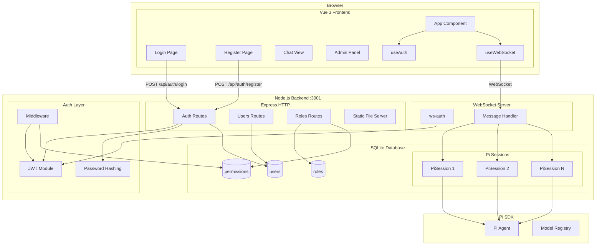
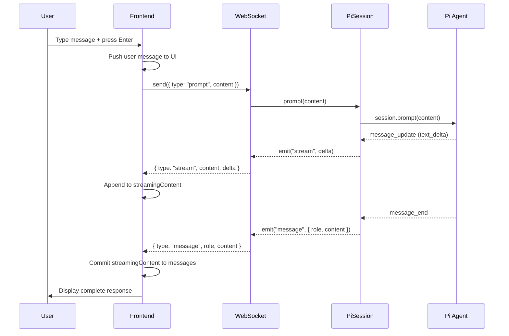

# Architecture Deep-Dive

**Tags:** `architecture`, `system-design`, `data-flow`, `components`, `overview`, `full-stack`

## Overview

Betty is a full-stack web application that provides a browser-based chat interface for the Pi coding agent. It consists of a Node.js/Express backend with WebSocket support and a Vue 3 frontend built with Vite.

## System Architecture



## Component Breakdown

### Frontend Layer

| Component | Framework | Responsibility |
|---|---|---|
| App.vue | Vue 3 | Root component, routing, chat UI |
| useAuth.js | Vue composable | Authentication state, token management |
| useWebSocket.js | Vue composable | WebSocket connection, event handling |
| Login.vue | Vue 3 SFC | Login form |
| Register.vue | Vue 3 SFC | Registration form |
| Admin.vue | Vue 3 SFC | Admin panel container |
| UserList.vue | Vue 3 SFC | User CRUD table |
| RoleManager.vue | Vue 3 SFC | Role/permission CRUD |
| main.css | CSS | Global styles, dark theme |

### Backend Layer

| Module | Technology | Responsibility |
|---|---|---|
| server.js | Express + ws | HTTP server, WebSocket server, session management |
| pi-session.js | Pi SDK | Pi agent lifecycle, event forwarding |
| auth/jwt.js | jsonwebtoken | Token generation, validation, session storage |
| auth/middleware.js | Express middleware | Auth enforcement, RBAC |
| auth/password.js | bcryptjs | Password hashing |
| auth/ws-auth.js | — | WebSocket token extraction |
| routes/auth.js | Express Router | Login, register, logout |
| routes/users.js | Express Router | User CRUD |
| routes/roles.js | Express Router | Role and permission CRUD |
| db/database.js | better-sqlite3 | Schema, connection |
| db/repositories.js | — | Data access layer |
| db/seeds.js | — | Initial data population |

### Data Layer

| Store | Technology | Purpose |
|---|---|---|
| SQLite | better-sqlite3 | Persistent data (users, roles, sessions) |
| In-memory | Pi SDK | Agent sessions (not persisted) |
| localStorage | Browser | JWT token persistence |

## Data Flow: Chat Message



## Data Flow: Authentication

```mermaid
sequenceDiagram
    participant U as User
    participant F as Frontend
    participant API as Express API
    participant JWT as JWT Module
    participant DB as SQLite

    U->>F: Enter credentials + submit
    F->>API: POST /api/auth/login
    API->>DB: SELECT users WHERE username
    DB-->>API: user record
    API->>API: bcrypt.compare(password, hash)
    API->>JWT: createSession(user)
    JWT->>JWT: jwt.sign(payload)
    JWT->>JWT: sha256(token)
    JWT->>DB: INSERT sessions (token_hash)
    DB-->>JWT: ok
    JWT-->>API: raw token
    API-->>F: { token, user }
    F->>F: localStorage.setItem("betty_token", token)
    F->>F: Navigate to #chat
    F->>F: new WebSocket("/ws?token=...")
```



## Security Model

### Authentication

- JWT tokens signed with HS256
- Token hashes stored in database (never raw tokens)
- 24-hour token expiration
- Session validation on every request

### Authorization

- Role-based access control (RBAC)
- Resource-action permission model
- Super admin bypasses all permission checks
- System roles are immutable
- Self-deletion prevention

### WebSocket Security

- Token passed via query parameter or Authorization header
- Same JWT validation as HTTP
- Per-connection rate limiting (60 msg/60s)
- Message size limit (1MB)

## Deployment Model

### Development

```
┌─────────────────┐     ┌──────────────────┐
│  Vite Dev Server │     │  Express Server   │
│  :5173           │────▶│  :3001            │
│  (proxy /api,    │     │  (HTTP + WS)      │
│   /ws)           │     │                  │
└─────────────────┘     └──────────────────┘
```

### Production

```
┌──────────────────────────────────┐
│  Express Server :3001            │
│  ┌────────────────────────────┐  │
│  │  Static files (frontend)   │  │
│  │  /api/* (REST endpoints)   │  │
│  │  /ws (WebSocket)           │  │
│  │  /* (SPA fallback)         │  │
│  └────────────────────────────┘  │
└──────────────────────────────────┘
```

## Configuration

| Setting | Development | Production |
|---|---|---|
| Frontend URL | `http://localhost:5173` | Same origin as backend |
| Backend URL | `http://localhost:3001` | Configurable via `PORT` |
| WS URL | `ws://localhost:3001/ws` | Same origin |
| JWT Secret | Random per restart | Set via `JWT_SECRET` env var |

## Related

- [[Server]] — Backend entry point
- [[PiSession]] — Pi agent wrapper
- [[Database]] — Schema and connection
- [[Auth Middleware]] — RBAC enforcement
- [[Getting Started]] — Setup instructions
