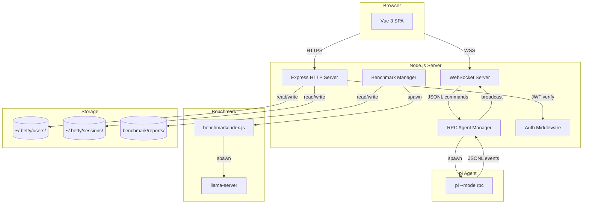
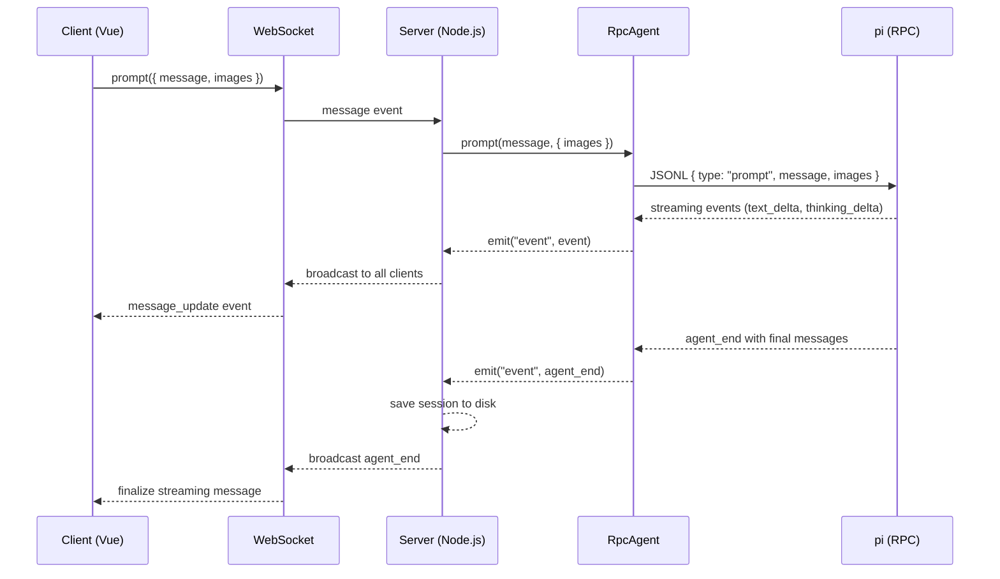
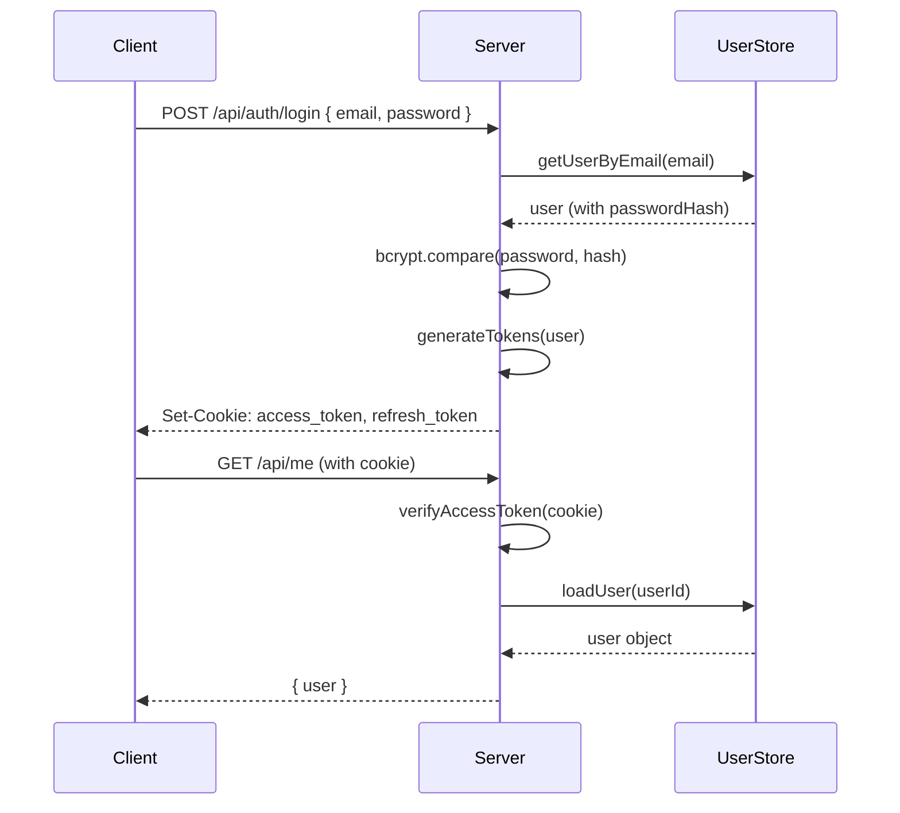
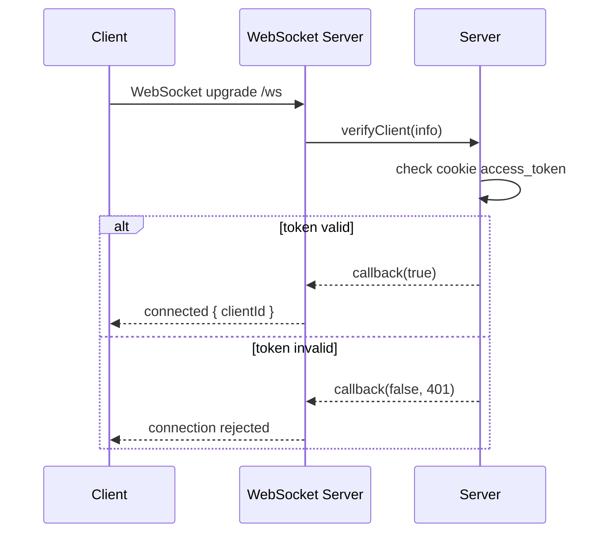

# Architecture

## Tags

`architecture`, `system-design`, `data-flow`, `express`, `vue`, `websocket`, `rpc`, `benchmark`, `authentication`, `session-management`

---

## Overview

Betty is a web-based chat interface for the [pi coding agent](https://pi.dev). It consists of:

1. **Backend** — Express.js HTTP server + WebSocket server + RPC agent manager + benchmark runner
2. **Frontend** — Vue 3 single-page application with Vite build
3. **Benchmark** — Automated llama.cpp performance testing tool



## Data Flow

### Chat Request Flow



### Authentication Flow



### WebSocket Authentication



## Component Relationships

### Backend Modules

| Module | Depends On | Used By |
|--------|-----------|---------|
| `server.js` | All backend modules | Entry point |
| `auth-middleware.js` | `auth-utils.js`, `user-store.js` | `server.js`, route handlers |
| `auth-utils.js` | bcrypt, jsonwebtoken | `auth-middleware.js`, `routes/auth.js`, `routes/admin.js` |
| `session-store.js` | node:fs | `server.js` |
| `user-store.js` | node:fs | `auth-middleware.js`, `routes/auth.js`, `routes/admin.js` |
| `routes/auth.js` | `user-store.js`, `auth-utils.js` | `server.js` |
| `routes/admin.js` | `user-store.js`, `auth-middleware.js`, `auth-utils.js` | `server.js` |

### Frontend Modules

| Module | Depends On | Used By |
|--------|-----------|---------|
| `App.vue` | All composables, stores, components | Entry point (main.js) |
| `useWebSocket.js` | `auth-store.js` | `App.vue` |
| `useStreaming.js` | — | `App.vue` |
| `useAutoScroll.js` | — | `ChatView.vue` |
| `useVirtualList.js` | — | `ChatView.vue` |
| `useMessageStore.js` | — | `App.vue`, `ChatView.vue` |
| `useToast.js` | — | `App.vue`, `ToastContainer.vue` |
| `auth-store.js` | — | `App.vue`, `LoginPage.vue`, `RegisterPage.vue`, `useWebSocket.js` |
| `utils.js` | marked, highlight.js | `ChatMessage.vue` |

## Session Persistence

Sessions are stored as individual JSON files in `~/.betty/sessions/`:

```
~/.betty/sessions/
├── <uuid-1>.json
├── <uuid-2>.json
└── ...
```

Each session file contains:

```json
{
  "id": "uuid",
  "name": "Session 2026-06-14T12:00:00.000Z",
  "createdAt": 1718380800000,
  "updatedAt": 1718380800000,
  "messageCount": 42,
  "messages": [...]
}
```

Session saves are debounced — when multiple messages arrive, the save is scheduled at 2-second intervals to minimize disk I/O.

## Security Architecture

- **Passwords**: bcrypt with cost factor 12
- **Sessions**: httpOnly cookies (immune to XSS token theft)
- **Access tokens**: 24-hour expiration with JWT signing
- **Refresh tokens**: 7-day expiration, separate signing secret
- **Rate limiting**: 10 login attempts/min, 3 registration attempts/min (in-memory, pruned every 60s)
- **Path traversal**: All file paths validated to stay within HOME directory
- **Timing attacks**: Dummy bcrypt comparison when user not found during login
- **Privilege escalation**: Whitelist-based field updates in `updateUser()` and `updateSession()`

## Configuration

| Environment Variable | Default | Description |
|---------------------|---------|-------------|
| `PORT` | `3000` | HTTP server port |
| `HOST` | `0.0.0.0` | Bind address |
| `WORKSPACE` | `$HOME` | Default agent working directory |
| `AUTH_ENABLED` | `true` | Enable/disable authentication |
| `JWT_SECRET` | *(required)* | Access token signing secret |
| `JWT_REFRESH_SECRET` | *(required)* | Refresh token signing secret |
| `JWT_EXPIRES_IN` | `24h` | Access token lifetime |
| `JWT_REFRESH_EXPIRES_IN` | `7d` | Refresh token lifetime |
| `SESSIONS_ENABLED` | `true` | Enable/disable session persistence to disk |
