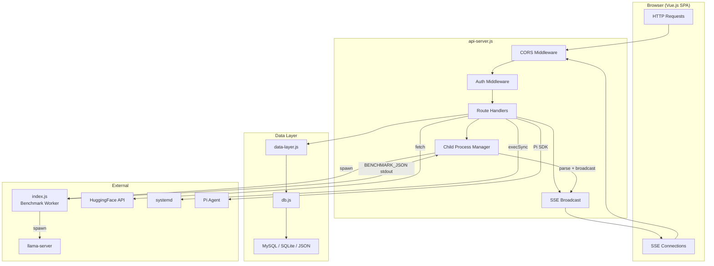

# Express API Server

Central HTTP server for Betty. Handles all REST endpoints, SSE streaming, benchmark execution, systemd management, HuggingFace integration, and Pi agent sessions.

**Source:** `src/backend/api-server.js`

See also: [[api-reference]] • [[backend/benchmark-runner]] • [[backend/sse-streaming]] • [[backend/authentication]]

## Overview

The API server listens on port `3456` (configurable via `API_PORT` env). It serves a Vue.js SPA from `dist/`, routes all `/api/*` requests through Express middleware, and manages child processes for benchmarking and builds.



## Configuration

| Environment Variable | Default | Purpose |
|---|---|---|
| `API_PORT` | `3456` | HTTP listen port |
| `API_HOST` | `0.0.0.0` | Bind address |
| `CORS_ORIGIN` | `*` | CORS allowed origin(s) |
| `BETTY_AUTH_ENABLED` | `true` | Enable JWT auth on API routes |
| `JWT_EXPIRES_IN` | `24h` | JWT token lifetime |

Key directories:

| Constant | Path | Purpose |
|---|---|---|
| `BETTY_DIR` | `~/.betty` | Data root |
| `CONFIGS_FILE` | `~/.betty/configs.json` | Configuration storage |
| `REPORTS_DIR` | `~/.betty/reports` | Benchmark reports |
| `PROFILES_DIR` | `~/.betty/profiles` | Config profiles |
| `MODELS_DIR` | `~/.betty/models` | Model files |
| `CHAT_TEMPLATES_DIR` | `~/.betty/chat_templates` | Chat templates |

## Middleware Stack

### CORS

Configured via `CORS_ORIGIN`. When set to `*`, credentials are disabled. When set to explicit origin(s), credentials are enabled.

### Authentication

Applied to all `/api/*` routes except:

- `/api/auth/login` and `/api/auth/register` (public)
- `/api/health` (public)
- `/api/docs/*` (public)
- `/api/library/*` (public, except export/import)
- `/api/pi/skills` (public)

See [[backend/authentication]] for full auth details.

### SPA Fallback

Any unmatched route returns `dist/index.html` for client-side routing.

## Endpoint Groups

### Configs

| Method | Path | Auth | Description |
|---|---|---|---|
| `GET` | `/api/configs` | none | Get current configuration |
| `PUT` | `/api/configs` | admin | Save configuration (defaults synced automatically) |

PUT merges incoming config with defaults using `deepMerge()`, ensuring no keys are missing.

### Benchmark

| Method | Path | Auth | Description |
|---|---|---|---|
| `POST` | `/api/run` | admin/operator | Start benchmark (body: `{ env: {...} }`) |
| `POST` | `/api/stop` | admin/operator | Stop benchmark (SIGTERM, then SIGKILL after 2s) |
| `GET` | `/api/status` | none | Get benchmark status and live results |
| `GET` | `/api/stream` | none | SSE stream for benchmark logs |
| `GET` | `/api/messages` | none | Get benchmark message results |
| `GET` | `/api/results` | none | Get `results.md` content |
| `GET` | `/api/launch-command` | none | Reconstruct current launch command |

Benchmark status values: `idle`, `building`, `testing`, `error`, `stopped`.

### Profiles

| Method | Path | Auth | Description |
|---|---|---|---|
| `GET` | `/api/profiles` | none | List all config profiles |
| `GET` | `/api/profile/:name` | none | Get a single profile |
| `POST` | `/api/profile` | admin/operator | Save a profile (body: `{ name, data }`) |
| `DELETE` | `/api/profile/:name` | admin | Delete a profile |
| `POST` | `/api/profile/:name/load` | admin/operator | Load profile into active config |

### Service Profiles

| Method | Path | Auth | Description |
|---|---|---|---|
| `GET` | `/api/service-profiles` | none | List all service profiles |
| `GET` | `/api/service-profile/:name` | none | Get a service profile |
| `POST` | `/api/service-profile` | admin/operator | Save a service profile |
| `DELETE` | `/api/service-profile/:name` | admin | Delete a service profile |
| `POST` | `/api/service-profile/:name/load` | admin/operator | Apply to systemd service |

### Reports

| Method | Path | Auth | Description |
|---|---|---|---|
| `GET` | `/api/reports` | none | List all reports |
| `GET` | `/api/report/:name` | none | Get a report by name |
| `POST` | `/api/report` | admin/operator | Save raw report data |
| `DELETE` | `/api/report/:name` | admin | Delete a report |
| `POST` | `/api/save-report` | admin/operator | Save current benchmark results (body: `{ name }`) |
| `GET` | `/api/report/:name/configs/:testRunId` | none | Per-run config from a report |
| `GET` | `/api/report/:name/commands/:testRunId` | none | Build + launch commands for a run |

### Models

| Method | Path | Auth | Description |
|---|---|---|---|
| `GET` | `/api/models-dir` | none | Get models directory path |
| `GET` | `/api/models?directory=...` | none | List model files (recursive, `.gguf`/`.bin`/`.safetensors`) |
| `DELETE` | `/api/model/:path(*)` | admin/operator | Delete model file (path-traversal protected) |

### HuggingFace

| Method | Path | Auth | Description |
|---|---|---|---|
| `GET` | `/api/hf/search?q=...&limit=20&filter=gguf` | none | Search HuggingFace models |
| `GET` | `/api/hf/model/:id` | none | Get model details |
| `GET` | `/api/hf/model/:id/files` | none | List model files |
| `POST` | `/api/hf/download` | admin/operator | Download model file (SSE progress) |
| `GET` | `/api/hf/download/:modelId` | none | Get download progress |
| `GET` | `/api/hf/active-downloads` | none | List active downloads |
| `DELETE` | `/api/hf/download/active/:modelId` | admin/operator | Cancel active download |
| `GET` | `/api/hf/downloads` | none | List downloaded models |
| `DELETE` | `/api/hf/download/:modelId` | admin/operator | Delete downloaded model |

### Systemd Service

| Method | Path | Auth | Description |
|---|---|---|---|
| `GET` | `/api/service/status` | none | Check if `llama.service` is active |
| `POST` | `/api/service/start` | admin | Start service |
| `POST` | `/api/service/stop` | admin | Stop service |
| `GET` | `/api/service/config` | none | Read current systemd config |
| `POST` | `/api/service/update` | admin | Update service |
| `POST` | `/api/service/install` | admin | Install service from report |
| `POST` | `/api/kill-port` | admin | Kill all processes on llama port |

All service endpoints require Linux with `systemctl`. Return 501 otherwise.

### System Status & Health

| Method | Path | Auth | Description |
|---|---|---|---|
| `GET` | `/api/system-status` | none | CPU cores, RAM, GPU info |
| `GET` | `/api/health` | none | Health check (`{ status: "ok" }`) |

### Chat Templates

| Method | Path | Auth | Description |
|---|---|---|---|
| `GET` | `/api/chat-templates` | none | List chat templates |
| `POST` | `/api/chat-templates/download` | admin/operator | Download template via wget (SSE) |
| `DELETE` | `/api/chat-templates/:filename` | admin/operator | Delete template |

### MMProj

| Method | Path | Auth | Description |
|---|---|---|---|
| `GET` | `/api/mmproj-models` | none | List mmproj files |
| `POST` | `/api/mmproj/download` | admin/operator | Download mmproj (SSE) |
| `DELETE` | `/api/mmproj/:filename` | admin/operator | Delete mmproj |

### Build

| Method | Path | Auth | Description |
|---|---|---|---|
| `POST` | `/api/build` | admin | Build llama.cpp (SSE stream) |
| `POST` | `/api/clone` | admin | Clone/pull llama.cpp repo (SSE) |
| `DELETE` | `/api/build/delete` | admin | Delete build directory |
| `DELETE` | `/api/build/llama/delete` | admin | Delete llama.cpp repo |

### Library

| Method | Path | Auth | Description |
|---|---|---|---|
| `GET` | `/api/library` | none | List library topics |
| `GET` | `/api/library/tags` | none | List all tags |
| `GET` | `/api/library/:topicSlug` | none | Get topic content |
| `GET` | `/api/library/tag/:tagname` | none | Get tag details |
| `GET` | `/api/library/export` | admin/operator | Export library as `tar.gz` |
| `POST` | `/api/library/import` | admin/operator | Import library archive (SSE) |

### Git Update

| Method | Path | Auth | Description |
|---|---|---|---|
| `GET` | `/api/git/update-status` | none | Get cached git update status |
| `POST` | `/api/git/update` | admin | Pull latest + restart service |
| `POST` | `/api/update` | admin | Run update script |

Git update polling runs every hour on startup, checking `git fetch` for new commits.

### Logs

| Method | Path | Auth | Description |
|---|---|---|---|
| `GET` | `/api/logs` | none | `llama.service` journalctl output |
| `GET` | `/api/logs/betty` | none | `betty.service` journalctl output |

### Docs

| Method | Path | Auth | Description |
|---|---|---|---|
| `GET` | `/api/docs` | none | List documentation files |
| `GET` | `/api/docs/:filename` | none | Get documentation content |

### Pi Agent

| Method | Path | Auth | Description |
|---|---|---|---|
| `POST` | `/api/pi/session` | admin/operator | Create Pi agent session |
| `GET` | `/api/pi/session/:id/stream` | none | SSE stream for session output |
| `POST` | `/api/pi/session/:id/prompt` | admin/operator | Send prompt to session |
| `POST` | `/api/pi/session/:id/abort` | admin/operator | Abort current operation |
| `DELETE` | `/api/pi/session/:id` | admin | Dispose session |
| `GET` | `/api/pi/skills` | none | List available Pi skills |

## Request/Response Formats

### Config Request

```json
PUT /api/configs
{
  "build_make_params": { "llama": { "cpu_threads": 8 } },
  "context_length": { "start": 2048, "step": 2048, "max": 8192 },
  "gpu_layers": { "start": 0, "step": 10, "max": 50 }
}
```

### Benchmark Run Request

```json
POST /api/run
{
  "env": { "CUDA_VISIBLE_DEVICES": "0" }
}
```

### Benchmark Status Response

```json
{
  "status": "testing",
  "currentTestRun": 42,
  "totalTestRuns": 120,
  "liveResults": [...],
  "benchmarkMessages": [...]
}
```

### Profile Request

```json
POST /api/profile
{
  "name": "fast-inference",
  "data": { "context_length": { "start": 4096, "max": 4096 } }
}
```

## SSE Streaming

Multiple endpoints use Server-Sent Events for real-time progress:

- `/api/stream` — benchmark logs and results
- `/api/build` — build output
- `/api/clone` — git clone/pull output
- `/api/hf/download` — download progress
- `/api/library/import` — import progress
- `/api/pi/session/:id/stream` — Pi agent output

See [[backend/sse-streaming]] for full SSE protocol details.

## In-Memory State

| Variable | Type | Purpose |
|---|---|---|
| `benchmarkProcess` | `ChildProcess` | Running benchmark process |
| `benchmarkStatus` | `string` | Current benchmark state |
| `currentTestRun` | `number` | Test run counter |
| `liveResults` | `array` | Accumulated test results |
| `streamingClients` | `Set` | SSE benchmark subscribers |
| `benchmarkMessages` | `array` | Message-level results |
| `buildProcess` | `ChildProcess` | Running build process |
| `buildStatus` | `string` | Build state |
| `hfDownloads` | `Map` | Active HuggingFace downloads |
| `piSessions` | `Map` | Active Pi agent sessions |
| `gitUpdateCache` | `object` | Cached git status |

## Key Helper Functions

### `deepMerge(target, source)`

Recursively adds missing keys from `source` into `target`. Preserves existing values. Used to sync config defaults.

### `getBuildCommand(configs, testRunConfig)`

Reconstructs the full `cmake` build command from configuration. Used for reproducibility in reports.

### `getLaunchCommand(configs, testRunConfig)`

Reconstructs the full `llama-server` launch command. Includes all runtime flags.

### `parseBenchmarkJSON(line)`

Parses `BENCHMARK_JSON:{...}` lines from benchmark stdout. Extracts structured test results.

### `safeFlush(res)`

Express 4 workaround for SSE flushing. Ensures `res.flush()` or `res.socket.write()` works across Express versions.
