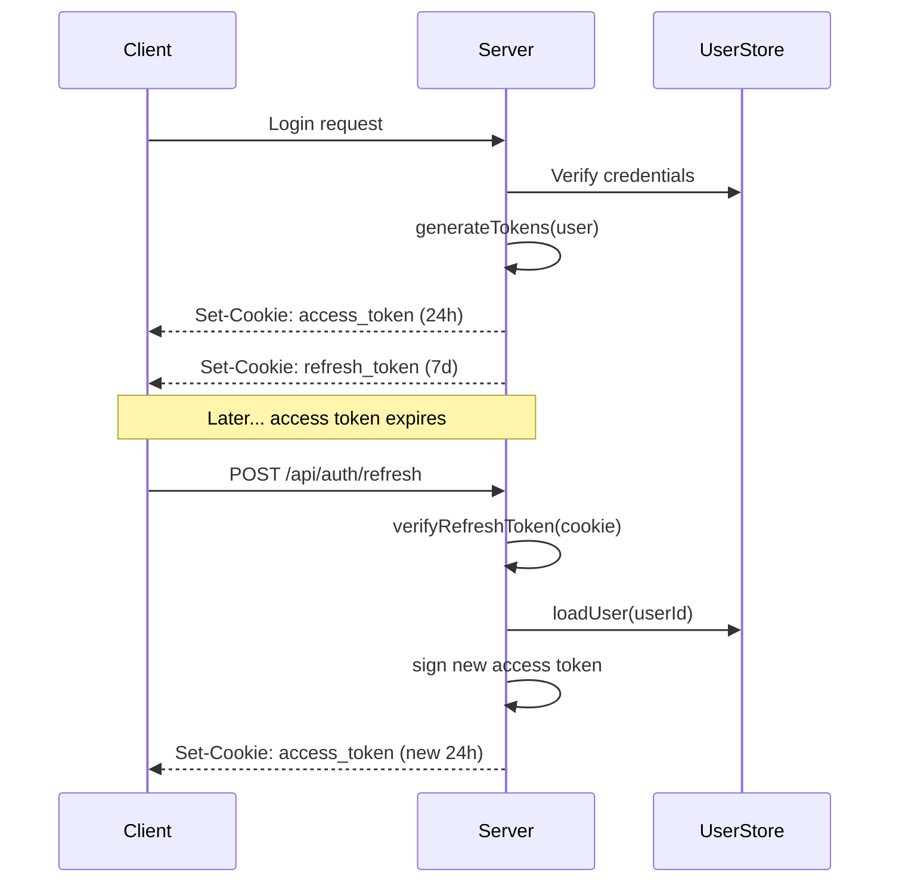

# Backend / Auth Utils

## Tags

`backend`, `authentication`, `jwt`, `bcrypt`, `security`, `tokens`, `password-hashing`

---

## Overview

`src/backend/auth-utils.js` provides password hashing, JWT token generation/verification, and token refresh functions.

## Configuration

| Variable | Source | Default | Description |
|----------|--------|---------|-------------|
| `BCRYPT_COST` | Hardcoded | `12` | bcrypt cost factor |
| `JWT_SECRET` | `process.env.JWT_SECRET` | *(required)* | Access token signing secret |
| `JWT_REFRESH_SECRET` | `process.env.JWT_REFRESH_SECRET` | *(required)* | Refresh token signing secret |
| `JWT_EXPIRES_IN` | `process.env.JWT_EXPIRES_IN` | `24h` | Access token lifetime |
| `JWT_REFRESH_EXPIRES_IN` | `process.env.JWT_REFRESH_EXPIRES_IN` | `7d` | Refresh token lifetime |

**Startup validation:** If `JWT_SECRET` or `JWT_REFRESH_SECRET` is not set, the process exits immediately with a helpful error message.

## Functions

### `hashPassword(password)`

Hash a password using bcrypt with cost factor 12.

- **Input:** Non-empty string (max 72 bytes per bcrypt limit)
- **Output:** Promise resolving to bcrypt hash string
- **Throws:** `Error` if password is empty or not a string

### `verifyPassword(password, hash)`

Verify a password against a bcrypt hash.

- **Input:** Password string, hash string
- **Output:** Promise resolving to `true` or `false`
- **Throws:** `Error` if either argument is empty or not a string

### `generateTokens(user)`

Generate access and refresh JWT tokens for a user.

- **Input:** `{ id: string, email: string, role: string }`
- **Output:** `{ accessToken, refreshToken, expiresIn }`
- **Throws:** `Error` if any required field is missing

**Token payloads:**

```js
// Access token
{ userId, email, role }

// Refresh token
{ userId, type: "refresh" }
```

### `verifyAccessToken(token)`

Verify and decode an access token.

- **Input:** JWT string
- **Output:** Decoded payload object or `null` if invalid/expired

### `verifyRefreshToken(token)`

Verify and decode a refresh token.

- **Input:** JWT string
- **Output:** Decoded payload or `null` if invalid/expired/not a refresh token

### `refreshAccessToken(refreshToken)`

Generate a new access token using a valid refresh token.

- **Input:** Refresh token string
- **Output:** New access token string or `null`
- **Process:** Verify refresh token → load user → sign new access token

## Token Flow



## Security Notes

- Passwords are hashed with bcrypt cost 12 (~250ms per hash on modern hardware)
- Access tokens are short-lived (24h) to limit exposure window
- Refresh tokens use a separate signing secret for defense in depth
- httpOnly cookies prevent XSS-based token theft
- Token rotation on refresh invalidates old access tokens

## Related

- [[Backend / Auth Middleware]] — Uses these functions for request validation
- [[Backend / Auth Routes]] — Uses these functions for login/register/refresh
- [[Architecture]] — Security overview
