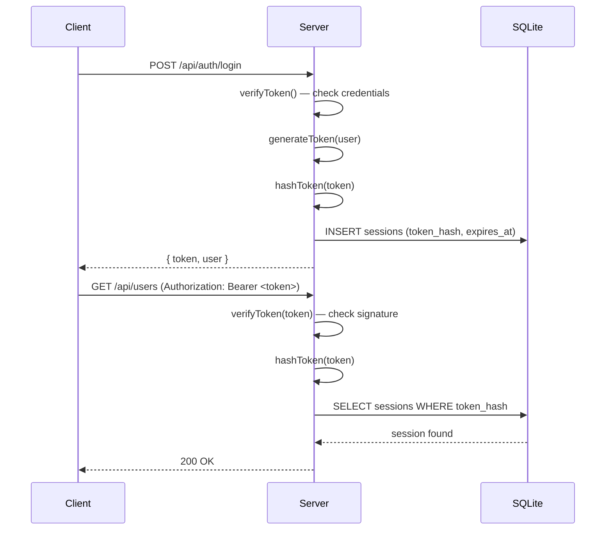

# JWT Authentication

**Tags:** `backend`, `auth`, `jwt`, `token`, `session`, `security`, `http`

## Overview

The JWT module (`src/backend/auth/jwt.js`) handles JSON Web Token generation, verification, and session lifecycle for HTTP API authentication.

## Configuration

| Environment Variable | Default | Description |
|---|---|---|
| `JWT_SECRET` | Random 32-byte hex (per process) | HS256 signing secret |
| `JWT_EXPIRES_IN` | `24h` | Token expiration duration |

## API Reference

### `generateToken(user: object): string`

Create a signed JWT containing user identity.

**Payload:**
```json
{
  "sub": 1,
  "username": "admin",
  "role_id": 1,
  "role_name": "super_admin"
}
```

### `verifyToken(token: string): object | null`

Decode and verify a JWT. Returns the decoded payload or `null` if invalid/expired. Uses `HS256` algorithm only.

### `hashToken(token: string): string`

SHA-256 hash of the raw token string, used for database storage. The raw token is never stored.

### `createSession(user: object): Promise<string>`

End-to-end session creation:

1. Generate JWT with user claims
2. Hash the token
3. Store hash + expiration in the `sessions` table
4. Return the raw token to the caller

### `validateToken(token: string): object | null`

Full token validation:

1. Verify JWT signature and expiration
2. Hash the token
3. Look up the hash in the `sessions` table
4. Return user data if valid, `null` otherwise

### `revokeSession(token: string): boolean`

Delete a single session by token hash. Returns `true` if found and deleted.

### `revokeAllUserSessions(userId: number): void`

Delete all sessions for a user. Used when a user is deleted or admin revokes access.

## Token Flow



## Security Considerations

- Raw tokens are **never** stored in the database — only SHA-256 hashes
- Tokens expire after 24 hours by default
- `JWT_SECRET` is random per process restart (use env var for production)
- Algorithm is pinned to `HS256` to prevent algorithm confusion attacks

## Related

- [[Auth Middleware]] — Uses `validateToken()` for HTTP request auth
- [[WebSocket Auth]] — Uses `validateToken()` for WebSocket connections
- [[Auth Routes]] — Login/register endpoints that create sessions
- [[Session Repository]] — Database operations for session storage
