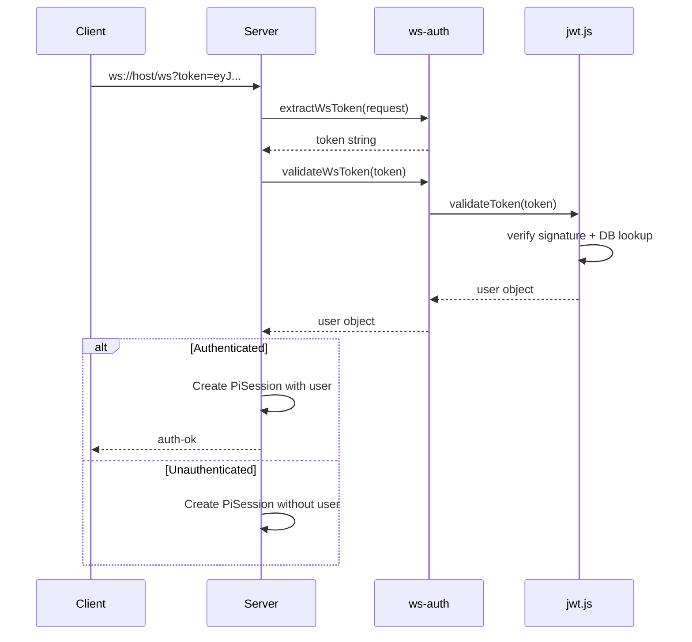

# WebSocket Authentication

**Tags:** `backend`, `auth`, `websocket`, `token`, `security`, `real-time`

## Overview

The WebSocket auth module (`src/backend/auth/ws-auth.js`) handles JWT token extraction and validation for WebSocket connections. It supports tokens passed via query parameters or the `Authorization` header.

## Token Extraction

### `extractWsToken(request): string | null`

Extract the JWT token from a WebSocket upgrade request. Checks in order:

1. **Query parameter:** `?token=<jwt>`
2. **Authorization header:** `Authorization: Bearer <jwt>`

Returns `null` if no token is found.

## Token Validation

### `validateWsToken(token: string): object | null`

Validate a JWT token by delegating to `validateToken()` from the JWT module. Returns user data or `null`.

## Permission Checking

### `checkWsPermission(user: object, resource: string, action: string): boolean`

Check if a WebSocket user has a specific permission.

- Returns `false` if user is `null`
- Returns `true` if the user has `super_admin` role (bypass)
- Checks `PermissionRepo.hasPermission()` for all other roles

## Connection Flow



## Frontend Usage

The frontend passes the token via query parameter:

```js
const ws = new WebSocket(`ws://localhost:3001/ws?token=${token}`);
```

## Related

- [[JWT Authentication]] — Core token validation
- [[Server]] — Uses ws-auth in the WebSocket connection handler
- [[Auth Middleware]] — HTTP equivalent of WebSocket auth
- [[Permission Repository]] — Permission checks for WebSocket users
