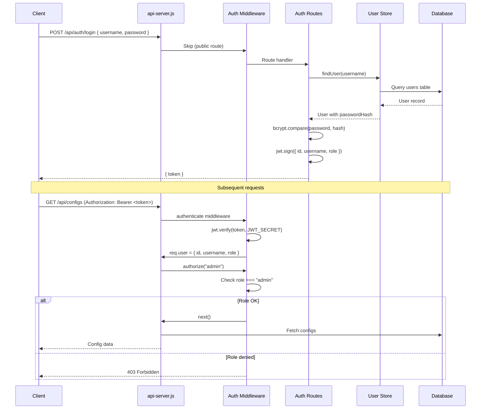

# Authentication System

JWT-based authentication with role-based access control. Three roles: admin, operator, viewer.

**Source:** `src/backend/auth/middleware.js`, `src/backend/auth/routes.js`, `src/backend/auth/user-store.js`

See also: [[backend/api-server]] • [[backend/database]]

## Overview

Authentication is controlled by the `BETTY_AUTH_ENABLED` environment variable. When enabled, all `/api/*` routes require a valid JWT except public endpoints (login, register, health, docs, library, pi-skills).



## Roles

| Role | Permissions | Description |
|---|---|---|
| `admin` | Full access | Manage users, configs, profiles, reports, builds, services, models |
| `operator` | Run access | Start/stop benchmarks, save profiles/reports, download models, run builds |
| `viewer` | Read-only | View configs, profiles, reports, status, models, logs |

### Role Matrix

| Action | admin | operator | viewer |
|---|---|---|---|
| Read configs | ✅ | ✅ | ✅ |
| Save configs | ✅ | ❌ | ❌ |
| Start/stop benchmark | ✅ | ✅ | ❌ |
| Save/load profiles | ✅ | ✅ | ❌ |
| Delete profiles | ✅ | ❌ | ❌ |
| Save reports | ✅ | ✅ | ❌ |
| Delete reports | ✅ | ❌ | ❌ |
| Build llama.cpp | ✅ | ❌ | ❌ |
| Manage systemd service | ✅ | ❌ | ❌ |
| Download models | ✅ | ✅ | ❌ |
| Delete models | ✅ | ✅ | ❌ |
| Manage users | ✅ | ❌ | ❌ |
| Kill port | ✅ | ❌ | ❌ |

## Middleware

### `authenticate(req, res, next)`

Verifies JWT and attaches `req.user`. Token sources (in order):

1. `Authorization: Bearer <token>` header
2. `?token=<token>` query parameter (for SSE connections)

Returns:
- `401` if token is missing, expired, or invalid
- Attaches `req.user = { id, username, role }` on success

### `authorize(...allowedRoles)`

Factory function returning role-based middleware.

```javascript
// Only admin
router.put('/api/configs', authorize('admin'), handler);

// Admin or operator
router.post('/api/run', authorize('admin', 'operator'), handler);
```

Returns:
- `401` if no authenticated user
- `403` if user role not in allowed list

### `optionalAuth(req, res, next)`

Non-blocking auth. Sets `req.user` if token is present and valid, otherwise sets `req.user = null`. Used for routes that work with or without authentication.

## Auth Routes

All routes are under `/api/auth/*`.

### POST `/api/auth/login`

Authenticate user and receive JWT.

**Request:**
```json
{ "username": "admin", "password": "secret123" }
```

**Response:**
```json
{ "token": "eyJhbGciOiJIUzI1NiIsInR5cCI6IkpXVCJ9..." }
```

**Errors:** `401` for invalid credentials.

### POST `/api/auth/register`

Register a new user. The **first user** is automatically assigned the `admin` role. Subsequent registrations default to `viewer` (unless a role is specified and the server allows it).

**Request:**
```json
{ "username": "newuser", "password": "secret123", "role": "viewer" }
```

**Response:**
```json
{ "token": "eyJhbG...", "user": { "id": "...", "username": "newuser", "role": "admin" } }
```

**Validation:** Password must be at least 8 characters.

### PUT `/api/auth/password`

Change the authenticated user's password.

**Request:**
```json
{ "currentPassword": "old123", "newPassword": "new123" }
```

**Auth:** Required (any role).

**Validation:** New password must be at least 8 characters.

### GET `/api/auth/me`

Get the authenticated user's information.

**Response:**
```json
{ "id": "uuid", "username": "admin", "role": "admin", "createdAt": "2024-01-01T00:00:00.000Z" }
```

**Auth:** Required.

### GET `/api/auth/users`

List all users (without password hashes).

**Response:**
```json
[
  { "id": "uuid-1", "username": "admin", "role": "admin", "createdAt": "..." },
  { "id": "uuid-2", "username": "viewer1", "role": "viewer", "createdAt": "..." }
]
```

**Auth:** admin only.

### PUT `/api/auth/users/:username`

Update a user's role or password.

**Request:**
```json
{ "role": "operator" }
// or
{ "password": "newpassword123" }
```

**Auth:** admin only.

### DELETE `/api/auth/users/:username`

Delete a user. Cannot delete yourself.

**Auth:** admin only.

**Errors:** `400` if trying to delete self.

## User Store

**Source:** `src/backend/auth/user-store.js`

Database-backed user CRUD operations using [[backend/database]].

### User Schema

```typescript
{
  id: string,          // UUID (crypto.randomUUID())
  username: string,
  passwordHash: string, // bcrypt hash
  role: 'admin' | 'operator' | 'viewer',
  createdAt: string,   // ISO timestamp
  updatedAt: string    // ISO timestamp
}
```

### Available Operations

| Function | Description |
|---|---|
| `ensureUsersFile()` | Initialize DB and create users table if needed |
| `loadUsers()` | Load all users from DB |
| `saveUsers(users)` | Bulk upsert all users |
| `findUser(username)` | Find by username (includes passwordHash) |
| `findUserById(id)` | Find by UUID |
| `addUser(user)` | Insert new user (auto-generates UUID, timestamps) |
| `updateUser(username, updates)` | Update passwordHash or role |
| `deleteUser(username)` | Delete by username |
| `listUsers()` | List all users (without password hashes) |
| `hasUsers()` | Check if any users exist |
| `getUserCount()` | Get total count |

### DB Column Mapping

CamelCase JS → snake_case DB:

| JS Property | DB Column |
|---|---|
| `id` | `id` |
| `username` | `username` |
| `passwordHash` | `password_hash` |
| `role` | `role` |
| `createdAt` | `created_at` |
| `updatedAt` | `updated_at` |

## JWT Secret Management

The JWT secret is managed through the [[backend/data-layer]] settings store:

1. On startup, `initJwtSecret()` attempts to load the secret from the database via `getSetting('jwt_secret')`
2. If no secret exists, one is generated using `crypto.randomBytes(64).toString('hex')` and saved to the database
3. The secret is set as `process.env.JWT_SECRET`
4. The secret persists across server restarts

### Default Admin User

On startup, `initAuth()` checks if any users exist. If not, it seeds a default admin user:
- Username: from `BETTY_DEFAULT_ADMIN_USERNAME` env (default: `admin`)
- Password: from `BETTY_DEFAULT_ADMIN_PASSWORD` env (default: `admin`)

This only runs once — if users already exist, no seeding occurs.

## Security Notes

- Passwords are hashed with bcrypt (not stored in plaintext)
- JWT tokens expire after 24 hours (configurable via `JWT_EXPIRES_IN`)
- Path traversal is blocked on model deletion endpoints
- First-user auto-admin prevents lockout on fresh installations
- Auth is bypassed only for explicitly whitelisted public routes
