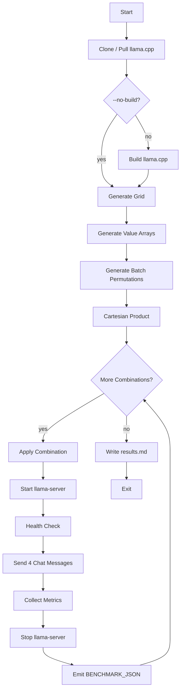
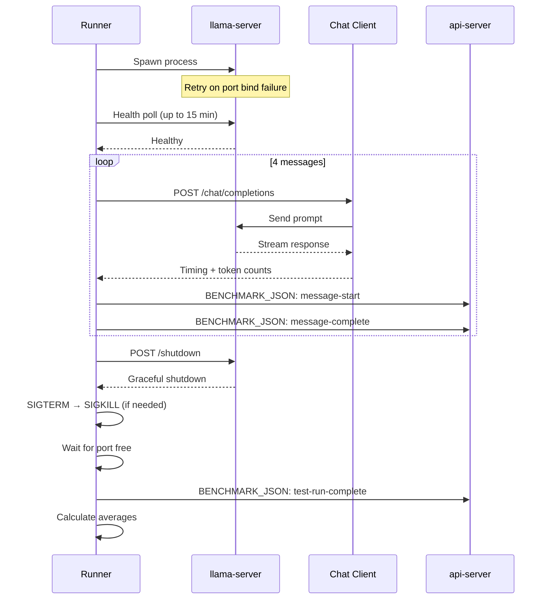

# Benchmark Runner

Grid search engine that iterates over all parameter combinations, runs `llama-server` for each, sends chat messages, and collects performance metrics.

**Source:** `src/backend/index.js`

See also: [[backend/api-server]] • [[backend/sse-streaming]] • [[configuration-reference]]

## Overview

The benchmark runner is a standalone Node.js process spawned by [[backend/api-server]]. It performs a full cartesian product of test parameters, running a separate `llama-server` instance for each combination.



## CLI Flags

| Flag | Description |
|---|---|
| `--no-build` | Skip llama.cpp build (use existing binary) |
| `--build-only` | Build llama.cpp and exit (no benchmark) |

## Grid Search Algorithm

### Phase 1: Value Array Generation

Five parameter arrays are generated from the configuration:

| Parameter | Generation Method | Config Keys |
|---|---|---|
| Context Length | Multiplicative (geometric) | `context_length.start`, `.multiplier`, `.max` |
| Batch Size | Linear (arithmetic) | `batch_size.start`, `.step`, `.max` |
| U-Batch Size | Linear | `ubatch_size.start`, `.step`, `.max` |
| Cache RAM | Linear | `cache_ram.start`, `.step`, `.max` |
| GPU Layers | Linear | `gpu_layers.start`, `.step`, `.max` |

#### `generateMultiplicativeArray(start, multiplier, max)`

Produces a geometric progression: `[start, start*multiplier, start*multiplier*multiplier, ...]` until exceeding `max`. Used for context length because it grows exponentially.

Example: `start=2048, multiplier=2, max=16384` → `[2048, 4096, 8192, 16384]`

#### `generateValueArray(start, step, max)`

Produces an arithmetic progression: `[start, start+step, start+2*step, ...]` until exceeding `max`. Used for all other parameters.

Example: `start=0, step=10, max=50` → `[0, 10, 20, 30, 40, 50]`

### Phase 2: Batch Permutation Generation

`generateBatchPermutations(uBatchSizes, batchSizes)` generates all valid `(uBatchSize, batchSize)` pairs where `batchSize >= uBatchSize`. This constraint is enforced by llama.cpp.

Example:
```
uBatchSizes = [1, 4, 8]
batchSizes  = [32, 64, 128]
Result: [(1,32), (1,64), (1,128), (4,32), (4,64), (4,128), (8,32), (8,64), (8,128)]
```

### Phase 3: Cartesian Product

`cartesianProduct(arrays)` computes the full cartesian product of all parameter arrays. Combined with the batch permutations, this produces every test combination.

Total test runs = `len(contexts) * len(cacheRams) * len(gpuLayers) * len(batchPermutations)`

## Test Run Lifecycle

Each test combination follows this sequence:



### Server Start

1. Spawn `llama-server` with all parameters as CLI flags
2. If port bind fails, retry immediately (port may still be in TIME_WAIT)
3. Poll `/health` endpoint every 2 seconds, up to 15 minutes
4. If process dies within 3 seconds, treat as startup failure

### Message Exchange

For each test run, 4 chat messages are sent sequentially:

1. POST to `http://localhost:<port>/chat/completions`
2. Measure `promptTimeMs` (tokenization + first token)
3. Measure `predictedTimeMs` (generation time)
4. Extract `promptTokens` and `generatedTokens` from response
5. Read `/proc/meminfo` for memory usage

### Server Stop

1. POST to `/shutdown` endpoint for graceful shutdown
2. If not stopped within timeout, send SIGTERM
3. If still running, send SIGKILL
4. Wait for port to be free (check TIME_WAIT + lsof)
5. Kill any leftover processes on the port

## Structured Output Protocol

The benchmark runner emits structured JSON lines to stdout, which [[backend/api-server]] parses:

```
BENCHMARK_JSON:{"type":"message-start","testRunId":42,"messageIndex":0,"prompt":"..."}
BENCHMARK_JSON:{"type":"message-complete","testRunId":42,"messageIndex":0,"promptTokens":15,"generatedTokens":120,"promptTimeMs":50,"predictedTimeMs":200,"serverParams":{...},"mem":{...}}
BENCHMARK_JSON:{"type":"test-run-complete","testRunId":42,"contextLength":4096,"batchSize":64,"uBatchSize":8,"cacheRam":0,"gpuLayers":35,"flashAttn":false,"reasoning":false,"temperature":0.7,"topP":0.9,"minP":0.05,"topK":40,"layerSplit":"","tensorSplit":"","primaryGpu":null,"gpuSelection":null,"ropeScaling":null,"parallel":1,"env":{...},"cmakeFlags":[...],"messageResults":[...],"averages":{...}}
```

### Event Types

| Type | Fields | Purpose |
|---|---|---|
| `message-start` | `testRunId`, `messageIndex`, `prompt` | Prompt being sent |
| `message-complete` | `testRunId`, `messageIndex`, timing, tokens, `serverParams`, `mem` | Response received |
| `test-run-complete` | All params, `messageResults[]`, `averages` | Full run summary |

## Result Data Structures

### Per-Message Result

```typescript
{
  messageIndex: number,
  prompt: string,
  responseText: string,
  promptTokens: number,
  generatedTokens: number,
  totalTimeMs: number,
  promptTimeMs: number,
  predictedTimeMs: number,
  promptTokensPerSec: number,
  generatedTokensPerSec: number,
  serverParams: Record<string, unknown>,
  mem: { used: number, total: number }
}
```

### Test Run Result

```typescript
{
  testRunId: number,
  contextLength: number,
  batchSize: number,
  uBatchSize: number,
  cacheRam: number,
  gpuLayerOffload: number,
  flashAttn: boolean,
  reasoning: boolean,
  temperature: number,
  topP: number,
  minP: number,
  topK: number,
  layerSplit: string,
  tensorSplit: string,
  primaryGpu: string | null,
  gpuSelection: unknown | null,
  ropeScaling: unknown | null,
  gpuLayers: number,
  parallel: number,
  env: Record<string, string>,
  cmakeFlags: string[],
  messageResults: MessageResult[],
  averages: {
    totalPromptTokens: number,
    totalGeneratedTokens: number,
    totalTimeMs: number,
    avgPromptTokensPerSec: number,
    avgGenTokensPerSec: number,
    avgMemUsed: number,
    avgMemTotal: number
  }
}
```

## Markdown Output

`writeResultsToMarkdown()` writes all results to `~/.betty/reports/results.md` as formatted markdown tables. Columns include:

- Test run ID
- Context length, batch size, u-batch size
- Cache RAM, GPU layers
- Flash attention, reasoning mode
- Temperature, top-P, min-P, top-K
- Prompt tokens/sec (average)
- Generation tokens/sec (average)
- Memory usage

## Build Process

### `init()` / `initController()`

1. Check if `llama.cpp/` exists (`isCloned()`)
2. If not, clone from git (`runClone()`)
3. If yes, pull latest changes (`runPull()`)
4. If `--no-build` is not set, run cmake build (`runBuild()`)
5. If `--build-only` is set, exit after build

### `runBuild()`

1. Generate cmake command from `build_make_params` config
2. Run `cmake` configure with appropriate flags
3. Run `make` with parallel jobs
4. Verify `llama-server` binary exists
5. Build environment includes `CMAKE_BUILD_TYPE=Release` and GPU flags

### `runCommand(cmd, opts)`

Promise-wrapped `exec()` with a 1-hour timeout. Used for all git and build operations.

## System Memory

`getMem()` reads `/proc/meminfo` on Linux to get `MemTotal` and `MemAvailable`. Used to calculate memory usage per test run.
