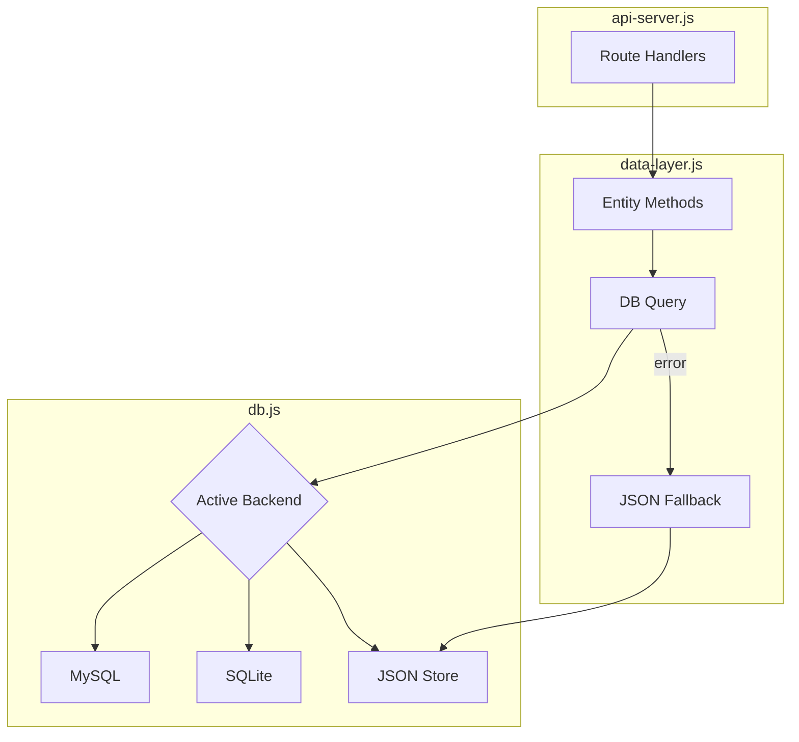

# Data Access Layer

Domain-specific data operations wrapping [[backend/database]]. Provides entity-focused CRUD methods with automatic JSON file fallback.

**Source:** `src/backend/db/data-layer.js`

See also: [[backend/database]] • [[backend/api-server]]

## Overview

The data layer sits between the API server and the database. It provides clean, entity-specific methods instead of raw SQL queries. Every operation follows a **DB-first with JSON fallback** pattern — try the database first, fall back to JSON files if the database is unavailable.



### Fallback Pattern

Every function follows this structure:

```javascript
export async function getConfigs() {
  try {
    const row = await db.jsonGet("SELECT value FROM configs WHERE id = 1");
    if (row && row.value) return row.value;
  } catch (err) {
    // Log error
  }
  return await jsonStore.getConfigs(); // Fallback to JSON file
}
```

This ensures the application works even if the database layer fails, falling back to `configs.json` and other JSON files.

## Entity Operations

### Configs

| Function | Description |
|---|---|
| `getConfigs()` | Get full configuration object |
| `saveConfigs(configs)` | Save configuration (writes to DB + JSON file for `index.js --build-only` compatibility) |
| `getConfig(key)` | Get nested config value, supports dot notation (e.g., `"gpu_selection.enabled"`) |

**Storage:** Single row in `configs` table (`id=1`), JSON `value` column.

**JSON fallback:** `~/.betty/configs.json`

### Reports

| Function | Description |
|---|---|
| `listReports()` | List all reports |
| `getReport(name)` | Get report by name |
| `saveReportData(name, report)` | Save report (serializes `liveResults`, `configsPerRun`, `configs` as JSON) |
| `deleteReport(name)` | Delete report by name |

**Storage:** `reports` table with columns: `name`, `saved_at`, `md_content`, `live_results`, `configs_per_run`, `configs`.

### Profiles

| Function | Description |
|---|---|
| `listProfiles()` | List all profiles |
| `getProfile(name)` | Get profile by name |
| `saveProfile(name, data)` | Save profile |
| `deleteProfile(name)` | Delete profile |

**Storage:** `profiles` table with columns: `name`, `data` (JSON).

**JSON fallback:** `~/.betty/profiles/<name>.json`

### Service Profiles

| Function | Description |
|---|---|
| `listServiceProfiles()` | List all service profiles |
| `getServiceProfile(name)` | Get service profile by name |
| `saveServiceProfile(name, data)` | Save service profile |
| `deleteServiceProfile(name)` | Delete service profile |

**Storage:** `service_profiles` table with columns: `name`, `data` (JSON).

**JSON fallback:** `~/.betty/service-profiles/<name>.json`

### Chat Templates

| Function | Description |
|---|---|
| `listChatTemplates()` | List all chat templates |
| `getChatTemplate(filename)` | Get template content |
| `saveChatTemplate(filename, content, size)` | Save template (writes to DB + file system) |
| `deleteChatTemplate(filename)` | Delete template (removes from DB + file system) |

**Storage:** `chat_templates` table with columns: `filename`, `content`, `size`. Also stored as files in `~/.betty/chat_templates/`.

### Settings

| Function | Description |
|---|---|
| `getSetting(key)` | Get a key-value setting |
| `saveSetting(key, value)` | Save a key-value setting |

**Storage:** `settings` table with columns: `key`, `value`.

**Usage:** JWT secret storage, feature flags, and other singleton settings.

**JSON fallback:** `~/.betty/settings.json`

## `getConfig(key)` — Nested Access

Supports dot-notation access into nested config objects:

```javascript
getConfig('gpu_selection.enabled')    // configs.gpu_selection.enabled
getConfig('build_make_params.llama.cpu_threads')
getConfig('context_length.start')
```

Traverses the config object using the dot-separated path. Returns `undefined` if the path doesn't exist.

## Save Patterns

### Configs — Dual Write

`saveConfigs()` writes to **both** the database and `configs.json`. This ensures `index.js --build-only` (which reads `configs.json` directly) always has current data.

### Chat Templates — DB + File

`saveChatTemplate()` writes to both the database and the file system. This allows direct file access for llama.cpp while maintaining database consistency.

`deleteChatTemplate()` removes from both locations.

### Reports — JSON Serialization

`saveReportData()` serializes complex nested data:
- `liveResults` → JSON string in `live_results` column
- `configsPerRun` → JSON string in `configs_per_run` column
- `configs` → JSON string in `configs` column
- Markdown content stored in `md_content` column

## Error Handling

All functions catch database errors and fall back to JSON store operations. Database errors are logged but don't propagate — the JSON fallback ensures the application remains functional.

## Relationship to json-store

The data layer imports entity-specific methods from the JSON store (covered in [[backend/database]]) for fallback operations. The JSON store provides the same entity methods but operates on JSON files directly, without going through `db.js`.

| Data Layer Method | JSON Store Fallback |
|---|---|
| `getConfigs()` | `jsonStore.getConfigs()` |
| `saveConfigs(configs)` | `jsonStore.saveConfigs(configs)` |
| `listReports()` | `jsonStore.listReports()` |
| `getReport(name)` | `jsonStore.getReport(name)` |
| `saveReportData(name, data)` | `jsonStore.saveReport(name, data)` |
| `deleteReport(name)` | `jsonStore.deleteReport(name)` |
| `listProfiles()` | `jsonStore.listProfiles()` |
| `getProfile(name)` | `jsonStore.getProfile(name)` |
| `saveProfile(name, data)` | `jsonStore.saveProfile(name, data)` |
| `deleteProfile(name)` | `jsonStore.deleteProfile(name)` |
| `listServiceProfiles()` | `jsonStore.listServiceProfiles()` |
| `getServiceProfile(name)` | `jsonStore.getServiceProfile(name)` |
| `saveServiceProfile(name, data)` | `jsonStore.saveServiceProfile(name, data)` |
| `deleteServiceProfile(name)` | `jsonStore.deleteServiceProfile(name)` |
| `listChatTemplates()` | `jsonStore.listChatTemplates()` |
| `getChatTemplate(filename)` | `jsonStore.getChatTemplate(filename)` |
| `saveChatTemplate(...)` | `jsonStore.saveChatTemplate(...)` |
| `deleteChatTemplate(filename)` | `jsonStore.deleteChatTemplate(filename)` |
| `getSetting(key)` | `jsonStore.getSetting(key)` |
| `saveSetting(key, value)` | `jsonStore.saveSetting(key, value)` |
