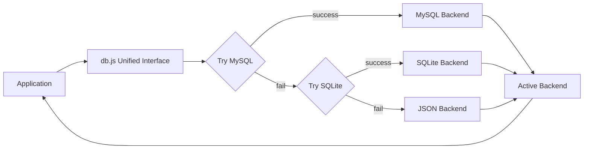
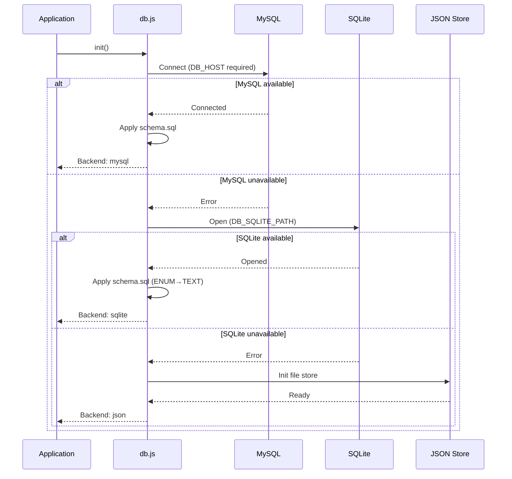

# Database Layer

Three-tier database abstraction with automatic fallback: MySQL → SQLite → JSON files. Provides a unified SQL-like interface regardless of the active backend.

**Source:** `src/backend/db/db.js`

See also: [[backend/data-layer]] • [[backend/api-server]]

## Overview

The database layer transparently handles three storage backends. It tries each in order until one succeeds, then uses that backend for all operations.



### Fallback Chain



## Configuration

| Environment Variable | Default | Purpose |
|---|---|---|
| `DB_HOST` | `""` | MySQL host (empty string skips MySQL) |
| `DB_PORT` | `3306` | MySQL port |
| `DB_USER` | `betty` | MySQL username |
| `DB_PASSWORD` | `""` | MySQL password |
| `DB_NAME` | `betty` | MySQL database name |
| `DB_POOL_SIZE` | `10` | MySQL connection pool size |
| `DB_SQLITE_PATH` | `~/.betty/betty.db` | SQLite database file path |

### Selecting a Backend

- **MySQL:** Set `DB_HOST` to a valid MySQL server address
- **SQLite:** Leave `DB_HOST` empty (or unset), ensure `better-sqlite3` is available
- **JSON:** Both MySQL and SQLite must fail for JSON to activate

## Unified Interface

All public methods dispatch to the active backend. The application code uses the same API regardless of storage.

### Core Methods

| Method | Signature | Description |
|---|---|---|
| `init()` | `async` | Initialize backend (try MySQL → SQLite → JSON) |
| `query(sql, params)` | `async` | Execute SQL, return rows |
| `get(sql, params)` | `async` | Execute SQL, return first row |
| `all(sql, params)` | `async` | Execute SQL, return all rows |
| `run(sql, params)` | `async` | Insert/update/delete, returns `{ affectedRows, lastId }` |
| `jsonGet(sql, params)` | `async` | Like `get()` but parses JSON columns |
| `jsonAll(sql, params)` | `async` | Like `all()` but parses JSON columns |
| `jsonRun(sql, params, jsonValue)` | `async` | Like `run()` but serializes JSON value |
| `close()` | `async` | Close database connection |
| `getBackend()` | sync | Return active backend name (`'mysql'` \| `'sqlite'` \| `'json'`) |
| `ensureInitialized()` | `async` | Lazy initialization |

### Usage Example

```javascript
const db = require('./db.js');

await db.init();

// Works the same for MySQL, SQLite, or JSON
const configs = await db.jsonGet("SELECT value FROM configs WHERE id = 1");
await db.jsonRun("INSERT INTO configs (id, value) VALUES (1, ?)", [], configData);
const reports = await db.jsonAll("SELECT * FROM reports ORDER BY saved_at DESC");
```

## JSON Column Parsing

When using SQLite (which stores everything as TEXT), these columns are automatically parsed from JSON strings to objects:

| Column Name | Used By |
|---|---|
| `value` | configs, settings |
| `live_results` | reports |
| `configs_per_run` | reports |
| `configs` | reports |
| `data` | profiles, service_profiles |

The `jsonGet()` and `jsonAll()` methods handle this parsing automatically. The `jsonRun()` method handles serialization.

## Schema

Schema is defined in `schema.sql` (same directory as `db.js`). Applied automatically on initialization.

### Tables

| Table | Key Columns | Purpose |
|---|---|---|
| `configs` | `id`, `value` (JSON) | Single-row config storage |
| `reports` | `name`, `saved_at`, `md_content`, `live_results` (JSON), `configs_per_run` (JSON), `configs` (JSON) | Benchmark reports |
| `profiles` | `name`, `data` (JSON) | Config profiles |
| `service_profiles` | `name`, `data` (JSON) | Service profiles |
| `chat_templates` | `filename`, `content`, `size` | Chat template files |
| `settings` | `key`, `value` | Key-value settings (JWT secret, etc.) |
| `users` | `id`, `username`, `password_hash`, `role`, `created_at`, `updated_at` | User accounts |

### SQLite Compatibility

When applying the schema to SQLite, `ENUM(...)` types are replaced with `TEXT` since SQLite doesn't support ENUM natively.

## Backend Dispatch Pattern

Every public method follows this pattern:

```javascript
async function get(sql, params = []) {
  await ensureInitialized();
  switch (activeBackend) {
    case "mysql":  return mysqlGet(sql, params);
    case "sqlite": return sqliteGet(sql, params);
    case "json":   return jsonStore.get(sql, params);
  }
}
```

## MySQL Backend

- Uses `mysql2/promise` with connection pooling
- Pool size configurable via `DB_POOL_SIZE`
- Standard SQL syntax
- Native JSON column support

## SQLite Backend

- Uses `better-sqlite3` (synchronous API wrapped in promises)
- Database file at `DB_SQLITE_PATH`
- JSON stored as TEXT, parsed by `jsonGet`/`jsonAll`
- ENUM columns converted to TEXT in schema

## JSON Backend

- Uses JSON files directly in `~/.betty/` for storage (see file layout table below)
- No SQL support — entity-specific methods handle all operations
- `query()`, `get()`, `all()`, `run()` are no-ops
- Data stored as JSON files in `~/.betty/`

### JSON Backend File Layout

| Entity | File Path |
|---|---|
| Users | `~/.betty/users.json` |
| Configs | `~/.betty/configs.json` |
| Reports | `~/.betty/reports/*.json` |
| Profiles | `~/.betty/profiles/*.json` |
| Service Profiles | `~/.betty/service-profiles/*.json` |
| Settings | `~/.betty/settings.json` |

## Initialization Flow

1. `init()` is called (or `ensureInitialized()` on first operation)
2. If `DB_HOST` is set, attempt MySQL connection
3. If MySQL fails or `DB_HOST` is empty, attempt SQLite
4. If SQLite fails, fall back to JSON store
5. For MySQL/SQLite: apply `schema.sql`
6. For JSON: create directories if needed
7. Set `activeBackend` to the successful backend name

## Migration Exports

For migration scripts, individual backend methods are exported:

- `mysqlInit()`, `sqliteInit()` — direct backend initialization
- Useful for running migrations against a specific backend regardless of the active one
