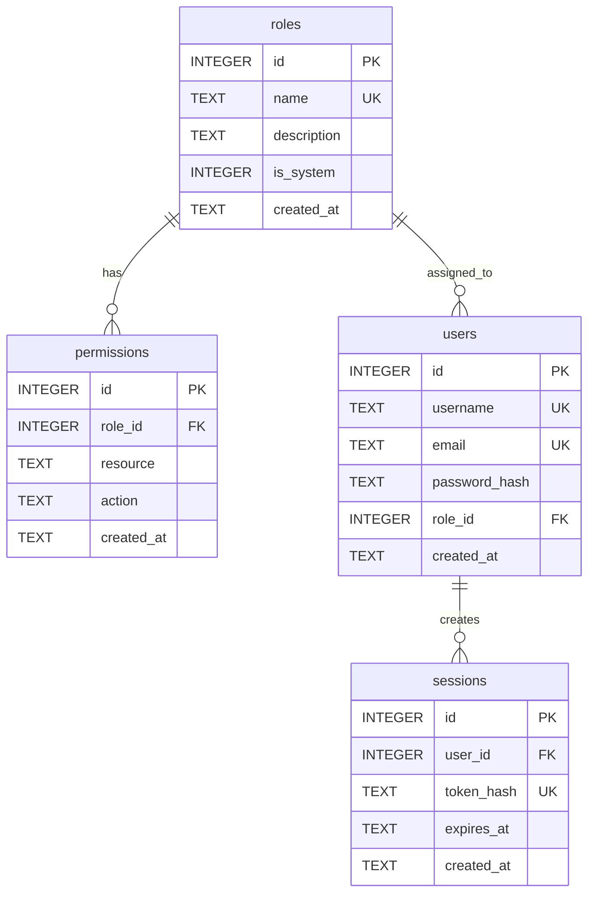

# Database

**Tags:** `backend`, `database`, `sqlite`, `schema`, `storage`, `better-sqlite3`

## Overview

The database module (`src/backend/db/database.js`) initializes and manages the SQLite database using `better-sqlite3`. The database file is stored at `src/backend/data/betty.db`.

## Schema

### Tables

#### `roles`

| Column | Type | Constraints | Description |
|---|---|---|---|
| `id` | INTEGER | PK, AUTOINCREMENT | Unique role ID |
| `name` | TEXT | NOT NULL, UNIQUE | Role name (e.g., `admin`, `user`) |
| `description` | TEXT | DEFAULT '' | Human-readable description |
| `is_system` | INTEGER | NOT NULL, DEFAULT 0 | 1 = built-in, 0 = custom |
| `created_at` | TEXT | DEFAULT datetime('now') | Creation timestamp |

#### `permissions`

| Column | Type | Constraints | Description |
|---|---|---|---|
| `id` | INTEGER | PK, AUTOINCREMENT | Unique permission ID |
| `role_id` | INTEGER | FK → roles.id, ON DELETE CASCADE | Associated role |
| `resource` | TEXT | NOT NULL | Resource name |
| `action` | TEXT | NOT NULL | Action name |
| `created_at` | TEXT | DEFAULT datetime('now') | Creation timestamp |

**Unique constraint:** `(role_id, resource, action)`

#### `users`

| Column | Type | Constraints | Description |
|---|---|---|---|
| `id` | INTEGER | PK, AUTOINCREMENT | Unique user ID |
| `username` | TEXT | NOT NULL, UNIQUE | Login username |
| `email` | TEXT | NOT NULL, UNIQUE | User email |
| `password_hash` | TEXT | NOT NULL | Bcrypt-hashed password |
| `role_id` | INTEGER | FK → roles.id, ON DELETE SET DEFAULT, DEFAULT 4 | Assigned role |
| `created_at` | TEXT | DEFAULT datetime('now') | Creation timestamp |

#### `sessions`

| Column | Type | Constraints | Description |
|---|---|---|---|
| `id` | INTEGER | PK, AUTOINCREMENT | Unique session ID |
| `user_id` | INTEGER | FK → users.id, ON DELETE CASCADE | Owning user |
| `token_hash` | TEXT | NOT NULL, UNIQUE | SHA-256 hash of JWT |
| `expires_at` | TEXT | NOT NULL | Expiration ISO timestamp |
| `created_at` | TEXT | DEFAULT datetime('now') | Creation timestamp |

### Indexes

| Index | Column(s) | Purpose |
|---|---|---|
| `idx_permissions_role_id` | `permissions.role_id` | Fast permission lookups by role |
| `idx_users_role_id` | `users.role_id` | Fast user lookups by role |
| `idx_sessions_user_id` | `sessions.user_id` | Fast session lookups by user |
| `idx_sessions_token_hash` | `sessions.token_hash` | Fast session validation |
| `idx_sessions_expires_at` | `sessions.expires_at` | Fast expired session cleanup |

## API Reference

### `initializeDatabase()`

Create all tables and indexes if they don't exist. Enables WAL mode and foreign keys.

### `getDb(): Database`

Return the `better-sqlite3` database instance.

### `closeDatabase()`

Close the database connection.

### `cleanupExpiredSessions()`

Delete all sessions where `expires_at < datetime('now')`. Called every hour by the server.

## Configuration

| Setting | Value | Description |
|---|---|---|
| Data directory | `src/backend/data/` | Auto-created if missing |
| Database file | `betty.db` | SQLite database file |
| Journal mode | WAL | Better concurrent read performance |
| Foreign keys | ON | Enforced at database level |

## Related

- [[Repositories]] — Data access layer built on this database
- [[Seeds]] — Initial data population
- [[JWT Authentication]] — Stores token hashes in the sessions table
- [[Architecture]] — Database layer in the system design
