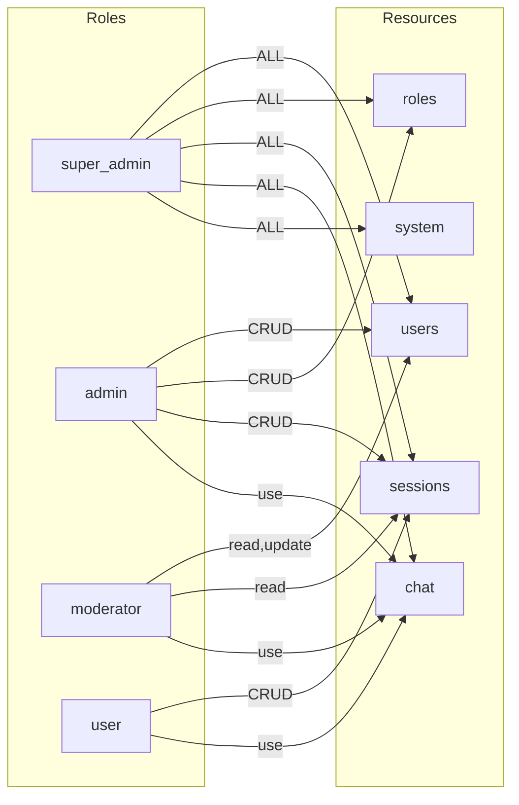

# Database Seeds

**Tags:** `backend`, `database`, `seeds`, `initial-data`, `roles`, `permissions`, `admin`

## Overview

The seeds module (`src/backend/db/seeds.js`) populates the database with built-in roles, their permissions, and a default super_admin user. It runs automatically on server startup.

## Built-in Roles

### `super_admin`

Full access to all resources and actions. Gets all 30 possible permissions (5 resources × 6 actions).

### `admin`

Manage users, roles, and chat sessions. Permissions:

| Resource | Actions |
|---|---|
| `users` | create, read, update, delete |
| `roles` | create, read, update, delete |
| `sessions` | create, read, update, delete |
| `chat` | use |

### `moderator`

View and edit users, manage sessions, use chat. Permissions:

| Resource | Actions |
|---|---|
| `users` | read, update |
| `sessions` | read |
| `chat` | use |

### `user`

Default role for new registrations. Permissions:

| Resource | Actions |
|---|---|
| `sessions` | create, read, update, delete |
| `chat` | use |

## API Reference

### `seedBuiltInRoles()`

Insert the four built-in roles and their permissions into the database. Uses `INSERT OR IGNORE` — safe to call multiple times. Wrapped in a transaction.

### `async seedDefaultAdmin(bcrypt): object | null`

Create the default super_admin user if one doesn't exist.

- **Username:** `admin`
- **Email:** `admin@betty.local`
- **Password:** `admin123`
- **Role:** `super_admin`

Returns `null` if the admin user already exists. Returns user info on creation.

## Permission Matrix

## Security Note

The default admin credentials (`admin` / `admin123`) are for development only. In production, set the admin user via environment variables or a secure setup script.

## Related

- [[Database]] — Schema that seeds populate
- [[Repositories]] — Database operations used by seeds
- [[Server]] — Calls seeds on startup
- [[Roles Routes]] — API for managing custom roles
