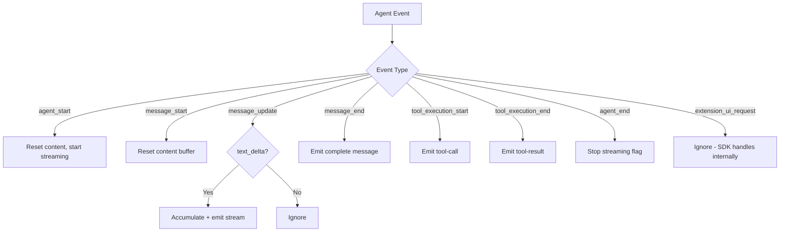

# PiSession

**Tags:** `backend`, `pi-agent`, `session`, `sdk`, `streaming`, `event-emitter`, `coding-agent`

## Overview

`PiSession` (`src/backend/pi-session.js`) is an EventEmitter-based wrapper around the Pi coding agent SDK. It manages the lifecycle of a single Pi agent instance, providing methods to send prompts, abort responses, delete messages from the context window, and stream responses in real time.

## SDK Integration

PiSession uses the `@earendil-works/pi-coding-agent` SDK directly (not RPC mode). This gives direct access to agent state, including the message context array.

### SDK Imports

```js
import {
  createAgentSession,
  SessionManager,
  AuthStorage,
  ModelRegistry,
} from "@earendil-works/pi-coding-agent";
```

## Class API

### Constructor

```js
const session = new PiSession();
```

Creates a new PiSession instance. No agent is started yet — call `start()` to initialize.

### `async start()`

Initialize and start a Pi agent session. Creates `AuthStorage`, `ModelRegistry`, and an in-memory `SessionManager`. Subscribes to agent events.

**Emits:** `status` (`starting`), `status` (`ready`), or `error`

### `async prompt(message: string): Promise<boolean>`

Send a user message to Pi. Returns `true` if accepted, `false` if session is not running.

### `steer(message: string): boolean`

Send a steering message delivered after the current turn completes. Returns `true` on success.

### `followUp(message: string): boolean`

Follow up on the last assistant response. Returns `true` on success.

### `async abort(): Promise<boolean>`

Abort the current Pi turn. Returns `true` on success.

### `deleteMessage(role: string, content: string): boolean`

Remove a message from the agent's context window. Matches by `role` and trimmed `content`. Handles both string and array content formats. Returns `true` if a message was found and removed.

### `async newSession(): Promise<boolean>`

Dispose the current session and create a fresh one. Re-subscribes to events.

### `stop()`

Tear down the session: unsubscribe from events, dispose the agent session, reset state.

### `isAlive(): boolean`

Check if the session is still running and the agent instance exists.

## Events

| Event | Payload | Description |
|---|---|---|
| `status` | `string` | Session status: `starting`, `ready`, `error` |
| `message` | `{ role: string, content: string }` | Complete assistant message |
| `stream` | `string` | Incremental text delta |
| `tool-call` | `{ toolName, toolCallId, args }` | Tool execution started |
| `tool-result` | `{ toolName, toolCallId, result, isError }` | Tool execution finished |
| `error` | `string` | Error message |

## Event Handling Flow



## State Management

| Property | Type | Description |
|---|---|---|
| `session` | AgentSession \| null | The Pi SDK session instance |
| `authStorage` | AuthStorage \| null | SDK auth storage |
| `modelRegistry` | ModelRegistry \| null | SDK model registry |
| `isRunning` | boolean | Whether the session has been started |
| `isStreaming` | boolean | Whether a response is currently streaming |
| `currentAssistantContent` | string | Accumulated content for the current response |
| `_unsubscribe` | Function \| null | Event subscription cleanup function |

## Context Window Management

The `deleteMessage()` method directly manipulates `this.session.agent.state.messages`. It:

1. Iterates the messages array
2. Compares each message's role and trimmed content
3. Filters out the matching message
4. Replaces the array reference on the agent state

This frees up context window space, allowing longer conversations.

## Related

- [[Server]] — Creates PiSession instances per WebSocket client
- [[WebSocket Composable]] — Frontend client for the WebSocket protocol
- [[Architecture]] — How PiSession fits into the system design
