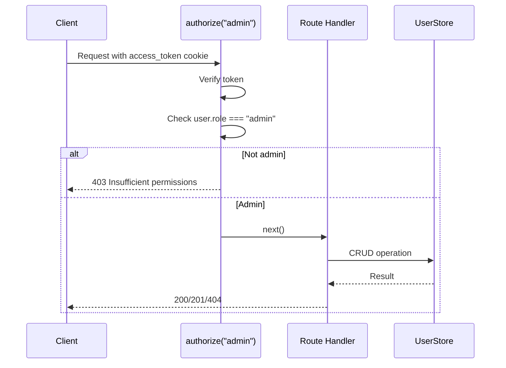

# Backend / Admin Routes

## Tags

`backend`, `admin`, `routes`, `express`, `api`, `user-management`, `authorization`

---

## Overview

`src/backend/routes/admin.js` defines admin-only user management endpoints mounted at `/api/admin`. All routes require the `admin` role via `authorize("admin")` middleware.

## Endpoints

### `GET /api/admin/users`

List all users (excluding password hashes).

**Responses:**

| Status | Body |
|--------|------|
| 200 | `{ users: [...] }` |
| 500 | `{ error }` |

### `POST /api/admin/users`

Create a new user.

**Request body:**

```json
{
  "name": "Jane Doe",
  "email": "jane@example.com",
  "password": "securepassword123",
  "role": "user"
}
```

**Validation:**

- Email: required, valid format
- Password: required, min 6 characters
- Role: optional, defaults to `"user"`, must be `"admin"` or `"user"`

**Responses:**

| Status | Condition | Body |
|--------|-----------|------|
| 201 | Success | `{ user }` |
| 400 | Validation error | `{ error }` |
| 409 | Email already exists | `{ error }` |

### `PATCH /api/admin/users/:id`

Update a user's role.

**Request body:**

```json
{
  "role": "admin"
}
```

**Responses:**

| Status | Condition | Body |
|--------|-----------|------|
| 200 | Success | `{ user }` |
| 400 | Invalid role | `{ error }` |
| 403 | Self-demotion attempt | `{ error: "Cannot demote yourself" }` |
| 404 | User not found | `{ error }` |

**Security:**

- Admins cannot demote themselves (prevents lockout)

### `DELETE /api/admin/users/:id`

Delete a user.

**Responses:**

| Status | Condition | Body |
|--------|-----------|------|
| 200 | Success | `{ message: "User deleted successfully" }` |
| 403 | Self-deletion attempt | `{ error: "Cannot delete your own account" }` |
| 404 | User not found | `{ error }` |

**Security:**

- Users cannot delete their own account (prevents self-lockout)

## Authorization Flow



## Related

- [[Backend / Auth