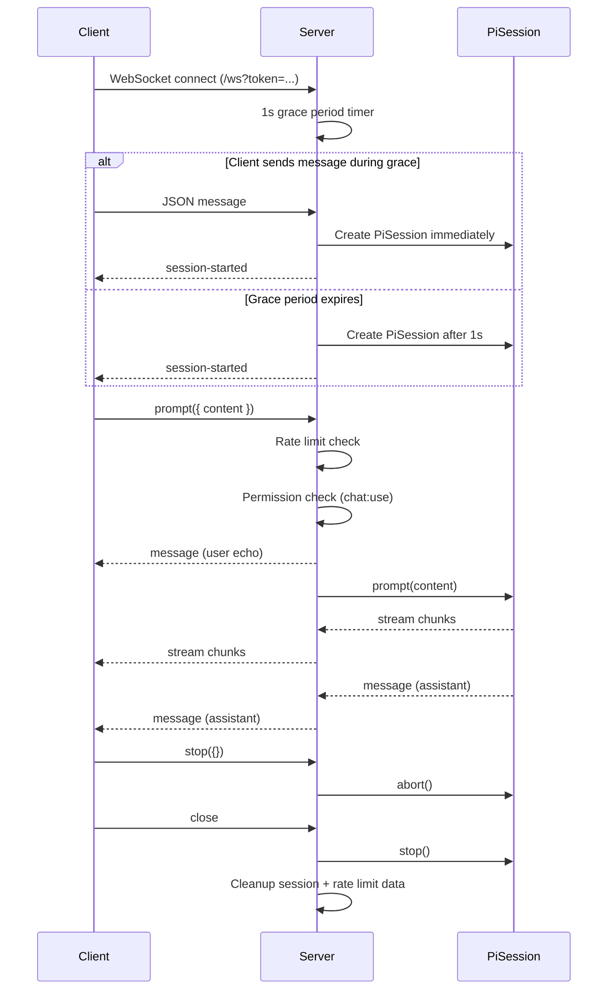

# Server (Express + WebSocket)

**Tags:** `backend`, `express`, `websocket`, `server`, `http`, `api`, `real-time`, `node.js`

## Overview

The server module (`src/backend/server.js`) is the entry point for the Betty backend. It combines an Express.js HTTP server with a WebSocket server (`ws` library) to provide both REST API endpoints and real-time communication with the Pi coding agent.

## Responsibilities

- Initialize the SQLite database and seed built-in roles and default admin
- Serve REST API routes (`/api/auth`, `/api/users`, `/api/roles`)
- Manage WebSocket connections at `/ws`
- Create and manage `PiSession` instances per WebSocket client
- Enforce rate limiting (60 messages/60s per client) and message size limits (1MB)
- Serve the built frontend as static files with SPA fallback
- Expose health check (`/health`) and session listing (`/api/sessions`) endpoints

## Configuration

| Environment Variable | Default | Description |
|---|---|---|
| `PORT` | `3001` | HTTP/WebSocket server port |
| `JWT_SECRET` | Random 32-byte hex | JWT signing secret |
| `JWT_EXPIRES_IN` | `24h` | JWT token expiration |

## WebSocket Protocol

### Client-to-Server Messages

| Type | Payload | Description |
|---|---|---|
| `prompt` | `{ content: string }` | Send a message to Pi |
| `stop` | `{}` | Abort the current response |
| `delete-message` | `{ role: string, content: string }` | Remove a message from context |
| `new-session` | `{}` | Start a fresh Pi session |

### Server-to-Client Messages

| Type | Payload | Description |
|---|---|---|
| `session-started` | `{ sessionId: string }` | New Pi session created |
| `auth-ok` | `{ user: { id, username, role } }` | Authentication confirmed |
| `message` | `{ role: string, content: string }` | Complete message (user echo or assistant response) |
| `stream` | `{ content: string }` | Incremental text chunk from Pi |
| `status` | `{ status: string }` | Session status (`starting`, `ready`, `error`) |
| `tool-call` | `{ toolName, toolCallId, args }` | Pi invoked a tool |
| `tool-result` | `{ toolName, toolCallId, result, isError }` | Tool execution completed |
| `error` | `{ message: string }` | Error occurred |

## Connection Lifecycle

## Rate Limiting

- **Limit:** 60 messages per client per 60-second window
- **Enforcement:** Sliding window per WebSocket connection
- **Action on exceed:** Returns `error` message, does not disconnect

## Session Cleanup

- Expired database sessions are cleaned up every hour via `cleanupExpiredSessions()`
- WebSocket disconnections trigger immediate `PiSession.stop()` and Map cleanup

## REST Endpoints

| Method | Path | Description | Auth Required |
|---|---|---|---|
| `GET` | `/health` | Health check | No |
| `GET` | `/api/sessions` | List active WebSocket sessions | No |

## Related

- [[PiSession]] — The Pi agent session wrapper
- [[WebSocket Auth]] — Token extraction and validation for WebSocket
- [[Auth Middleware]] — HTTP authentication middleware
- [[Database]] — SQLite schema and initialization
