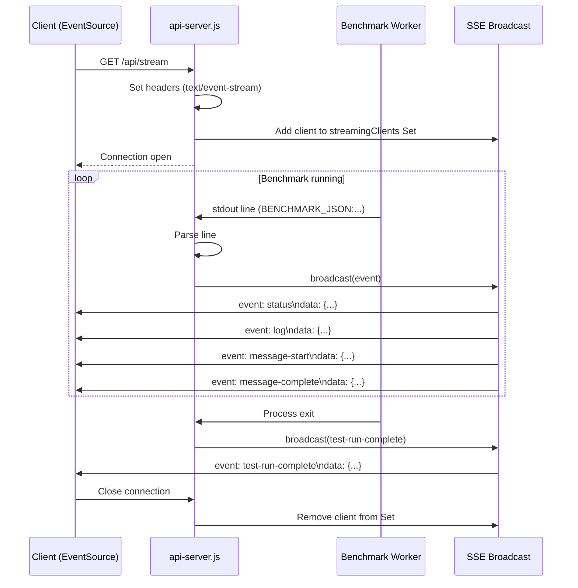

# Server-Sent Events (SSE)

Real-time event streaming from the backend to connected clients. Used for benchmark logs, build output, download progress, and Pi agent sessions.

**Source:** `src/backend/api-server.js` (SSE endpoints and broadcast logic)

See also: [[backend/api-server]] • [[backend/benchmark-runner]]

## Overview

SSE provides a unidirectional, persistent HTTP connection from server to client. The server pushes events as they occur; the client receives them in real-time without polling.



## Benchmark Stream Endpoint

### `GET /api/stream`

Opens an SSE connection for live benchmark data.

**Response headers:**
```
Content-Type: text/event-stream
Cache-Control: no-cache
Connection: keep-alive
```

**No authentication required** — any connected client can subscribe.

### Client Usage

```javascript
const eventSource = new EventSource('/api/stream');

eventSource.addEventListener('status', (e) => {
  const data = JSON.parse(e.data);
  console.log('Status:', data.status, 'Run:', data.currentTestRun);
});

eventSource.addEventListener('results', (e) => {
  const results = JSON.parse(e.data);
  console.log('New results:', results.length);
});

eventSource.addEventListener('log', (e) => {
  console.log('Log:', e.data);
});

eventSource.addEventListener('message-start', (e) => {
  const data = JSON.parse(e.data);
  console.log('Sending prompt:', data.prompt);
});

eventSource.addEventListener('message-complete', (e) => {
  const data = JSON.parse(e.data);
  console.log('Tokens:', data.generatedTokens, 'Time:', data.predictedTimeMs);
});

eventSource.addEventListener('test-run-complete', (e) => {
  const data = JSON.parse(e.data);
  console.log('Run', data.testRunId, 'complete');
});

eventSource.addEventListener('heartbeat', (e) => {
  // Keep-alive ping
});
```

## Event Types

### `status`

Benchmark status update.

```json
{
  "status": "testing",
  "currentTestRun": 42,
  "totalTestRuns": 120
}
```

**Status values:** `idle`, `building`, `testing`, `error`, `stopped`

### `results`

Updated results array after each test run completes.

```json
[
  {
    "testRunId": 1,
    "contextLength": 2048,
    "batchSize": 64,
    "uBatchSize": 8,
    "averages": {
      "avgPromptTokensPerSec": 150.5,
      "avgGenTokensPerSec": 45.2
    }
  }
]
```

### `log`

Raw log line from the benchmark process.

```
data: [2024-01-01 12:00:00] Starting test run 42/120...
```

### `message-start`

A chat message is being sent to llama-server.

```json
{
  "testRunId": 42,
  "messageIndex": 0,
  "prompt": "What is the capital of France?"
}
```

### `message-complete`

A chat message response was received with timing data.

```json
{
  "testRunId": 42,
  "messageIndex": 0,
  "promptTokens": 15,
  "generatedTokens": 120,
  "promptTimeMs": 50,
  "predictedTimeMs": 200,
  "promptTokensPerSec": 300,
  "generatedTokensPerSec": 600
}
```

### `test-run-complete`

All 4 messages for a test run are complete. Includes full parameter set and averages.

```json
{
  "testRunId": 42,
  "contextLength": 4096,
  "batchSize": 64,
  "uBatchSize": 8,
  "gpuLayers": 35,
  "messageResults": [...],
  "averages": {
    "totalPromptTokens": 120,
    "totalGeneratedTokens": 960,
    "totalTimeMs": 3200,
    "avgPromptTokensPerSec": 150.5,
    "avgGenTokensPerSec": 45.2
  }
}
```

### `heartbeat`

Periodic keep-alive event to prevent connection timeout. No data payload.

## Client Management

### `streamingClients` — Set of Connected Clients

```javascript
const streamingClients = new Set();
```

Each connected SSE client stores its Express `res` object in the set.

### Connection Lifecycle

1. **Connect:** Client opens `/api/stream`, `res` is added to `streamingClients`
2. **Active:** Client receives broadcast events
3. **Disconnect:** Client closes connection or network drops, `res` is removed from `streamingClients`
4. **Cleanup:** `on('close')` and `on('error')` handlers remove the client

### Disconnect Detection

```javascript
res.on('close', () => {
  streamingClients.delete({ res });
});
res.on('error', () => {
  streamingClients.delete({ res });
});
```

## Broadcast Mechanism

`broadcast(eventType, data)` sends an event to all connected SSE clients:

```javascript
function broadcast(eventType, data) {
  const payload = typeof data === 'string' ? data : JSON.stringify(data);
  for (const { res } of streamingClients) {
    try {
      res.write(`event: ${eventType}\n`);
      res.write(`data: ${payload}\n\n`);
      safeFlush(res);
    } catch (err) {
      streamingClients.delete({ res });
    }
  }
}
```

### `safeFlush(res)`

Express 4 workaround for SSE flushing. Ensures data reaches the client immediately:

```javascript
function safeFlush(res) {
  if (res.socket && res.socket.writable) {
    res.flush ? res.flush() : res.socket.write('');
  }
}
```

## Other SSE Endpoints

Beyond the benchmark stream, several endpoints use SSE for real-time progress:

### Build Output — `POST /api/build`

Streams cmake and make output in real-time.

```
event: log
data: -- Configuring done
data: -- Generating done
data: [ 15%] Building CXX CMakeFiles/llama-server.dir/server.cpp.o
```

### Git Clone — `POST /api/clone`

Streams git clone/pull output.

### HuggingFace Download — `POST /api/hf/download`

Streams download progress.

```json
event: progress
{
  "modelId": "user/model",
  "filename": "model.gguf",
  "downloaded": 5368709120,
  "total": 10737418240,
  "percentage": 50.0
}
```

### Library Import — `POST /api/library/import`

Streams import progress as files are extracted.

### Pi Agent Session — `GET /api/pi/session/:id/stream`

Streams Pi agent output for a specific session.

```json
event: message
{ "content": "Thinking..." }
event: complete
{ "sessionId": "abc123" }
```

## Token Parameter for SSE

SSE connections cannot set custom headers. Authenticated SSE endpoints accept the JWT token as a query parameter:

```
GET /api/pi/session/:id/stream?token=eyJhbG...
```

The auth middleware checks both `Authorization: Bearer <token>` and `?token=<token>`.

## Error Handling

- Broken pipe errors during broadcast remove the client from the set
- Client disconnections are detected via `close` and `error` events
- No retry logic on the server — the client's `EventSource` handles reconnection automatically
- If all clients disconnect, the server continues running (benchmark is independent of SSE clients)
