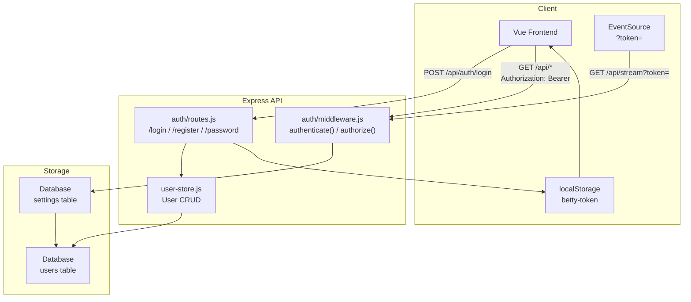
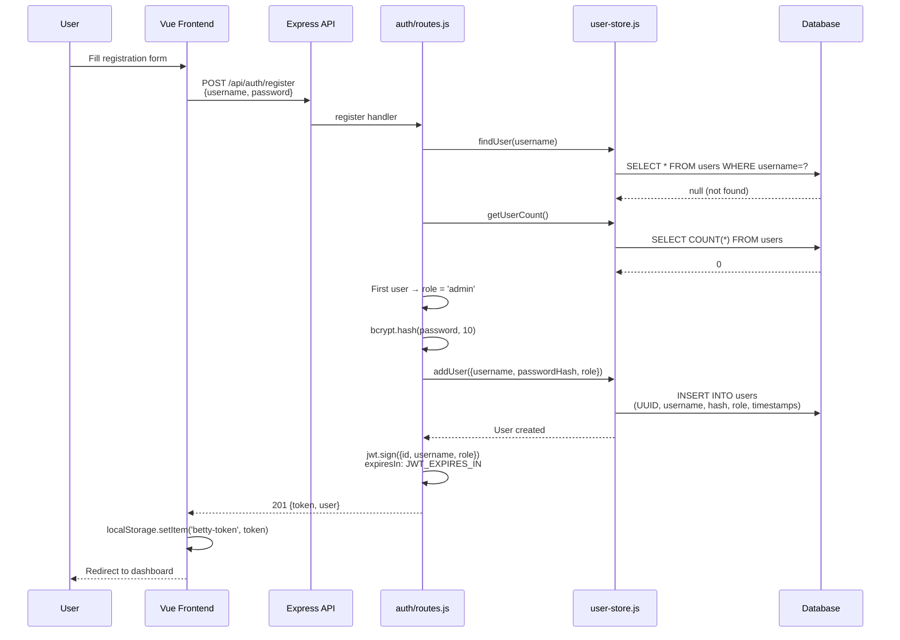
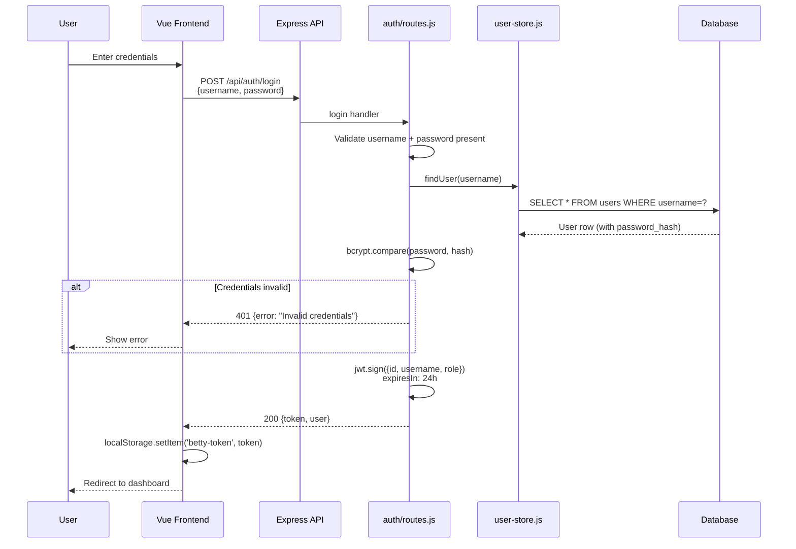
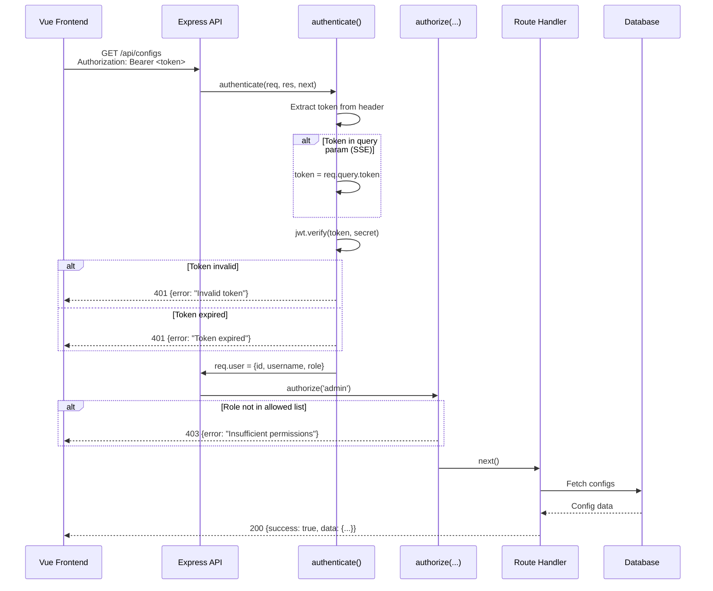

# Authentication Flow

> **Purpose:** Deep dive into Betty's authentication system — JWT token lifecycle, role-based access control, password management, token expiry, and the auth middleware chain.

---

## Table of Contents

- [Overview](#overview)
- [Authentication Flow](#authentication-flow)
- [JWT Token Lifecycle](#jwt-token-lifecycle)
- [Role-Based Access Control](#role-based-access-control)
- [Token Expiry and Refresh](#token-expiry-and-refresh)
- [Auth Endpoints](#auth-endpoints)
- [Public vs Protected Routes](#public-vs-protected-routes)
- [Security Considerations](#security-considerations)
- [Cross-References](#cross-references)

---

## Overview

Betty uses **JWT (JSON Web Tokens)** for stateless authentication. Tokens are issued on login or registration, stored in `localStorage`, and sent with every API request via the `Authorization: Bearer <token>` header. For SSE connections (which can't use custom headers), the token is passed as a query parameter.



### Key Components

| Component | File | Responsibility |
|-----------|------|---------------|
| Auth Middleware | `auth/middleware.js` | JWT validation, role checks |
| Auth Routes | `auth/routes.js` | Login, register, password change, user CRUD |
| User Store | `auth/user-store.js` | User CRUD operations, bcrypt hashing |
| JWT Secret | `settings` table | Stored as `jwt-secret` key |
| Token Storage | `localStorage` | Key: `betty-token` |

---

## Authentication Flow

### Registration

First user registration automatically receives the `admin` role:



### Login



### Protected Request

Every API request (except public routes) passes through the auth middleware:



---

## JWT Token Lifecycle

### Token Structure

```javascript
// Payload signed with jwt.sign()
{
  id: "uuid-v4",
  username: "admin",
  role: "admin"
}

// Options
{
  expiresIn: "24h"  // configurable via JWT_EXPIRES_IN
}
```

### Token Extraction

The middleware checks two sources, in order:

1. **`Authorization: Bearer <token>`** header — standard HTTP auth
2. **`?token=<token>`** query parameter — for SSE (EventSource doesn't support custom headers)

```javascript
// auth/middleware.js
function authenticate(req, res, next) {
  const authHeader = req.headers.authorization;
  let token = null;

  if (authHeader && authHeader.startsWith("Bearer ")) {
    token = authHeader.slice(7);
  }

  if (!token && req.query.token) {
    token = req.query.token;
  }
  // ... verify token
}
```

### Token Storage (Client-Side)

The token is stored in `localStorage` under the key `betty-token`:

```javascript
// On login/register success
localStorage.setItem('betty-token', token);

// On every API request
headers: { 'Authorization': `Bearer ${localStorage.getItem('betty-token')}` }

// On SSE connection
const token = localStorage.getItem('betty-token');
const url = `/api/stream${token ? `?token=${encodeURIComponent(token)}` : ''}`;

// On logout
localStorage.removeItem('betty-token');
```

### Secret Management

The JWT signing secret is managed as follows:

1. **Database** (`settings` table, key `jwt-secret`) — primary source
2. **File** (`~/.betty/jwt-secret`) — fallback for migration
3. **Auto-generated** — 96-char hex string via `crypto.randomBytes(48)`

On startup, the secret is loaded from the database. If not found, it tries the file. If neither exists, a new secret is generated and persisted to both locations.

---

## Role-Based Access Control

### Roles

| Role | Access Level |
|------|-------------|
| `admin` | Full access — all endpoints, user management, config editing |
| `operator` | Run benchmarks, save reports, manage profiles and services |
| `viewer` | Read-only — view configs, reports, status, models |

### Authorization Middleware

The `authorize()` middleware is a factory that accepts one or more allowed roles:

```javascript
function authorize(...allowedRoles) {
  return (req, res, next) => {
    if (!req.user) {
      return res.status(401).json({ success: false, error: "Authentication required" });
    }
    if (!allowedRoles.includes(req.user.role)) {
      return res.status(403).json({
        success: false,
        error: `Insufficient permissions. Required: ${allowedRoles.join(" or ")}`,
      });
    }
    next();
  };
}
```

### Route Permissions

| Endpoint | Method | Required Role |
|----------|--------|---------------|
| `/api/configs` | GET | Any (viewer+) |
| `/api/configs` | PUT | admin |
| `/api/run` | POST | admin, operator |
| `/api/stop` | POST | admin, operator |
| `/api/save-report` | POST | admin, operator |
| `/api/report/:name` | DELETE | admin |
| `/api/profile` | POST | admin, operator |
| `/api/profile/:name` | DELETE | admin |
| `/api/profile/:name/load` | POST | admin, operator |
| `/api/service-profile` | POST | admin, operator |
| `/api/service-profile/:name` | DELETE | admin |
| `/api/service-profile/:name/load` | POST | admin, operator |
| `/api/auth/login` | POST | Public |
| `/api/auth/register` | POST | Public |
| `/api/auth/password` | PUT | Any authenticated |
| `/api/auth/me` | GET | Any authenticated |
| `/api/auth/users` | GET | admin |
| `/api/auth/users/:username` | PUT | admin |
| `/api/auth/users/:username` | DELETE | admin |

### Optional Auth

The `optionalAuth` middleware validates the token if present but doesn't reject unauthenticated requests. Used for routes that work with or without authentication:

```javascript
function optionalAuth(req, res, next) {
  // Try to verify token, but set req.user = null on failure
  // Always calls next()
}
```

---

## Token Expiry and Refresh

### Expiry Configuration

| Setting | Default | Description |
|---------|---------|-------------|
| `JWT_EXPIRES_IN` | `"24h"` | Token lifetime (env var) |
| `BETTY_AUTH_ENABLED` | `true` | Enable/disable auth (env var) |

### Expiry Handling

When a token expires, the middleware returns a `401` with `"Token expired"`:

```javascript
try {
  const decoded = jwt.verify(token, secret);
  req.user = { id: decoded.id, username: decoded.username, role: decoded.role };
  next();
} catch (err) {
  if (err.name === "TokenExpiredError") {
    return res.status(401).json({ success: false, error: "Token expired" });
  }
  return res.status(401).json({ success: false, error: "Invalid token" });
}
```

### Client-Side Refresh

The frontend does **not** implement automatic token refresh. When a 401 is received:

1. The store action catches the error
2. The user is redirected to the login page
3. After re-login, a new token is issued

### Default Admin Account

On first startup (when no users exist), a default admin account is created:

```javascript
const adminPassword = process.env.ADMIN_PASSWORD || "admin";
const passwordHash = bcrypt.hashSync(adminPassword, 10);
await addUser({ username: "admin", passwordHash, role: "admin" });
```

The password can be set via the `ADMIN_PASSWORD` environment variable. The default is `admin` (with a warning logged).

---

## Auth Endpoints

### POST /api/auth/login

Authenticate and receive a JWT token.

**Request:**
```json
{ "username": "admin", "password": "secret" }
```

**Response (200):**
```json
{
  "success": true,
  "data": {
    "token": "eyJhbGciOiJIUzI1NiIs...",
    "user": { "id": "uuid", "username": "admin", "role": "admin" }
  }
}
```

### POST /api/auth/register

Register a new user. First user becomes admin.

**Request:**
```json
{ "username": "newuser", "password": "secret123" }
```

**Response (201):**
```json
{
  "success": true,
  "data": {
    "token": "eyJhbGciOiJIUzI1NiIs...",
    "user": { "id": "uuid", "username": "newuser", "role": "viewer" }
  }
}
```

### PUT /api/auth/password

Change the current user's password.

**Request:**
```json
{ "currentPassword": "old", "newPassword": "new12345678" }
```

**Response (200):**
```json
{ "success": true, "message": "Password changed successfully" }
```

### GET /api/auth/me

Get the current authenticated user's info.

**Response (200):**
```json
{
  "success": true,
  "data": { "id": "uuid", "username": "admin", "role": "admin" }
}
```

### GET /api/auth/users (admin only)

List all users (without password hashes).

### PUT /api/auth/users/:username (admin only)

Update user role or password.

### DELETE /api/auth/users/:username (admin only)

Delete a user. Cannot delete self.

---

## Public vs Protected Routes

### Public Routes (no auth required)

| Route | Purpose |
|-------|---------|
| `/api/auth/login` | User login |
| `/api/auth/register` | User registration |
| `/api/health` | Health check |
| `/api/docs/*` | Documentation |
| `/api/library/*` | Research library (read) |
| `/api/pi/skills/*` | Pi skills |

### Protected Routes (auth required)

All other `/api/*` routes require a valid JWT token. Routes with `authorize()` additionally check roles.

### Auth Middleware Registration

```javascript
// api-server.js
if (AUTH_ENABLED) {
  app.use("/api", (req, res, next) => {
    const exempt = [
      "/auth/login", "/auth/register",
      "/health", "/docs", "/library", "/pi/skills",
    ];
    if (req.path === "/library/export" || req.path === "/library/import") {
      authenticate(req, res, next);
      return;
    }
    if (exempt.some((p) => req.path === p || req.path.startsWith(p + "/"))) return next();
    authenticate(req, res, next);
  });
}
```

Note: Library export/import endpoints require auth even though `/library/*` is exempt.

---

## Security Considerations

| Aspect | Implementation |
|--------|---------------|
| Password hashing | bcrypt with cost factor 10 |
| Token signing | JWT HS256 with 96-char random secret |
| Secret storage | Database `settings` table, auto-generated on first run |
| Token expiry | 24 hours (configurable) |
| Role enforcement | Middleware chain: `authenticate()` → `authorize(...roles)` |
| CORS | Configurable via `CORS_ORIGIN` env var |
| Self-deletion prevention | Admin cannot delete own account |
| First-user admin | First registration auto-promoted to admin |

---

## Cross-References

### Related Concepts
- concepts/data-flow]] — How auth fits into the request/response flow
- concepts/config-schema]] — Configuration (protected by auth)
- concepts/grid-search]] — Benchmark execution (protected by auth)

### Architecture
- architecture]] — System architecture overview
- api-reference]] — API documentation

### QA Guides
- qa/getting-started]] — Installation and first run (includes auth setup)
- qa/troubleshooting]] — Common issues including auth problems
