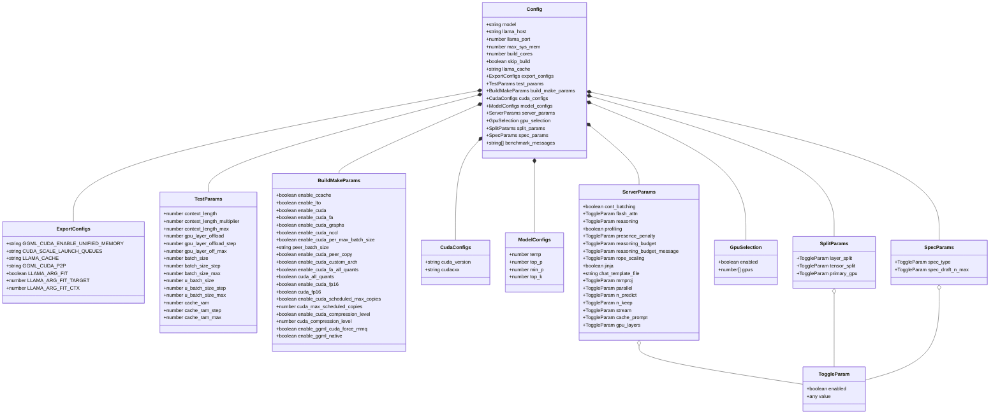

# Configuration Schema

> **Purpose:** Complete reference for the `configs.json` structure — all sections, fields, default values, and how they map to cmake flags, llama-server arguments, and benchmark parameters.

---

## Table of Contents

- [Overview](#overview)
- [Schema Diagram](#schema-diagram)
- [Section Reference](#section-reference)
- [Default Values](#default-values)
- [Deep Merge Behavior](#deep-merge-behavior)
- [Cross-References](#cross-references)

---

## Overview

All benchmark configuration is stored in a single JSON structure, persisted in the `configs` database table (single row, `id=1`). On every load, the stored config is **deep-merged** with `DEFAULT_CONFIGS` so new keys are auto-added without overwriting user values.

The config is organized into logical sections, each controlling a different aspect of the benchmark:

| Section | Controls |
|---------|----------|
| `export_configs` | CUDA environment variables |
| `test_params` | Grid search parameters |
| `build_make_params` | CMake build flags |
| `cuda_configs` | CUDA toolkit settings |
| `model_configs` | Sampling parameters |
| `server_params` | llama-server runtime flags |
| `gpu_selection` | Multi-GPU device selection |
| `split_params` | Layer/tensor split for multi-GPU |
| `spec_params` | Speculative decoding |
| `benchmark_messages` | Test prompts |
| Top-level fields | Server address, model path, build settings |

---

## Schema Diagram



---

## Section Reference

### Top-Level Fields

| Field | Type | Default | Description |
|-------|------|---------|-------------|
| `model` | string | `""` | Model filename (resolved from `~/.betty/models/`) |
| `llama_host` | string | `"localhost"` | llama-server hostname |
| `llama_port` | number | `11434` | llama-server port |
| `max_sys_mem` | number | `93` | System memory threshold (%) — aborts if exceeded |
| `build_cores` | number | `1` | CPU cores for cmake build |
| `skip_build` | boolean | `false` | Skip cmake/make on benchmark start |
| `llama_cache` | string | `"llama_cache"` | Cache directory for llama.cpp |

### export_configs

CUDA environment variables exported to the build and runtime environment:

| Field | Default | Description |
|-------|---------|-------------|
| `GGML_CUDA_ENABLE_UNIFIED_MEMORY` | `"1"` | Enable unified memory for GPU |
| `CUDA_SCALE_LAUNCH_QUEUES` | `"4x"` | Scale launch queue multiplier |
| `LLAMA_CACHE` | `""` | Override cache directory path |
| `GGML_CUDA_P2P` | `"on"` | Peer-to-peer GPU memory access |
| `LLAMA_ARG_FIT` | `true` | Enable model fitting |
| `LLAMA_ARG_FIT_TARGET` | — | Target size for model fitting |
| `LLAMA_ARG_FIT_CTX` | — | Context size for model fitting |

### test_params

Grid search parameters. Each parameter defines a **start value**, **step** (or multiplier), and **max value**. The benchmark generates all values in the range and computes the cartesian product.

| Field | Default | Step/Multiplier | Max | Description |
|-------|---------|-----------------|-----|-------------|
| `context_length` | `32768` | ×2 (multiplicative) | `262144` | Context window size |
| `context_length_multiplier` | `2` | — | — | Multiplier for context scaling |
| `gpu_layer_offload` | `999` | `0` | `999` | Number of layers on GPU |
| `gpu_layer_offload_step` | `0` | — | — | Step for GPU layer offload |
| `gpu_layer_off_max` | `999` | — | — | Max GPU layer offload |
| `batch_size` | `128` | `128` | `16384` | Server batch size |
| `batch_size_step` | `128` | — | — | Step for batch size |
| `batch_size_max` | `16384` | — | — | Max batch size |
| `u_batch_size` | `64` | `64` | `4096` | User batch size |
| `u_batch_size_step` | `64` | — | — | Step for ubatch size |
| `u_batch_size_max` | `4096` | — | — | Max ubatch size |
| `cache_ram` | `4096` | `1024` | `4096` | RAM cache size (GB) |
| `cache_ram_step` | `1024` | — | — | Step for cache RAM |
| `cache_ram_max` | `4096` | — | — | Max cache RAM |

### build_make_params

CMake build flags. Each flag has an `enable_*` toggle and an optional value.

| Field | Default | Description |
|-------|---------|-------------|
| `enable_ccache` | `true` | Use compiler cache |
| `enable_lto` | `true` | Link-time optimization |
| `enable_cuda` | `true` | CUDA GPU support |
| `enable_cuda_fa` | `true` | Flash attention |
| `enable_cuda_graphs` | `true` | CUDA graph capture |
| `enable_cuda_nccl` | `true` | Multi-GPU NCCL |
| `enable_cuda_per_max_batch_size` | `true` | Per-max batch size |
| `peer_batch_size` | `"512"` | Batch size for peer copy |
| `enable_cuda_peer_copy` | `true` | GPU peer-to-peer memory |
| `enable_cuda_custom_arch` | `true` | Custom CUDA architecture |
| `enable_cuda_fa_all_quants` | `true` | Flash attention all quants |
| `cuda_all_quants` | `true` | CUDA all quantization types |
| `enable_cuda_fp16` | `true` | FP16 precision |
| `cuda_fp16` | `true` | FP16 value |
| `enable_cuda_scheduled_max_copies` | `true` | Scheduled copies |
| `cuda_max_scheduled_copies` | `14` | Max scheduled copies |
| `enable_cuda_compression_level` | `false` | Compression level |
| `cuda_compression_level` | `0` | Compression level value |
| `enable_ggml_cuda_force_mmq` | `false` | Force MMQ |
| `enable_ggml_native` | `false` | Native GGML |

### cuda_configs

| Field | Default | Description |
|-------|---------|-------------|
| `cuda_version` | `"12.6"` | CUDA toolkit version |
| `cudacxx` | `"/usr/local/cuda/bin/nvcc"` | NVCC compiler path |

### model_configs

Sampling parameters passed to llama-server:

| Field | Default | Description |
|-------|---------|-------------|
| `temp` | `0.6` | Temperature |
| `top_p` | `0.95` | Nucleus sampling threshold |
| `min_p` | `0` | Minimum probability threshold |
| `top_k` | `20` | Top-K sampling |

### server_params

llama-server runtime flags. Toggle parameters use `{enabled, value}` pairs:

| Field | Default | Description |
|-------|---------|-------------|
| `cont_batching` | `true` | Continuous batching |
| `flash_attn` | `{enabled: true, value: 1}` | Flash attention level |
| `reasoning` | `{enabled: true, value: 1}` | Reasoning mode |
| `profiling` | `true` | Enable profiling |
| `presence_penalty` | `{enabled: true, value: 0}` | Presence penalty |
| `reasoning_budget` | `{enabled: true, value: 2048}` | Reasoning token budget |
| `reasoning_budget_message` | `{enabled: true, value: "Proceed to final answer."}` | Budget message |
| `rope_scaling` | `{enabled: true, value: "yarn"}` | RoPE scaling method |
| `jinja` | `false` | Jinja template support |
| `chat_template_file` | `""` | Path to chat template file |
| `mmproj` | `{enabled: false, value: ""}` | Multimodal projector |
| `parallel` | `{enabled: true, value: 1}` | Parallel requests |
| `n_predict` | `{enabled: false, value: 512}` | Max predicted tokens |
| `n_keep` | `{enabled: false, value: 0}` | Tokens to keep |
| `stream` | `{enabled: true, value: false}` | Streaming mode |
| `cache_prompt` | `{enabled: true, value: true}` | Prompt caching |
| `gpu_layers` | `{enabled: true, value: 999}` | GPU layer count |

### gpu_selection

Multi-GPU device selection:

| Field | Default | Description |
|-------|---------|-------------|
| `enabled` | `true` | Enable GPU selection |
| `gpus` | `[0]` | Array of GPU indices |

When multiple GPUs are selected, `tensor_split` is auto-calculated as equal weights (e.g., `[0, 1]` → `"50,50"`).

### split_params

Multi-GPU splitting configuration:

| Field | Default | Description |
|-------|---------|-------------|
| `layer_split.enabled` | `false` | Enable layer splitting |
| `layer_split.value` | `"layer"` | Split mode |
| `tensor_split.enabled` | `false` | Enable tensor splitting |
| `tensor_split.value` | `"16,12,12"` | Tensor split ratios |
| `primary_gpu.enabled` | `false` | Set primary GPU |
| `primary_gpu.value` | `0` | Primary GPU index |

### spec_params

Speculative decoding parameters:

| Field | Default | Description |
|-------|---------|-------------|
| `spec_type.enabled` | `false` | Enable speculative decoding |
| `spec_type.value` | `"draft-mtp"` | Speculative decoding type |
| `spec_draft_n_max.enabled` | `false` | Enable draft token limit |
| `spec_draft_n_max.value` | `3` | Maximum draft tokens |

### benchmark_messages

Array of messages sent sequentially per test run. Each message accumulates context with prior messages and responses:

```json
[
  "Develop a design doc for a self-hosted tetris clone web-based game.",
  "Audit the design doc.",
  "Recommend optimizations.",
  "Create a social-media marketing campaign for it."
]
```

---

## Default Values

The complete `DEFAULT_CONFIGS` object is defined in `api-server.js` and applied on startup via `syncConfigDefaults()`. Any missing keys in the stored config are filled in from defaults using a recursive deep merge.

Key defaults:

- `max_sys_mem`: `93` (percent)
- `llama_port`: `11434`
- `llama_host`: `"localhost"`
- `build_cores`: `1`
- `skip_build`: `false`
- `context_length`: `32768` (start), `×2` (multiplier), `262144` (max)
- `batch_size`: `128` (start), `128` (step), `16384` (max)
- `u_batch_size`: `64` (start), `64` (step), `4096` (max)
- `cache_ram`: `4096` (start), `1024` (step), `4096` (max)
- `temp`: `0.6`, `top_p`: `0.95`, `min_p`: `0`, `top_k`: `20`
- `cuda_version`: `"12.6"`

---

## Deep Merge Behavior

The `deepMerge()` function recursively adds missing keys from `DEFAULT_CONFIGS` into the stored config:

```javascript
function deepMerge(target, defaults) {
  for (const key of Object.keys(defaults)) {
    if (!(key in target)) {
      target[key] = JSON.parse(JSON.stringify(defaults[key]));
    } else if (both are plain objects) {
      deepMerge(target[key], defaults[key]);
    }
  }
}
```

This means:
- **New keys** added to defaults are auto-inserted into existing configs
- **Existing user values** are never overwritten
- **Nested objects** are merged recursively
- **Arrays** are replaced wholesale (not merged element-by-element)

---

## Cross-References

### Related Concepts
- concepts/data-flow]] — How config flows through the system
- concepts/grid-search]] — How test_params drive grid search
- concepts/auth-flow]] — Auth middleware protecting config endpoints

### Architecture
- architecture]] — System architecture overview
- config]] — Configuration UI overview
- configuration-reference]] — Configuration reference

### QA Guides
- qa/profile-workflow]] — Config and service profiles
- qa/benchmark-workflow]] — Running benchmarks
