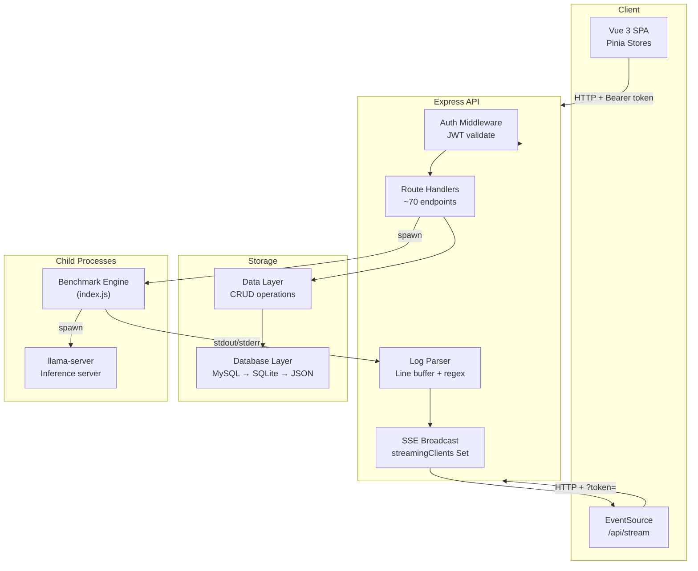
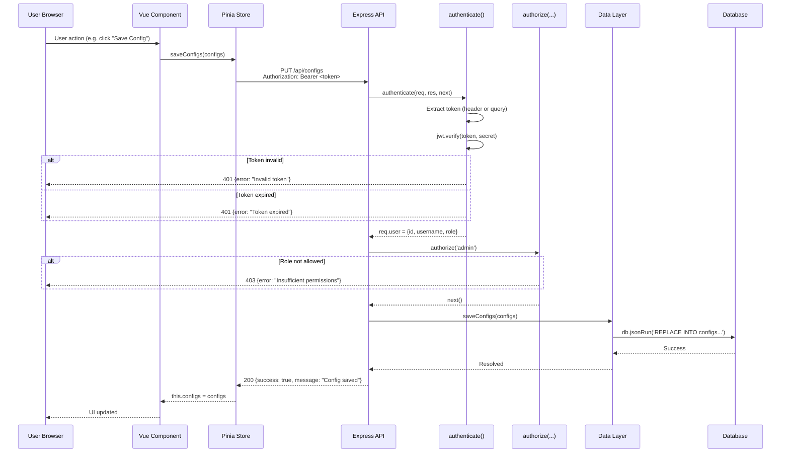
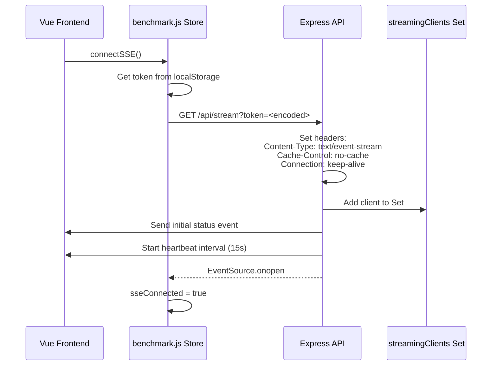
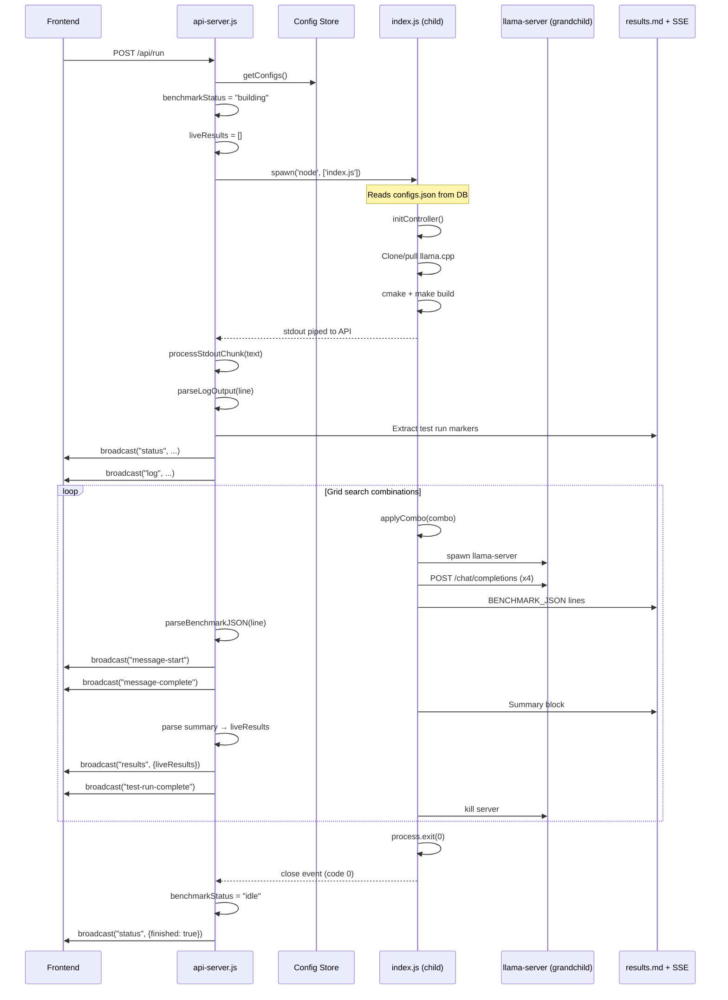
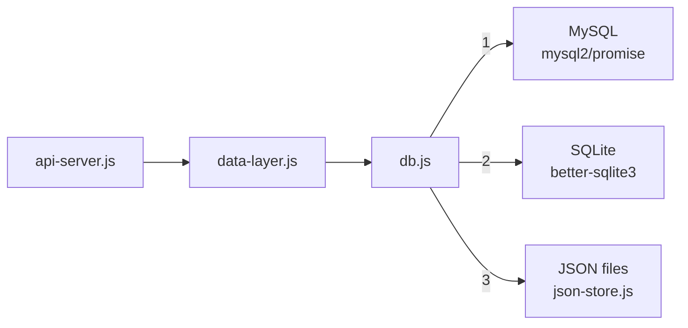

# Data Flow

> **Purpose:** Detailed analysis of how data moves through Betty — from frontend user actions to API requests, database operations, benchmark execution, and real-time streaming back to the client.

---

## Table of Contents

- [Overview](#overview)
- [Standard API Request/Response](#standard-api-requestresponse)
- [SSE Streaming Path](#sse-streaming-path)
- [Benchmark Process Spawning](#benchmark-process-spawning)
- [Database Access Pattern](#database-access-pattern)
- [Cross-References](#cross-references)

---

## Overview

Betty follows a layered architecture: **Vue 3 frontend** → **Express API** → **Database (MySQL/SQLite/JSON)** → **child processes** (benchmark engine, llama-server). Data flows through these layers via HTTP requests, SSE streams, and stdout/stderr pipes.



---

## Standard API Request/Response

Every non-streaming API call follows this path:



### Request Flow Details

| Step | Component | Action |
|------|-----------|--------|
| 1 | Vue Component | User interacts with UI, dispatches store action |
| 2 | Pinia Store | `axios.get/post/put/delete` to API endpoint |
| 3 | Express API | Route handler receives request |
| 4 | Auth Middleware | Validates JWT, attaches `req.user` |
| 5 | RBAC Middleware | Checks `req.user.role` against allowed roles |
| 6 | Route Handler | Business logic — reads/writes data |
| 7 | Data Layer | `db.jsonGet()`, `db.jsonAll()`, `db.jsonRun()` |
| 8 | Database | MySQL, SQLite, or JSON file backend |
| 9 | Response | JSON `{success, data?, error?}` back to store |
| 10 | Pinia Store | Updates reactive state |
| 11 | Vue Component | Reactive UI update |

### Response Format

All API endpoints return a consistent envelope:

```json
{
  "success": true,
  "data": { ... },
  "message": "Optional message"
}
```

On error:

```json
{
  "success": false,
  "error": "Error description"
}
```

---

## SSE Streaming Path

Betty uses **Server-Sent Events (SSE)** for real-time updates during benchmark execution, builds, and downloads. The SSE connection is established once per page load and maintained throughout the session.

### Connection Establishment



### Event Types

| Event | Payload | Triggered By |
|-------|---------|-------------|
| `status` | `{status, testRun, liveResults, processAlive, finished?}` | State transitions, test run start |
| `results` | `{liveResults}` | After each test run summary parsed |
| `log` | `{type: "stdout"\|"stderr", text, status, testRun, liveResults}` | Every stdout/stderr chunk from benchmark |
| `message-start` | `{testRunId, messageIndex, prompt}` | Before each chat request |
| `message-complete` | `{testRunId, messageIndex, prompt, response, promptTokens, generatedTokens, totalTimeMs}` | After each chat response |
| `test-run-complete` | `{testRunId, messages, processAlive}` | After all messages in a test run |
| `heartbeat` | `{ts}` | Every 15 seconds |

### Broadcast Mechanism

```javascript
// api-server.js
let streamingClients = new Set();

function broadcast(event, data) {
  for (const client of streamingClients) {
    sendToClient(client, event, data);
  }
}

function sendToClient(client, event, data) {
  if (!streamingClients.has(client)) return;
  const msg = `event: ${event}\ndata: ${JSON.stringify(data)}\n\n`;
  client.res.write(msg);
  safeFlush(client.res);
}
```

Clients are removed from the Set on connection close or write error. The `safeFlush()` helper handles both Express 4 (no `res.flush()`) and Express 5.

### Client-Side Event Handling

The Pinia store registers listeners for each event type:

```javascript
eventSource.addEventListener('status', (e) => {
  const data = JSON.parse(e.data);
  this.status = data.status;
  this.testRun = data.testRun;
  this.liveResults = data.liveResults || [];
});

eventSource.addEventListener('log', (e) => {
  const data = JSON.parse(e.data);
  this.logs.push({ type: data.type, text: data.text, timestamp: Date.now() });
});
```

Reconnection is handled automatically by EventSource, with a 20-second timeout before forcing a manual reconnect.

---

## Benchmark Process Spawning

The benchmark engine (`index.js`) runs as a **separate child process**, spawned by the API server when a benchmark is started. This isolation ensures the API server remains responsive during long-running benchmarks.

### Spawn Flow



### Process Lifecycle

| State | Value | Meaning |
|-------|-------|---------|
| `idle` | Initial | No benchmark running |
| `building` | After POST /api/run | Build phase (cmake + make) |
| `testing` | During grid search | Test runs executing |
| `error` | On failure | Process exited non-zero or max errors reached |
| `stopped` | After POST /api/stop | User-initiated stop (SIGTERM → SIGKILL) |

### Output Parsing

The API server parses the benchmark process output line-by-line using a line buffer:

```javascript
let stdoutLineBuffer = "";

function processStdoutChunk(text) {
  stdoutLineBuffer += text;
  const lines = stdoutLineBuffer.split("\n");
  stdoutLineBuffer = lines.pop() || "";
  for (const line of lines) {
    if (line.trim()) parseLogOutput(line);
  }
}
```

The parser recognizes:
- `Test Run #N` markers — updates `currentTestRun`
- `Summary ===` blocks — accumulates metrics across lines
- `BENCHMARK_JSON:` lines — structured JSON events (message-start, message-complete, test-run-complete)
- Metric lines (tokens/sec, memory, time) — extracted via regex

### Stop Mechanism

```javascript
// POST /api/stop
benchmarkProcess.kill("SIGTERM");
setTimeout(() => {
  if (benchmarkProcess && !benchmarkProcess.killed) {
    benchmarkProcess.kill("SIGKILL");
  }
}, 5000);
benchmarkStatus = "stopped";
```

Graceful shutdown (SIGTERM) is attempted first, with SIGKILL as fallback after 5 seconds.

---

## Database Access Pattern

The database layer provides a **unified interface** across three backends:



### Initialization Order

1. **MySQL** — Requires `DB_HOST` env var. Creates connection pool.
2. **SQLite** — Path `~/.betty/betty.db`. WAL mode, foreign keys enabled.
3. **JSON files** — Last resort fallback.

Once initialized, the active backend is used for all subsequent operations. Schema is auto-applied on init.

### Unified Methods

| Method | Purpose | JSON Handling |
|--------|---------|---------------|
| `db.query(sql, params)` | Generic query | Raw values |
| `db.get(sql, params)` | Single row | Raw values |
| `db.all(sql, params)` | All rows | Raw values |
| `db.run(sql, params)` | Insert/update/delete | Raw values |
| `db.jsonGet(sql, params)` | Single row | Parses JSON columns |
| `db.jsonAll(sql, params)` | All rows | Parses JSON columns |
| `db.jsonRun(sql, params, value)` | Insert with JSON | Serializes value |

JSON columns (`value`, `live_results`, `configs_per_run`, `configs`, `data`) are auto-parsed from TEXT for SQLite compatibility.

---

## Cross-References

### Related Concepts
- concepts/config-schema]] — Full configuration structure
- concepts/grid-search]] — Grid search parameter generation
- concepts/auth-flow]] — Authentication and authorization

### Architecture
- architecture]] — System architecture overview
- api-reference]] — API documentation

### QA Guides
- qa/benchmark-workflow]] — Running benchmarks
- qa/report-workflow]] — Saving and viewing reports
