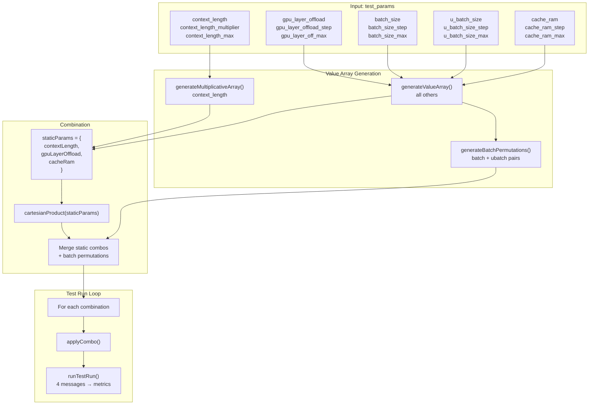

# Grid Search

> **Purpose:** Detailed explanation of Betty's grid search algorithm — how parameter arrays are generated, how the cartesian product is computed, batch permutation constraints, and how combinations map to test runs.

---

## Table of Contents

- [Overview](#overview)
- [Value Array Generation](#value-array-generation)
- [Cartesian Product Computation](#cartesian-product-computation)
- [Batch Permutation Constraint](#batch-permutation-constraint)
- [Complete Example](#complete-example)
- [Combination Application](#combination-application)
- [Performance Considerations](#performance-considerations)
- [Cross-References](#cross-references)

---

## Overview

The grid search engine generates every valid combination of benchmark parameters and runs a full test (4 sequential messages) for each combination. The result is a comprehensive performance matrix showing how context length, GPU layers, batch size, ubatch size, and cache RAM affect throughput.



---

## Value Array Generation

Two generation strategies are used depending on the parameter:

### Multiplicative Generation (context_length only)

Context length uses **exponential growth** via a multiplier, producing values like `32768, 65536, 131072, 262144`:

```javascript
function generateMultiplicativeArray(start, multiplier, max) {
  if (multiplier <= 1 || start === 0 || start > max) {
    return start <= max && start !== 0 ? [start] : [];
  }
  const values = [];
  const maxIterations = 1000; // safety cap
  for (let i = 0; i < maxIterations; i++) {
    if (start > max) break;
    values.push(start);
    start *= multiplier;
  }
  if (values[values.length - 1] !== max) {
    values.push(max);
  }
  return values;
}
```

**Example:** `context_length=32768`, `multiplier=2`, `max=262144`

| Iteration | Value |
|-----------|-------|
| 0 | 32,768 |
| 1 | 65,536 |
| 2 | 131,072 |
| 3 | 262,144 (max reached) |

Result: `[32768, 65536, 131072, 262144]` (4 values)

### Linear Generation (all other parameters)

Linear generation produces evenly-spaced values from start to max:

```javascript
function generateValueArray(start, step, max) {
  if (step === 0 || step === "0") {
    return [start];
  }
  const values = [];
  for (let v = start; v <= max; v += step) {
    values.push(v);
  }
  if (values[values.length - 1] !== max) {
    values.push(max);
  }
  return values;
}
```

**Example:** `batch_size=128`, `step=128`, `max=16384`

Result: `[128, 256, 384, 512, 640, 768, 896, 1024, 1152, 1280, 1408, 1536, 1664, 1792, 1920, 2048, ..., 16384]` (128 values)

**Example with step=0:** `gpu_layer_offload=999`, `step=0`, `max=999`

Result: `[999]` (single value — no variation)

### Edge Cases

| Condition | Behavior |
|-----------|----------|
| `step === 0` | Returns `[start]` (single value) |
| `multiplier <= 1` | Returns `[start]` (prevents infinite loop) |
| `start === 0` | Returns `[start]` or `[0, max]` depending on max |
| `start > max` | Returns `[]` (empty) |
| `maxIterations` exceeded | Loop breaks (safety cap of 1000) |
| Final value not exactly max | Max is appended to ensure coverage |

---

## Cartesian Product Computation

After generating value arrays, the static parameters (contextLength, gpuLayerOffload, cacheRam) are combined via cartesian product:

```javascript
function cartesianProduct(arrays) {
  const keys = Object.keys(arrays);
  const result = [[]];
  for (const key of keys) {
    const values = arrays[key];
    const newResult = [];
    for (const combo of result) {
      for (const val of values) {
        newResult.push([...combo, { key, val }]);
      }
    }
    result.length = 0;
    result.push(...newResult);
  }
  return result;
}
```

Each combination is an array of `{key, val}` pairs. For example:

```javascript
// Input: { contextLength: [512, 1024], gpuLayerOffload: [999], cacheRam: [4096] }
// Output:
[
  [{key: "contextLength", val: 512},  {key: "gpuLayerOffload", val: 999}, {key: "cacheRam", val: 4096}],
  [{key: "contextLength", val: 1024}, {key: "gpuLayerOffload", val: 999}, {key: "cacheRam", val: 4096}],
]
```

The cartesian product grows multiplicatively: if you have 4 context lengths × 3 GPU offload values × 2 cache values, you get 24 static combinations.

---

## Batch Permutation Constraint

Batch size and ubatch size are handled **separately** from the static cartesian product because of a key constraint:

### Constraint: `batchSize >= uBatchSize`

The server batch size must always be greater than or equal to the user batch size. Invalid combinations (where `batchSize < uBatchSize`) are filtered out:

```javascript
function generateBatchPermutations(uBatchSizes, batchSizes) {
  const pairs = [];
  for (const ub of uBatchSizes) {
    for (const b of batchSizes) {
      if (b >= ub) {
        pairs.push({ uBatchSize: ub, batchSize: b });
      }
    }
  }
  return pairs;
}
```

### How It Works

For each `uBatchSize`, only `batchSize` values that are **greater than or equal** to it are included:

```
uBatchSizes = [64, 128]
batchSizes  = [64, 128, 256]

Permutations:
  uBatch=64:  batchSize=64, 128, 256  (3 pairs)
  uBatch=128: batchSize=128, 256       (2 pairs)
  Total: 5 valid pairs
```

Invalid pairs (`uBatch=128, batchSize=64`) are excluded.

### Merging with Static Combinations

Each static combination is paired with every valid batch permutation:

```javascript
const combinations = [];
for (const staticCombo of staticCombinations) {
  for (const batchPerm of batchPermutations) {
    combinations.push([
      ...staticCombo,
      { key: "uBatchSize", val: batchPerm.uBatchSize },
      { key: "batchSize", val: batchPerm.batchSize },
    ]);
  }
}
```

**Total combinations = staticCombinations.length × batchPermutations.length**

---

## Complete Example

Given these test_params:

```json
{
  "context_length": 512,
  "context_length_multiplier": 2,
  "context_length_max": 4096,
  "gpu_layer_offload": 999,
  "gpu_layer_offload_step": 0,
  "gpu_layer_off_max": 999,
  "batch_size": 64,
  "batch_size_step": 64,
  "batch_size_max": 256,
  "u_batch_size": 64,
  "u_batch_size_step": 64,
  "u_batch_size_max": 128,
  "cache_ram": 4096,
  "cache_ram_step": 0,
  "cache_ram_max": 4096
}
```

### Step 1: Generate Value Arrays

| Parameter | Strategy | Values | Count |
|-----------|----------|--------|-------|
| contextLength | Multiplicative (×2) | `[512, 1024, 2048, 4096]` | 4 |
| gpuLayerOffload | Linear (step=0) | `[999]` | 1 |
| batchSize | Linear (step=64) | `[64, 128, 192, 256]` | 4 |
| uBatchSize | Linear (step=64) | `[64, 128]` | 2 |
| cacheRam | Linear (step=0) | `[4096]` | 1 |

### Step 2: Static Cartesian Product

```
staticParams = {
  contextLength: [512, 1024, 2048, 4096],   // 4 values
  gpuLayerOffload: [999],                     // 1 value
  cacheRam: [4096]                            // 1 value
}

staticCombinations = 4 × 1 × 1 = 4
```

### Step 3: Batch Permutations

```
uBatchSizes = [64, 128]
batchSizes  = [64, 128, 192, 256]

Permutations:
  uBatch=64:  batchSize=64, 128, 192, 256    (4 pairs)
  uBatch=128: batchSize=128, 192, 256         (3 pairs)
  Total: 7 valid pairs
```

### Step 4: Final Combination Count

```
Total = staticCombinations × batchPermutations
      = 4 × 7
      = 28 test runs
```

### Step 5: First Few Combinations

```
Run 1: ctx=512,  gpu=999, cache=4096, ubatch=64,  batch=64
Run 2: ctx=512,  gpu=999, cache=4096, ubatch=64,  batch=128
Run 3: ctx=512,  gpu=999, cache=4096, ubatch=64,  batch=192
Run 4: ctx=512,  gpu=999, cache=4096, ubatch=64,  batch=256
Run 5: ctx=512,  gpu=999, cache=4096, ubatch=128, batch=128
Run 6: ctx=512,  gpu=999, cache=4096, ubatch=128, batch=192
Run 7: ctx=512,  gpu=999, cache=4096, ubatch=128, batch=256
Run 8: ctx=1024, gpu=999, cache=4096, ubatch=64,  batch=64
...
Run 28: ctx=4096, gpu=999, cache=4096, ubatch=128, batch=256
```

---

## Combination Application

Each combination is applied via `applyCombo()`, which maps `{key, val}` pairs to the active test variables:

```javascript
function applyCombo(combo) {
  for (const { key, val } of combo) {
    switch (key) {
      case "contextLength":    contextLength = val; break;
      case "gpuLayerOffload":  gpuLayerOffload = val; break;
      case "batchSize":        batchSize = val; break;
      case "uBatchSize":       uBatchSize = val; break;
      case "cacheRam":         cacheRam = val; break;
    }
  }
}
```

These variables are then used by `getRunScript()` to construct the llama-server command line for each test run.

### Runtime Constraint Enforcement

Even after grid generation, the effective batch size is clamped at runtime:

```javascript
const effectiveBatchSize = Math.max(batchSize, uBatchSize);
```

This ensures `batchSize >= uBatchSize` is always satisfied, even if config values are edited manually.

---

## Performance Considerations

### Grid Size Warning

The benchmark engine warns when the grid exceeds 10,000 combinations:

```
WARNING: Grid contains 12,288 combinations.
  At ~30s per run, this will take ~102 hours. Consider reducing grid size.
```

### Reducing Grid Size

| Strategy | Effect |
|----------|--------|
| Set step to `0` | Single value (no variation) |
| Reduce `max` values | Fewer steps in range |
| Increase step size | Fewer values in range |
| Use multiplier `1` for context | Single context length |

### Memory Guard

Before each test run, system memory is checked against `max_sys_mem` (default 93%). If exceeded, the run is aborted and recorded as aborted in results.

### Error Limit

After 10 consecutive errors, the benchmark stops automatically to prevent cascading failures.

---

## Cross-References

### Related Concepts
- concepts/config-schema]] — test_params configuration reference
- concepts/data-flow]] — How grid search fits into data flow
- concepts/auth-flow]] — Auth for starting benchmarks

### Architecture
- architecture]] — System architecture overview
- config]] — Configuration UI

### QA Guides
- qa/benchmark-workflow]] — Running benchmarks step by step
- qa/report-workflow]] — Viewing grid search results
