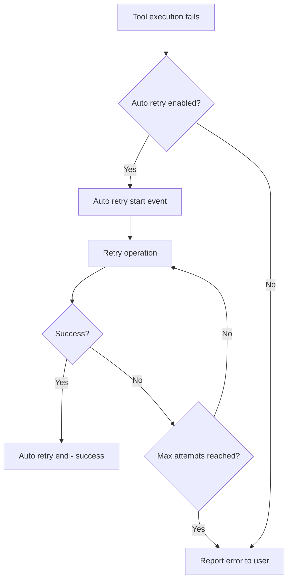

# Auto Retry

## Summary

Auto retry controls whether the pi agent automatically retries failed operations (such as tool execution failures or API errors) instead of reporting them as final errors.

## Concepts

When auto retry is enabled, transient failures are automatically retried. When disabled, failures are reported immediately to the user.

## Protocol

### Toggle Auto Retry

```json
{ "type": "set_auto_retry", "enabled": true }
{ "type": "set_auto_retry", "enabled": false }
```

### Auto Retry Events

```json
{
  "type": "auto_retry_start",
  "toolCallId": "call_abc123",
  "toolName": "bash",
  "attempt": 2,
  "maxAttempts": 3
}
{
  "type": "auto_retry_end",
  "toolCallId": "call_abc123",
  "toolName": "bash",
  "success": true,
  "attempts": 2
}
```

## Store Actions

| Action | Description |
|--------|-------------|
| `send({ type: "set_auto_retry", enabled })` | Enable or disable auto retry |

## Error Handling Flow



## Tags

- **category**: feature, error-handling
- **component**: server.ts, stores/chat.ts
- **pattern**: auto-retry, resilience
- **audience**: developers, users
