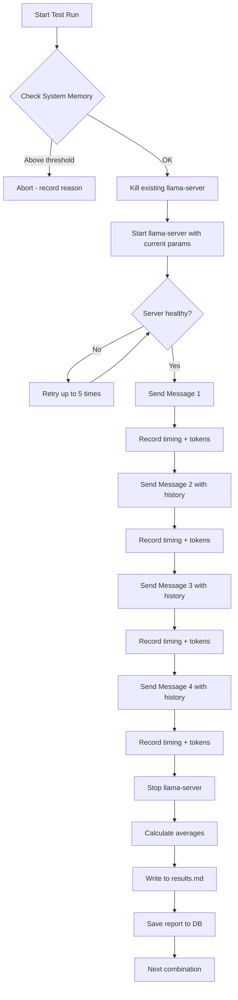

# Benchmark Engine

The benchmark engine is Betty's core feature — a systematic grid search that sweeps across multiple llama.cpp parameters to find optimal performance configurations.

## Overview

The engine runs a full cartesian product of test parameters, launching `llama-server` for each combination, sending a sequence of chat messages, measuring token throughput, and recording results. Each test run is independent — the server starts fresh for every parameter set.

## Grid Search Parameters

Five parameters form the search grid, all configured in `test_params` within [[configuration-reference]]:

| Parameter | Type | Description |
|-----------|------|-------------|
| `context_length` | Multiplicative | Context window size, multiplied by `context_length_multiplier` up to `context_length_max` |
| `gpu_layer_offload` | Additive | Number of GPU layers, stepped by `gpu_layer_offload_step` up to `gpu_layer_off_max` |
| `batch_size` | Additive | Server batch size, stepped by `batch_size_step` up to `batch_size_max` |
| `u_batch_size` | Additive | Micro-batch size, stepped by `u_batch_size_step` up to `u_batch_size_max` |
| `cache_ram` | Additive | Cache size in GB, stepped by `cache_ram_step` up to `cache_ram_max` |

### Value Generation

- **Multiplicative arrays** (context length): values grow by repeated multiplication (e.g., `32768, 65536, 131072, 262144`). A safety cap of 1000 iterations prevents infinite loops.
- **Additive arrays** (all others): values grow by repeated addition (e.g., `128, 256, 512, ...`).

### Batch Size Constraints

For each `u_batch_size` value, only `batch_size` values **greater than or equal to** `u_batch_size` are paired. This ensures the micro-batch never exceeds the server batch, which would cause errors.

## Configuration

Test parameters live in `configs.json` under `test_params`:

```json
{
  "test_params": {
    "context_length": 32768,
    "context_length_multiplier": 2,
    "context_length_max": 262144,
    "gpu_layer_offload": 999,
    "gpu_layer_offload_step": 0,
    "gpu_layer_off_max": 999,
    "batch_size": 128,
    "batch_size_step": 128,
    "batch_size_max": 16384,
    "u_batch_size": 64,
    "u_batch_size_step": 64,
    "u_batch_size_max": 4096,
    "cache_ram": 4096,
    "cache_ram_step": 1024,
    "cache_ram_max": 4096
  }
}
```

Set `step` to `0` to test a single value (e.g., `gpu_layer_offload_step: 0` tests only 999 layers).

## Grid Size Estimation

The engine calculates the total number of combinations before starting. If the grid exceeds **10,000 combinations**, a warning is printed with an estimated completion time (assuming ~30s per run).

**Example calculation**:
- context_length: 5 values (32768, 65536, 131072, 262144)
- gpu_layer_offload: 1 value (999)
- batch permutations: ~50 (varies by u_batch/batch constraints)
- cache_ram: 4 values
- **Total**: 5 × 1 × 50 × 4 = **1,000 combinations**

## How to Run

### Via Dashboard

1. Navigate to the [[dashboard]] tab
2. Configure parameters in the [[config]] tab
3. Click **Run Benchmark**

### Via API

```bash
# Start benchmark
curl -X POST http://localhost:3456/api/run \
  -H "Authorization: Bearer $TOKEN"

# Check status
curl http://localhost:3456/api/status \
  -H "Authorization: Bearer $TOKEN"

# Stop benchmark
curl -X POST http://localhost:3456/api/stop \
  -H "Authorization: Bearer $TOKEN"
```

### Streaming Updates

Connect to the SSE endpoint for real-time updates:

```
GET /api/stream
```

Events: `status`, `results`, `log`, `message-start`, `message-complete`, `test-run-complete`, `heartbeat`.

## Test Run Execution

Each test run follows this sequence:



Each message accumulates prior conversation history, simulating a real chat session with growing context.

## Benchmark Messages

Four user-defined messages fill the context window. Configured in `benchmark_messages` in [[configuration-reference]]:

```json
{
  "benchmark_messages": [
    "Develop a design doc for a self-hosted tetris clone web-based game..",
    "Audit the design doc.",
    "Recommend optimizations.",
    "Create a social-media marketing campaign for it."
  ]
}
```

Messages are sent sequentially, with each request including all prior messages (user + assistant responses), so the context grows with each turn.

## Results

### Per-Message Metrics

For each message in each test run:

| Metric | Source |
|--------|--------|
| `promptTokens` | `usage.prompt_tokens` from chat response |
| `generatedTokens` | `usage.completion_tokens` from chat response |
| `totalTimeMs` | Wall-clock time for the request |
| `promptTokensPerSec` | `promptTokens / timings.prompt_ms` |
| `generatedTokensPerSec` | `generatedTokens / timings.predicted_ms` |
| `mem.used` / `mem.total` | System RAM from `/proc/meminfo` |

### Per-Run Averages

Aggregated across all four messages:

- Average prompt tokens/sec
- Average generation tokens/sec
- Total prompt tokens
- Total generated tokens
- Total time (ms)
- Average memory used (GB)

### Markdown Output

Results are written incrementally to `results.md` after each test run, containing:

1. **Per-Message Results** — detailed table with all metrics
2. **Test Run Averages** — summary table per combination
3. **Server Parameters** — GPU, temperature, flash-attn, etc.
4. **CMake Build Flags** — CUDA flags, LTO, ccache, etc.
5. **Environment Variables** — runtime environment snapshot

## Error Handling

- **System memory threshold**: If RAM usage exceeds `max_sys_mem` (default 93%), the run is aborted and recorded with the reason.
- **Server startup failure**: Retried up to 5 times with a 2-second delay between attempts.
- **Chat request failure**: The entire test run is marked as failed. After 10 consecutive failures, the benchmark stops.
- **Port conflicts**: Existing `llama-server` processes are killed before each run. Port is verified free (no TIME_WAIT) before starting.

## Related

- [[configuration-reference]] — Full `test_params` schema
- [[dashboard]] — Benchmark controls and live results
- [[reports]] — Saved benchmark reports
- [[qa-benchmark-run]] — End-to-end benchmark examples
