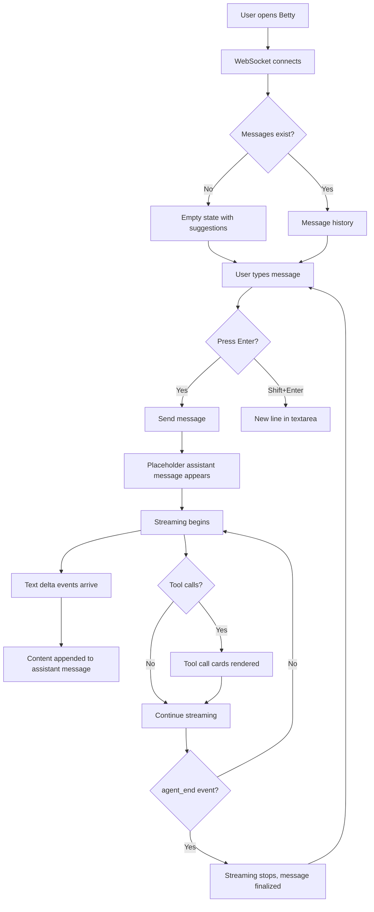

# Chat Interface

## Summary

The core chat UI where users interact with the AI assistant. Features real-time streaming, tool call visualization, markdown rendering, and keyboard shortcuts.

## User Flow



## Key Features

### Real-Time Streaming

Messages stream character-by-character via `message_update` events with `text_delta` sub-events. The store maintains a placeholder assistant message with `isStreaming: true` and appends each delta.

### Tool Call Visualization

When the agent executes tools (bash, read, edit, write, etc.), the UI renders collapsible cards showing:

- Status icon (⏳ pending, ✅ complete, ❌ error)
- Tool name
- Arguments passed to the tool
- Result output (truncated to 200 chars)

### Markdown Rendering

The `formatContent()` function converts a subset of Markdown to HTML:

| Markdown | HTML |
|----------|------|
| `**bold**` | `<strong>bold</strong>` |
| `*italic*` | `<em>italic</em>` |
| `` `code` `` | `<code class="inline-code">code</code>` |
| ` ```lang\ncode\n``` ` | `<pre class="code-block"><code>code</code></pre>` |
| `# Heading` | `<h2>Heading</h2>` |
| `## Heading` | `<h3>Heading</h3>` |
| `### Heading` | `<h4>Heading</h4>` |
| `- item` | `<li>item</li>` |

### Keyboard Shortcuts

| Shortcut | Action |
|----------|--------|
| `Enter` | Send message |
| `Shift+Enter` | New line in textarea |

### Auto-Scroll

The chat auto-scrolls to the bottom when:
- A new message is added
- Streaming is active (new content arrives)

### Suggestions (Empty State)

When no messages exist, three suggestion buttons are shown:

1. "List all TypeScript files"
2. "Explain the project structure"
3. "Help me write a Vue component"

Clicking a suggestion fills the input and focuses the textarea.

## Components

| Element | Description |
|---------|-------------|
| Message avatar | `👤` for user, `🤖` for assistant |
| Message time | Formatted via `toLocaleTimeString()` |
| Streaming indicator | Animated typing dots with "Thinking..." text |
| Scroll anchor | Invisible div for scroll anchoring |

## Tags

- **category**: feature, chat
- **component**: App.vue (messages section)
- **pattern**: real-time-streaming, markdown-rendering
- **audience**: developers, users
