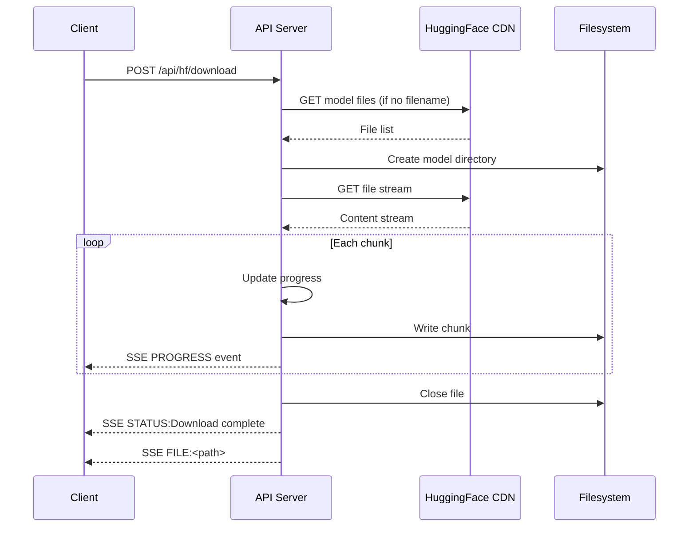

# HuggingFace Integration

Betty integrates with the [HuggingFace Hub API](https://huggingface.co/docs/hub/api) to search, inspect, and download GGUF models directly from the dashboard.

## Overview

The integration provides end-to-end model management:

1. **Search** — query the HF API for models matching a search term
2. **Inspect** — view model details (tags, pipeline, downloads, likes)
3. **List files** — browse available files in a model repository
4. **Download** — stream files with real-time progress via SSE
5. **Cancel** — abort in-progress downloads
6. **History** — view and manage previously downloaded models

## Model Search

Search the HuggingFace Hub for models:

```
GET /api/hf/search?q=llama&limit=20&sort=downloads&direction=-1&filter=gguf
```

| Parameter | Description |
|-----------|-------------|
| `q` | Search query (required) |
| `limit` | Max results (default 20) |
| `sort` | Sort field (`downloads`, `likes`, `lastModified`, `trending`) |
| `direction` | Sort direction (`1` ascending, `-1` descending) |
| `filter` | Filter string (e.g., `gguf`) |

Results include model ID, tags, pipeline tag, download count, last modified date, and likes.

## Model Details

Get full metadata for a specific model:

```
GET /api/hf/model/:id
```

Returns the complete HF model object including:

- `id` — model identifier (e.g., `bartowski/Meta-Llama-3.1-8B-Instruct-GGUF`)
- `tags` — model tags (architecture, quantization, language, etc.)
- `pipeline_tag` — task type (e.g., `text-generation`)
- `downloads` — total download count
- `likes` — like count
- `library_name` — library (e.g., `gguf`)

## Model Files

List all files in a model's `main` branch:

```
GET /api/hf/model/:id/files
```

Returns the repository tree — directories and files with their sizes. Filter for `.gguf` files to find quantized model files.

## Download

Download a model file with real-time progress:

```
POST /api/hf/download
Content-Type: application/json
Authorization: Bearer $TOKEN

{
  "modelId": "bartowski/Meta-Llama-3.1-8B-Instruct-GGUF",
  "filename": "Meta-Llama-3.1-8B-Instruct-Q4_K_M.gguf"
}
```

### Response: SSE Stream

The download endpoint returns an SSE stream with progress events:

```
event: hf-download
data: PROGRESS:45:1234567890

event: hf-download
data: PROGRESS:100

event: hf-download
data: STATUS:Download complete

event: hf-download
data: FILE:/home/user/.betty/models/bartowski_Meta-Llama-3.1-8B-Instruct-GGUF/Meta-Llama-3.1-8B-Instruct-Q4_K_M.gguf
```

### Default File Selection

If `filename` is omitted, the server finds the first `.gguf` file in the repository automatically.

### Storage Location

Models are stored in `~/.betty/models/<model-id-sanitized>/<filename>`. The model ID is sanitized by replacing `/` with `_`.

### Download Flow



## Cancel Active Downloads

Stop a download in progress:

```
DELETE /api/hf/download/active/:modelId
Authorization: Bearer $TOKEN
```

Cancellation:
1. Marks the download as `cancelled`
2. Aborts the HTTP fetch request
3. Destroys the body and file streams
4. Deletes the partial file from disk

## Active Downloads

List currently downloading models:

```
GET /api/hf/active-downloads
```

Returns an array of active downloads with model ID, progress, total size, and downloaded bytes.

## Download History

List all downloaded models:

```
GET /api/hf/downloads
```

Returns model directories under `~/.betty/models/`, each with a list of `.gguf` files and their sizes.

## Delete Downloaded Models

Remove a downloaded model (entire directory):

```
DELETE /api/hf/download/:modelId
Authorization: Bearer $TOKEN
```

Removes the model directory and all its files from disk.

## Local Model Management

Beyond HF downloads, Betty manages local model files:

```
GET  /api/models?directory=/path/to/dir   — List .gguf, .bin, .safetensors files
GET  /api/models-dir                       — Get default models directory
DELETE /api/model/:path                    — Delete a local model file
```

Model listing is recursive and returns paths relative to the base directory, along with file size and modification time.

## Related

- [[models]] — Models tab documentation
- [[qa-model-download]] — Step-by-step download examples
- [[features/benchmark-engine]] — Using downloaded models in benchmarks
- [[features/mmproj-models]] — Multimodal projector model management
