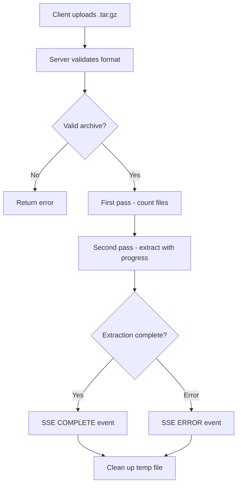

# Library Import / Export

The Research Library supports exporting its entire contents as a compressed archive and importing from an archive. This enables backup, transfer, and sharing of research documents.

## Overview

- **Export**: Creates a `.tar.gz` archive of the entire `~/.betty/library/` directory
- **Import**: Extracts a `.tar.gz` archive into the library directory with progress tracking

## Export

Download the library as a compressed tar archive:

```
GET /api/library/export
Authorization: Bearer $TOKEN
```

Returns a `betty-library-export.tar.gz` file with `Content-Type: application/gzip`.

The archive contains the entire library directory structure:

```
betty-library-export.tar.gz
├── INDEX.md
├── topics/
│   ├── llama-cpp-performance/
│   │   ├── index.md
│   │   └── report.md
│   └── ...
└── tags/
    ├── llama-cpp.md
    └── ...
```

## Import

Upload and extract a library archive:

```
POST /api/library/import
Authorization: Bearer $TOKEN
Content-Type: multipart/form-data

archive: <betty-library-export.tar.gz>
```

### Accepted Formats

- `.tar.gz`
- `.tgz`

Maximum file size: **500 MB**.

### Progress Streaming

The import endpoint returns an SSE stream with progress updates:

```
event: library-import
data: PROGRESS:25:50/200

event: library-import
data: PROGRESS:50:100/200

event: library-import
data: COMPLETE:200 files extracted
```

### Two-Pass Extraction

Import uses a two-pass approach:

1. **First pass**: List archive entries to count total files (for progress tracking)
2. **Second pass**: Extract files with progress updates

### Safety Measures

- **Symlink rejection**: Symbolic links in the archive are rejected to prevent symlink-based path traversal
- **Path traversal protection**: Entries that would resolve outside `LIBRARY_DIR` are rejected
- **Concurrent import protection**: Only one import can run at a time (returns `409 Conflict` if another is in progress)
- **Client disconnect handling**: If the client disconnects during import, the temp file is cleaned up
- **Temp file cleanup**: The uploaded archive is deleted after extraction completes (success or failure)

## Import Flow



## Use Cases

- **Backup**: Export the library before system changes
- **Transfer**: Move research between machines
- **Sharing**: Share research findings with team members
- **Restore**: Re-import after a clean install

## Related

- [[features/library]] — Browse and search the research library
- [[features/library]] — Research skill for creating new topics
- [[USER-MANUAL]] — Library management guide
