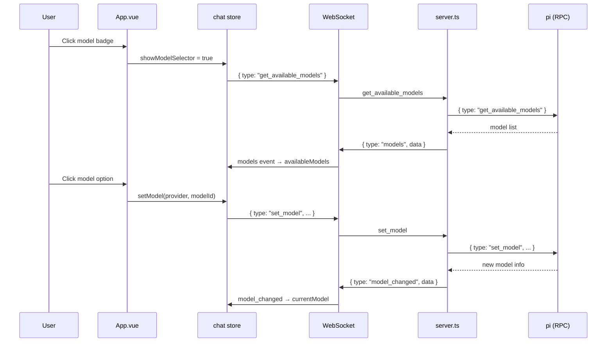

# Model Selection

## Summary

Users can view available models, select a different model, and cycle through models. The current model is displayed in the header badge.

## User Interface

### Model Badge (Header)

Located in the header bar, shows the current model name and provider. Clicking opens the model selector modal.

```
┌─────────────────────────────────────┐
│ [🤖 Betty]  ┌──────────────┐  💭 medium  ● Connected
│             │ claude-sonnet │
│             │ anthropic    │
│             └──────────────┘
└─────────────────────────────────────┘
```

### Model Selector Modal

A modal overlay listing all available models. The currently selected model is highlighted with a blue border and checkmark.

```
┌──────────────────────────────┐
│ Select Model            ✕    │
├──────────────────────────────┤
│ ┌──────────────────────────┐ │
│ │ claude-sonnet-4       ✓  │ │ ← Active
│ │ anthropic                │ │
│ └──────────────────────────┘ │
│ ┌──────────────────────────┐ │
│ │ gpt-4o                   │ │
│ │ openai                   │ │
│ └──────────────────────────┘ │
│ ┌──────────────────────────┐ │
│ │ claude-haiku-3           │ │
│ │ anthropic                │ │
│ └──────────────────────────┘ │
└──────────────────────────────┘
```

## Actions

| Action | Description |
|--------|-------------|
| Click model badge | Open model selector modal |
| Click model in list | Switch to that model |
| Click "Refresh Models" | Re-fetch available models |
| `cycleModel()` | Cycle to the next available model |

## Data Flow



## Model Data Structure

Each model provides:

| Field | Type | Description |
|-------|------|-------------|
| `id` | `string` | Unique model identifier |
| `name` | `string` | Display name |
| `provider` | `string` | Provider name (anthropic, openai, etc.) |
| `api` | `string` | API type |
| `baseUrl` | `string?` | Custom base URL |
| `reasoning` | `boolean?` | Whether the model supports reasoning |
| `contextWindow` | `number?` | Context window size in tokens |
| `maxTokens` | `number?` | Maximum output tokens |
| `cost` | `object?` | Cost per 1M tokens (input, output, cacheRead, cacheWrite) |

## Tags

- **category**: feature, model
- **component**: header, model selector modal
- **pattern**: dynamic-selection, model-switching
- **audience**: users, developers
