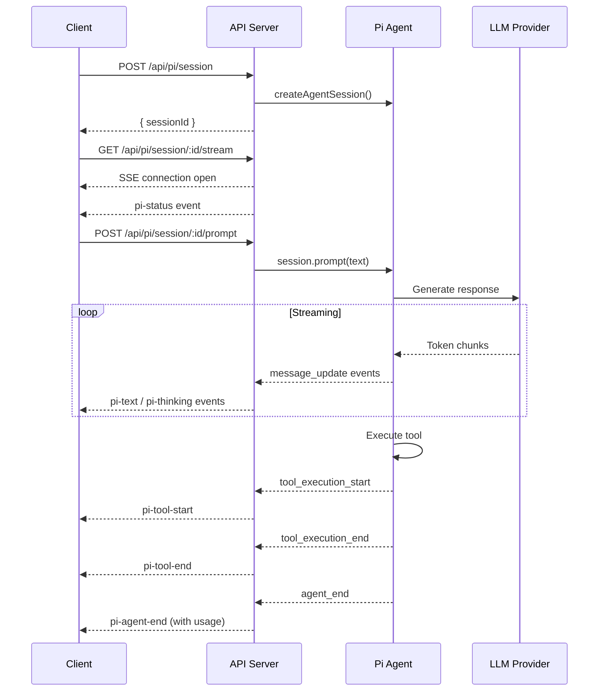

# Pi Chat

Pi Chat integrates the [@earendil-works/pi-coding-agent](https://www.npmjs.com/package/@earendil-works/pi-coding-agent) SDK into Betty's dashboard, providing an AI agent chat interface with tool execution, streaming responses, and session management.

## Overview

Pi Chat enables conversational interaction with an AI agent that can:

- **Stream responses** — text appears in real-time via SSE
- **Execute tools** — read files, run commands, write code, browse the web
- **Think before acting** — reasoning traces shown as thinking deltas
- **Manage sessions** — create, abort, and dispose agent sessions
- **Slash commands** — built-in commands for settings, model selection, export, etc.
- **Skill autocomplete** — discover and invoke Betty skills by name

## Session Management

### Create Session

```
POST /api/pi/session
Authorization: Bearer $TOKEN
```

Creates a new agent session with an in-memory session manager. Returns a session ID.

Sessions are automatically cleaned up after 30 minutes of inactivity. A background task runs every 5 minutes to prune idle sessions.

### Stream Events

```
GET /api/pi/session/:id/stream
```

Opens an SSE connection to receive real-time agent events:

| Event | Description |
|-------|-------------|
| `pi-status` | Session info (model, thinking level, streaming state, context window) |
| `pi-text` | Text delta — a chunk of the agent's response |
| `pi-thinking` | Thinking delta — reasoning trace chunk |
| `pi-message-start` | Agent started composing a message |
| `pi-message-end` | Agent finished a message |
| `pi-tool-start` | Tool execution started (includes tool name and params) |
| `pi-tool-update` | Tool execution progress |
| `pi-tool-end` | Tool execution completed (includes success status and output) |
| `pi-agent-start` | Agent turn started |
| `pi-agent-end` | Agent turn ended (includes token usage and cost) |
| `pi-turn-start` | Conversation turn started |
| `pi-turn-end` | Conversation turn ended |
| `pi-error` | Error occurred |
| `pi-heartbeat` | Keep-alive (every 15 seconds) |

### Send Prompt

```
POST /api/pi/session/:id/prompt
Authorization: Bearer $TOKEN

{
  "text": "Read the docs/index.md file and summarize it"
}
```

Sends a message to the agent. The agent processes it and streams events back through the SSE connection.

### Abort

```
POST /api/pi/session/:id/abort
Authorization: Bearer $TOKEN
```

Aborts the current agent operation.

### Dispose Session

```
DELETE /api/pi/session/:id
Authorization: Bearer $TOKEN
```

Closes all SSE connections, unsubscribes from events, and disposes the session.

## Skills Autocomplete

```
GET /api/pi/skills
```

Lists available skills for slash-command autocomplete. Skills are loaded from the project's `.pi/skills/` directory and the default skill set.

## Slash Commands

The Pi Chat UI supports slash commands for common operations:

| Command | Description |
|---------|-------------|
| `/settings` | Open settings menu |
| `/model` | Select model |
| `/export` | Export session (HTML or JSONL) |
| `/import` | Import and resume a session |
| `/share` | Share session as a GitHub gist |
| `/copy` | Copy last message to clipboard |
| `/name` | Set session display name |
| `/session` | Show session info and stats |
| `/fork` | Create a fork from a previous message |
| `/tree` | Navigate session tree |
| `/compact` | Manually compact context |
| `/reload` | Reload skills, prompts, themes |
| `/new` | Start a new session |
| `/quit` | Quit pi |

Type `/` to see the full list with autocomplete.

## Agent Event Flow



## Configuration

Pi Chat uses the Pi SDK's authentication and model configuration:

- **Auth storage**: `~/.pi/agents/auth.json` — provider API keys
- **Model registry**: `~/.pi/agents/models.json` — available models and providers
- **Agent directory**: Project-local `.pi/agents/` for project-specific agents

Configure providers with the `/login` slash command in the Pi Chat UI.

## Context Usage

The `pi-agent-end` event includes context window usage:

```json
{
  "tokens": { "input": 1500, "output": 450, "total": 1950 },
  "cost": 0.012,
  "contextUsage": {
    "tokens": 1950,
    "contextWindow": 128000,
    "percent": 1.52
  }
}
```

## Related

- [[features/pi-chat]] — Pi Chat tab documentation
- [[USER-MANUAL]] — Getting started with Pi Chat
- [[architecture]] — System architecture including Pi integration
