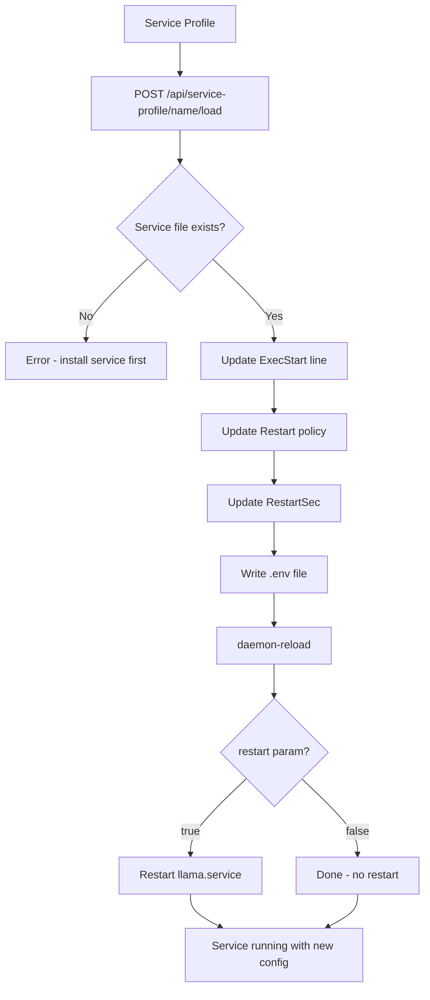

# Service Profiles

Service profiles save and restore systemd service configurations independently of benchmark configurations. While [[features/profiles]] store benchmark parameters, service profiles store the service's `ExecStart` command, environment variables, and restart policy.

## Overview

A service profile captures:

| Field | Description |
|-------|-------------|
| `execStart` | The full llama-server launch command |
| `envVars` | Environment variables (key-value map) |
| `restart` | Restart policy (`on-failure`, `always`, `no`, etc.) |
| `restartSec` | Restart delay in seconds |

## Save Service Profile

Save the current service configuration:

```
POST /api/service-profile
Authorization: Bearer $TOKEN

{
  "name": "production-llama-3",
  "data": {
    "execStart": "/path/to/llama-server -m /model.gguf --port 11434 -c 32768 -ngl 999",
    "envVars": {
      "GGML_CUDA_ENABLE_UNIFIED_MEMORY": "1",
      "CUDA_SCALE_LAUNCH_QUEUES": "4x",
      "LLAMA_ARG_FIT": "on"
    },
    "restart": "on-failure",
    "restartSec": 5
  }
}
```

The name is sanitized — non-alphanumeric characters (except `-` and `_`) are replaced with `_`.

## List Service Profiles

```
GET /api/service-profiles
```

Returns all saved service profiles.

## Get Service Profile

```
GET /api/service-profile/:name
```

Returns the full service profile data.

## Load Service Profile

Apply a saved profile to the running systemd service:

```
POST /api/service-profile/:name/load?restart=true
Authorization: Bearer $TOKEN
```

This:
1. Reads the existing `llama.service` file
2. Updates `ExecStart`, `Restart`, and `RestartSec` lines
3. Writes the updated `.env` file
4. Runs `systemctl --user daemon-reload`
5. Restarts the service (unless `?restart=false`)



## Delete Service Profile

```
DELETE /api/service-profile/:name
Authorization: Bearer $TOKEN
```

## Differences from Config Profiles

| Aspect | [[features/profiles]] | Service Profiles |
|--------|-------------|------------------|
| Scope | Benchmark parameters | Systemd service config |
| Storage | Database + JSON fallback | Database |
| Load effect | Replaces configs.json | Updates .service + .env files |
| Requires | None | Installed systemd service |
| Auto-restart | No | Yes (by default) |

## Use Cases

- **Environment switching**: Save "dev" and "prod" service profiles with different GPU settings
- **Quick rollback**: Revert service changes without editing files manually
- **Consistency**: Ensure the service always starts with verified parameters

## Related

- [[features/systemd-service]] — Systemd service management
- [[features/profiles]] — Config profiles (benchmark parameters)
- [[reports]] — Reports can be used to install services
