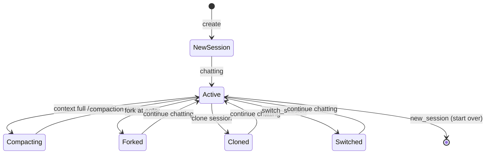

# Session Management

## Summary

Session management allows users to create, switch, fork, clone, and compact conversations. Sessions are persisted by pi and managed through WebSocket commands.

## Session Lifecycle



## Available Actions

### New Session

Creates a fresh conversation. Clears local message history and resets session state.

```typescript
store.newSession()
// Sends: { type: "new_session" }
```

### Compact

Compresses conversation context to reduce token usage. Supports optional custom instructions.

```typescript
store.compact("Focus on the key technical decisions")
// Sends: { type: "compact", customInstructions: "..." }
```

Events: `compaction_start` → `compaction_end`

### Fork

Forks the conversation at a specific message entry, creating a new branch.

```typescript
store.fork("entry-id-123")
// Sends: { type: "fork", entryId: "entry-id-123" }
```

### Clone

Clones the current session entirely, creating an independent copy.

```typescript
store.clone()
// Sends: { type: "clone" }
```

### Switch Session

Switches to a different session file.

```typescript
store.switchSession("/path/to/session.json")
// Sends: { type: "switch_session", sessionPath: "..." }
```

### Set Session Name

Renames the current session.

```typescript
store.setSessionName("My Discussion")
// Sends: { type: "set_session_name", name: "My Discussion" }
```

### Clear Messages

Clears the local message display without affecting the server-side session.

```typescript
store.clearMessages()
// Local only, no WebSocket message
```

## Sidebar

The sidebar shows:

- Current session name and message count
- "New Session" button
- Settings link
- Model refresh link

```
┌──────────────────────┐
│ Sessions         ✕   │
├──────────────────────┤
│ [+] New Session      │
├──────────────────────┤
│ My Discussion        │
│ 123 msgs             │
├──────────────────────┤
│ ⚙ Settings           │
│ 🔄 Refresh Models    │
└──────────────────────┘
```

## Session Info (Settings Modal)

The settings panel displays:

| Field | Description |
|-------|-------------|
| Session ID | Internal session identifier |
| Messages | Total message count |
| Pending | Pending message count |

## Tags

- **category**: feature, session
- **component**: sidebar, settings modal
- **pattern**: session-lifecycle, context-management
- **audience**: users, developers
