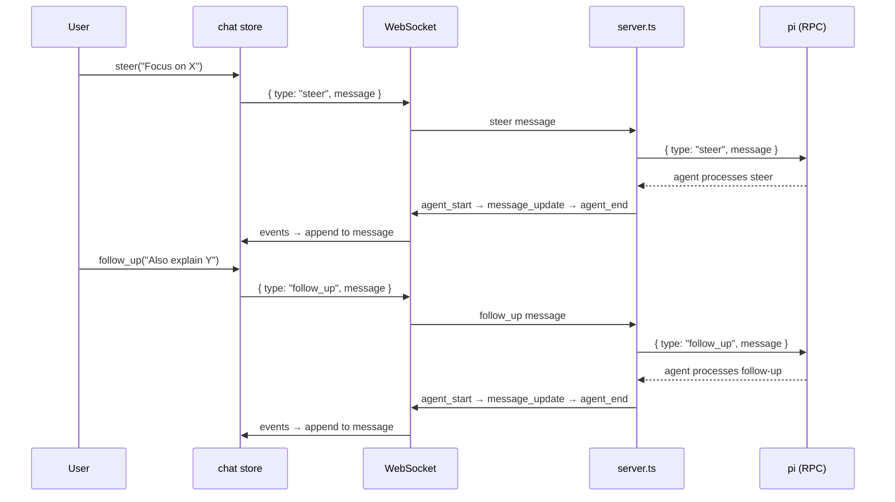

# Steering Mode

## Summary

Steering mode allows users to send follow-up messages and steer the AI agent's behavior within an active conversation. It supports both text-only and multimodal (image) inputs, enabling users to guide the agent's focus without starting a new session.

## Concepts

### Steer vs Follow-Up

| Mode | Description | Use Case |
|------|-------------|----------|
| **Steer** | Redirects the agent's attention to a specific topic or behavior | "Focus on the error handling in this function" |
| **Follow-Up** | Adds to the conversation as a continuation | "Can you also explain the error handling?" |

Both modes send a message to the agent while preserving conversation context.

## User Interface

Steering and follow-up are triggered through the chat input:

- **Normal send** (`Enter`): Sends as a `prompt` (starts a new turn)
- **Steer**: Implemented via the store's `send({ type: "steer", message })` action
- **Follow-Up**: Implemented via the store's `send({ type: "follow_up", message })` action

## Protocol

### Steer Command

```json
{
  "type": "steer",
  "message": "Focus on TypeScript types",
  "images": [
    { "type": "image", "data": "<base64>", "mimeType": "image/png" }
  ]
}
```

### Follow-Up Command

```json
{
  "type": "follow_up",
  "message": "Can you also add error handling?",
  "images": [
    { "type": "image", "data": "<base64>", "mimeType": "image/png" }
  ]
}
```

### Setting Modes

```json
{ "type": "set_steering_mode", "mode": "on" | "off" }
{ "type": "set_follow_up_mode", "mode": "on" | "off" }
```

### Queue Update Response

```json
{
  "type": "queue_update",
  "steering": ["pending steer message 1", "pending steer message 2"],
  "followUp": ["pending follow-up message"]
}
```

## Store Actions

| Action | Description |
|--------|-------------|
| `send({ type: "steer", message })` | Send a steer message to redirect the agent |
| `send({ type: "follow_up", message })` | Send a follow-up message to continue the conversation |
| `send({ type: "set_steering_mode", mode })` | Enable or disable steering mode |
| `send({ type: "set_follow_up_mode", mode })` | Enable or disable follow-up mode |

## Data Flow



## Multimodal Support

Both steer and follow-up commands support optional image attachments:

```json
{
  "type": "steer",
  "message": "Look at this error screenshot",
  "images": [
    { "type": "image", "data": "<base64-encoded-png>", "mimeType": "image/png" }
  ]
}
```

The images are forwarded to the pi agent as part of the RPC command, enabling multimodal steering.

## Queue Management

When multiple steering or follow-up messages are queued, the server sends `queue_update` events:

- `steering`: Array of pending steer messages
- `followUp`: Array of pending follow-up messages

The frontend currently receives these events (via `handleWsMessage`) but does not yet display the queue in the UI.

## Tags

- **category**: feature, steering
- **component**: stores/chat.ts, server.ts
- **pattern**: conversation-control, multimodal
- **audience**: developers, users
