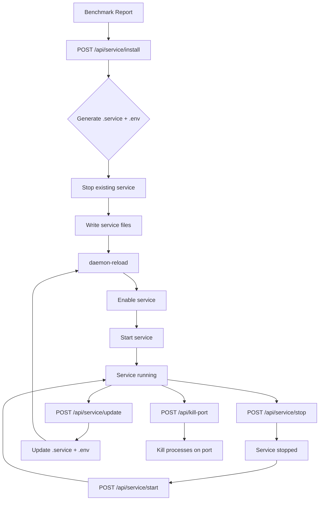

# Systemd Service Management

Betty can install and manage a `llama.service` systemd user service, allowing `llama-server` to run persistently in the background with automatic restart on failure.

> **Linux only.** This feature requires `systemctl` and a systemd-based Linux distribution. Returns `501 Not Implemented` on other platforms.

## Overview

The systemd integration provides:

1. **Install** — generate `.service` and `.env` files from a benchmark report
2. **Start/Stop** — control the service lifecycle
3. **Status** — check if the service is active
4. **Read config** — inspect current service configuration
5. **Update config** — modify `ExecStart`, environment variables, and restart policy
6. **Kill port** — terminate processes binding the llama port

## Service Files

Two files are managed:

| File | Location | Purpose |
|------|----------|---------|
| `llama.service` | `~/.config/systemd/user/llama.service` | Service unit definition |
| `llama-benchmark.env` | `~/.config/systemd/user/llama-benchmark.env` | Environment variables |

### Service Unit Structure

```ini
[Unit]
Description=Llama.cpp Benchmark Service - <report-name> (Run #<N>)
After=network.target

[Service]
Type=simple
User=<username>
EnvironmentFile=~/.config/systemd/user/llama-benchmark.env
ExecStart=<path-to-llama-server> <arguments>
Restart=on-failure
RestartSec=5
StandardOutput=journal
StandardError=journal
SyslogIdentifier=llama-benchmark

[Install]
WantedBy=default.target
```

### Environment File

Contains CUDA and llama.cpp environment variables:

```
GGML_CUDA_ENABLE_UNIFIED_MEMORY=1
CUDA_SCALE_LAUNCH_QUEUES=4x
LLAMA_CACHE=/path/to/cache
CUDACXX=/usr/local/cuda/bin/nvcc
GGML_CUDA_P2P=on
PATH=/usr/local/cuda-12.6/bin:$PATH
LLAMA_ARG_FIT=on
```

## Install Service from Report

Generate and install a service from a saved benchmark report:

```
POST /api/service/install
Authorization: Bearer $TOKEN

{
  "reportName": "2024-01-15-llama-3-8b",
  "testRunId": 5
}
```

This:
1. Loads the report and extracts the launch command for the specified test run
2. Generates the `.service` file with the correct `ExecStart`
3. Generates the `.env` file with environment variables
4. Stops any existing `llama.service`
5. Runs `systemctl --user daemon-reload`
6. Enables the service (`systemctl --user enable`)
7. Starts the service (`systemctl --user start`)

If any step fails, the generated files are cleaned up.

## Service Control

### Start

```
POST /api/service/start
Authorization: Bearer $TOKEN
```

Executes `systemctl --user start llama.service`.

### Stop

```
POST /api/service/stop
Authorization: Bearer $TOKEN
```

Executes `systemctl --user stop llama.service`.

### Status

```
GET /api/service/status
```

Returns `{ "success": true, "active": true|false }`.

## Read Service Configuration

```
GET /api/service/config
```

Returns the current service configuration:

```json
{
  "success": true,
  "exists": true,
  "description": "Llama.cpp Benchmark Service - ...",
  "execStart": "/path/to/llama-server -m ...",
  "restart": "on-failure",
  "restartSec": 5,
  "envVars": {
    "GGML_CUDA_ENABLE_UNIFIED_MEMORY": "1",
    "CUDA_SCALE_LAUNCH_QUEUES": "4x",
    ...
  },
  "serviceFile": "/home/user/.config/systemd/user/llama.service",
  "envFile": "/home/user/.config/systemd/user/llama-benchmark.env"
}
```

## Update Service Configuration

Modify the running service's configuration:

```
POST /api/service/update
Authorization: Bearer $TOKEN

{
  "execStart": "/path/to/llama-server -m /new/model.gguf --port 11434",
  "envVars": {
    "GGML_CUDA_ENABLE_UNIFIED_MEMORY": "1",
    "CUDA_SCALE_LAUNCH_QUEUES": "8x"
  },
  "restart": "always",
  "restartSec": 10
}
```

This updates the service file in place (preserving other sections), writes the environment file, reloads systemd, and restarts the service.

## Kill Port Conflicts

Terminate all processes binding the llama port (default 11434):

```
POST /api/kill-port
Authorization: Bearer $TOKEN
```

Uses `lsof -ti :<port>` to find PIDs, then sends `kill -9` to each. Returns the list of killed PIDs.

## Service Lifecycle



## Related

- [[features/service-profiles]] — Save and load service configurations
- [[reports]] — Benchmark reports (source for service install)
- [[logs]] — View systemd journal logs
- [[USER-MANUAL]] — Installation and setup guide
