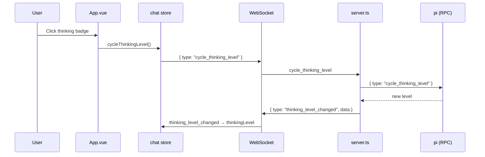

# Thinking Level

## Summary

The thinking level controls how much reasoning the AI agent performs before responding. Users can set it explicitly or cycle through levels by clicking the thinking badge.

## Available Levels

| Level | Description |
|-------|-------------|
| `off` | No extended thinking |
| `minimal` | Minimal reasoning |
| `low` | Light reasoning |
| `medium` | Default balanced reasoning |
| `high` | Deep reasoning |
| `xhigh` | Maximum reasoning |

## User Interface

### Thinking Badge (Header)

Located in the header bar next to the model badge. Shows the current level with a thought bubble emoji.

```
┌─────────────────────────────────────┐
│ [🤖 Betty]  ┌──────────────┐  💭 high  ● Connected
│             │ claude-sonnet │
│             │ anthropic    │
│             └──────────────┘
└─────────────────────────────────────┘
```

**Interactions:**
- **Click**: Cycles to the next thinking level
- **Tooltip**: Shows current level on hover

### Settings Panel

The settings modal provides buttons for each level. The active level is highlighted in blue.

```
┌──────────────────────────────┐
│ Settings                ✕    │
├──────────────────────────────┤
│ Thinking Level               │
│ [off] [minimal] [low] [medium] [high] [xhigh]
│                              │
│        ^ active (blue)       │
└──────────────────────────────┘
```

## Actions

| Action | Description |
|--------|-------------|
| Click thinking badge | Cycle to next level |
| Click level button in settings | Set specific level |
| `setThinkingLevel(level)` | Set level programmatically |
| `cycleThinkingLevel()` | Cycle to next level programmatically |

## Data Flow



## State Synchronization

The thinking level is synchronized from the server via the `state` event:

```json
{ "type": "state", "data": { "thinkingLevel": "high", ... } }
```

When the store receives a `state` event with `thinkingLevel`, it updates the local value.

## Tags

- **category**: feature, thinking
- **component**: header, settings modal
- **pattern**: level-cycling, state-sync
- **audience**: users, developers
