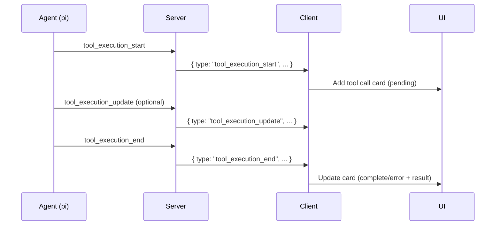

# Tool Calls

## Summary

When the AI agent needs to perform actions (read files, execute commands, edit code, etc.), it uses tool calls. Betty displays these in the chat with status indicators, arguments, and results.

## Tool Call Card

Each tool call is rendered as a collapsible card within the assistant message:

```
┌─────────────────────────────────────┐
│ ✅ bash                             │
│ {                                   │
│   "command": "ls -la"              │
│ }                                   │
│ file1.txt                           │
│ file2.ts                            │
│ package.json                        │
└─────────────────────────────────────┘
```

## Visual States

| State | Icon | Border | Description |
|-------|------|--------|-------------|
| Pending | ⏳ | Default (gray) | Tool call started, waiting for result |
| Complete | ✅ | Green | Tool completed successfully |
| Error | ❌ | Red | Tool execution failed |

## Data Structure

Each tool call has:

```typescript
interface ToolCallInfo {
  id: string;           // Unique call identifier
  name: string;         // Tool name (bash, read, edit, write, etc.)
  args: Record<string, unknown>;  // Arguments passed to the tool
  result?: string;      // Tool output (truncated to 200 chars in UI)
  isError?: boolean;    // Whether the tool failed
  isComplete?: boolean; // Whether the tool has finished
}
```

## Event Flow



## Tool Execution Events

### Start

```json
{
  "type": "tool_execution_start",
  "toolCallId": "call_abc123",
  "toolName": "bash",
  "args": { "command": "ls -la" }
}
```

### Update (optional)

```json
{
  "type": "tool_execution_update",
  "toolCallId": "call_abc123",
  "toolName": "bash",
  "args": { "command": "ls -la" },
  "partialResult": {
    "content": [{ "type": "text", "text": "file1.txt\n" }]
  }
}
```

### End

```json
{
  "type": "tool_execution_end",
  "toolCallId": "call_abc123",
  "toolName": "bash",
  "result": {
    "content": [{ "type": "text", "text": "file1.txt\nfile2.ts\n" }]
  },
  "isError": false
}
```

## Store Handling

The chat store handles tool calls through two event handlers:

### `tool_execution_start`

Adds a new `ToolCallInfo` to the current streaming assistant message's `toolCalls` array with `isComplete: false`.

### `tool_execution_end`

Finds the matching tool call by `toolCallId` and updates it with `isComplete: true`, `isError`, and the result text.

## Tags

- **category**: feature, tools
- **component**: App.vue (tool call rendering)
- **pattern**: tool-visualization, event-driven-ui
- **audience**: developers, users
