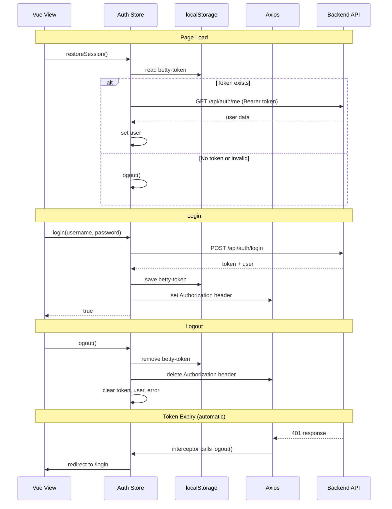

# Auth Store

Pinia store for authentication, session management, and user administration. Handles login, registration, logout, password changes, and role-based access checks.

**File**: `src/frontend/src/stores/auth.js`

**Related**: [[frontend/overview]] | [[frontend/benchmark-store]] | [[frontend/pi-chat-store]] | [[frontend/views]]

## State

All reactive state properties.

| Property | Type | Default | Description |
|----------|------|---------|-------------|
| `token` | `string \| null` | from `localStorage` | JWT token, persisted as `betty-token` in localStorage |
| `user` | `object \| null` | `null` | Current user `{ id, username, role }` |
| `loading` | `boolean` | `false` | Whether an auth action is in progress |
| `error` | `string \| null` | `null` | Last error message from any auth action |

### Token Persistence

On login or register, the token is saved to `localStorage` under the key `betty-token`. On page load, the store reads this value and attempts to restore the session via `restoreSession()`. On logout, the token is removed from storage.

## Getters

Computed properties derived from state. Used by views and the router for role-based access control.

| Getter | Returns | Description |
|--------|---------|-------------|
| `isLoggedIn` | `boolean` | `true` when both `token` and `user` are present |
| `isAdmin` | `boolean` | `true` when user role is `admin` |
| `isOperator` | `boolean` | `true` when user role is `operator` |
| `isViewer` | `boolean` | `true` when user role is `viewer` |
| `canEdit` | `boolean` | `true` for `admin` or `operator` roles |
| `canAdmin` | `boolean` | `true` for `admin` role only |

## Actions

### Session

#### `restoreSession()`

Restores the session on page load. Reads the token from `localStorage`, then calls `GET /api/auth/me` to verify it. On success, loads the user object. On failure, calls `logout()` to clear the stale token.

### Authentication

#### `login(username, password)`

Posts credentials to `POST /api/auth/login`. On success:

- Stores the token in state and `localStorage`
- Stores the user object in state
- Sets the `Authorization` header on `axios.defaults` for all future requests
- Returns `true`

On failure, stores the error message and returns `false`.

#### `register(username, password, role)`

Posts registration data to `POST /api/auth/register`. Behaves like `login()` — on success, sets token, user, localStorage, and the Axios auth header. Returns `true` on success, `false` on failure.

#### `logout()`

Synchronously clears the session:

- Sets `token`, `user`, and `error` to `null`
- Removes `betty-token` from `localStorage`
- Deletes the `Authorization` header from `axios.defaults`

#### `changePassword(currentPassword, newPassword)`

Sends the current and new password to `PUT /api/auth/password` with the auth token. Returns `true` on success, `false` on failure. Does not log the user out — the existing token remains valid.

### User Administration (Admin)

#### `fetchUsers()`

Fetches all users from `GET /api/auth/users`. Returns the array of user objects on success, or an empty array on failure. Admin only.

#### `createUser(username, password, role)`

Creates a new user via `POST /api/auth/register` (with auth header). Unlike `register()`, this does **not** set the session state — it is used by admins to create other users, not to log in. Returns the created user object on success, `null` on failure.

#### `updateUser(username, updates)`

Updates an existing user via `PUT /api/auth/users/:username`. The `updates` object may contain `role` and/or `password`. Returns the updated user on success, `null` on failure.

#### `deleteUser(username)`

Deletes a user via `DELETE /api/auth/users/:username`. Returns the result on success, `null` on failure.

### Utilities

#### `setError(message)`

Sets the `error` state property. Used to clear errors by passing `null`.

## Auth Flow

## Role Hierarchy

Roles are ordered from least to most privileged:

| Role | Level | Permissions |
|------|-------|-------------|
| `viewer` | 1 | Read-only access |
| `operator` | 2 | Read + edit benchmarks and settings |
| `admin` | 3 | Full access, including user management |

The router uses this hierarchy to enforce `requiredRole` on routes. The getters `canEdit` and `canAdmin` provide convenience checks for views.

## Conventions

- All async actions set `loading = true` before the request and `loading = false` in a `finally` block.
- Errors are caught and stored in `this.error` with a fallback message.
- Actions return `true`/`false` for success/failure (or a result object for fetch actions).
- `logout()` is synchronous and clears all auth-related state and storage.
- The Axios auth header is set globally so all subsequent requests are authenticated automatically.
