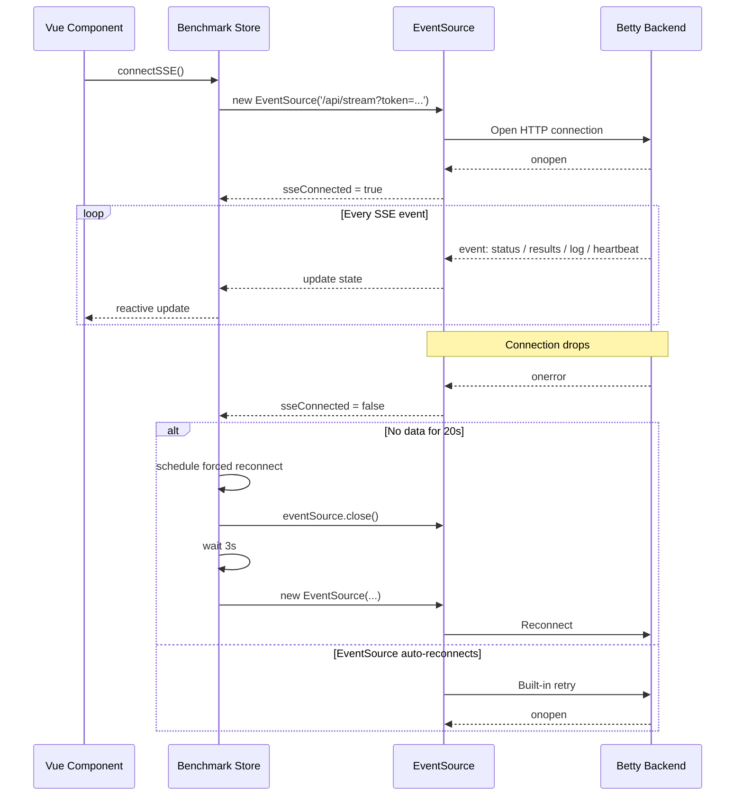
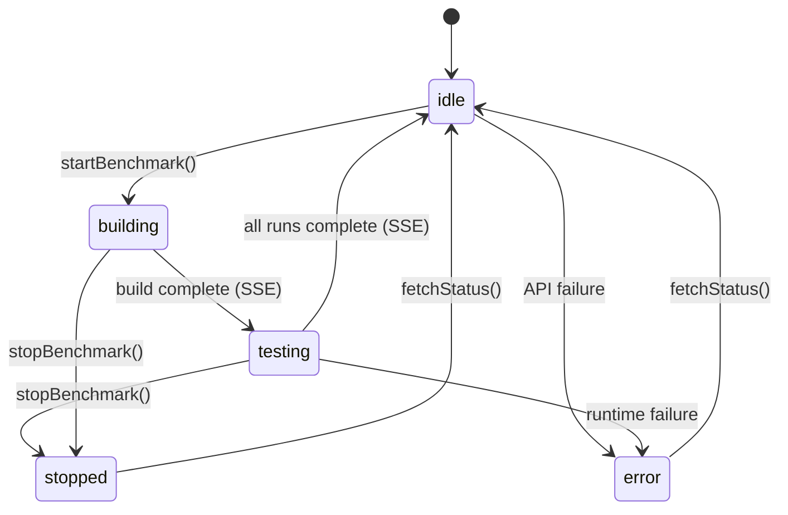

# Benchmark Store

Central Pinia store for the Betty frontend. Manages benchmark lifecycle, configuration, model browsing, HuggingFace downloads, system monitoring, build orchestration, and SSE streaming.

**File**: `src/frontend/src/stores/benchmark.js`

**Related**: [[frontend/overview]] | [[frontend/views]] | [[frontend/auth-store]] | [[frontend/pi-chat-store]]

## State

All reactive state properties. Grouped by domain.

### Benchmark Lifecycle

| Property | Type | Default | Description |
|----------|------|---------|-------------|
| `status` | `string` | `'idle'` | Current benchmark phase: `idle`, `building`, `testing`, `error`, `stopped` |
| `testRun` | `number` | `0` | Current test run counter |
| `liveResults` | `array` | `[]` | Array of benchmark result objects, updated in real-time via SSE |
| `processAlive` | `boolean` | `false` | Whether the llama.cpp process is currently running |
| `logs` | `array` | `[]` | Log entries `{ type, text, timestamp }`, capped at 500 lines |
| `error` | `string \| null` | `null` | Last error message from any API call |
| `sseConnected` | `boolean` | `false` | Whether the SSE stream is currently open |
| `benchmarkMessages` | `array` | `[]` | Test prompts and LLM responses from completed runs |

### Configuration

| Property | Type | Default | Description |
|----------|------|---------|-------------|
| `configs` | `object \| null` | `null` | Current benchmark configuration |
| `models` | `array` | `[]` | Available GGUF models on disk |
| `modelsDir` | `string \| null` | `null` | Root directory for model files |
| `profiles` | `array` | `[]` | Saved benchmark profiles |
| `serviceProfiles` | `array` | `[]` | Saved systemd service profiles |

### Reports

| Property | Type | Default | Description |
|----------|------|---------|-------------|
| `reports` | `array` | `[]` | List of saved benchmark reports |
| `currentReport` | `object \| null` | `null` | Currently viewed report |
| `resultsMd` | `string` | `''` | Markdown-formatted results for display |

### Build

| Property | Type | Default | Description |
|----------|------|---------|-------------|
| `buildStatus` | `string` | `'idle'` | Build phase: `idle`, `building`, `success`, `error` |
| `buildLogs` | `array` | `[]` | Build log entries `{ type, text, timestamp }` |
| `buildProgress` | `number` | `0` | Build progress percentage (0–100) |

### Systemd Service

| Property | Type | Default | Description |
|----------|------|---------|-------------|
| `serviceActive` | `boolean` | `false` | Whether the llama.service systemd unit is active |
| `launchCommand` | `string \| null` | `null` | Current launch command derived from configs |

### System Monitoring

| Property | Type | Default | Description |
|----------|------|---------|-------------|
| `systemMemory` | `object` | `see below` | System resource snapshot |

`systemMemory` structure:

| Field | Type | Description |
|-------|------|-------------|
| `totalGB` | `number` | Total system RAM in GB |
| `usedGB` | `number` | Used RAM in GB |
| `availableGB` | `number` | Available RAM in GB |
| `percentUsed` | `number` | Memory usage percentage |
| `cpuUsage` | `number` | Overall CPU usage percentage |
| `cpuCores` | `array` | Per-core CPU usage |
| `gpuStats` | `array` | GPU memory and utilization stats |

### HuggingFace

| Property | Type | Default | Description |
|----------|------|---------|-------------|
| `hfSearchResults` | `array` | `[]` | Search results from HuggingFace API |
| `hfModelDetails` | `object \| null` | `null` | Details for a specific model |
| `hfModelFiles` | `array` | `[]` | File listing for a model |
| `hfDownloads` | `array` | `[]` | History of completed downloads |
| `hfActiveDownloads` | `array` | `[]` | Currently in-progress downloads |
| `hfError` | `string \| null` | `null` | Last HuggingFace-related error |

### Git Update

| Property | Type | Default | Description |
|----------|------|---------|-------------|
| `gitUpdate` | `object` | `see below` | Git update check status |

`gitUpdate` structure:

| Field | Type | Description |
|-------|------|-------------|
| `hasUpdate` | `boolean` | Whether a newer commit exists remotely |
| `localCommit` | `string \| null` | Current local commit hash |
| `remoteCommit` | `string \| null` | Latest remote commit hash |
| `lastChecked` | `string \| null` | Timestamp of last check |

### Notification

| Property | Type | Default | Description |
|----------|------|---------|-------------|
| `notification` | `object` | `{ type: null, message: null }` | Toast notification, auto-clears after 6s |

### Chat Templates

| Property | Type | Default | Description |
|----------|------|---------|-------------|
| `chatTemplates` | `array` | `[]` | Available chat template files |
| `chatTemplateDownloading` | `boolean` | `false` | Whether a template download is in progress |
| `chatTemplateDownloadProgress` | `number` | `0` | Download progress percentage |
| `chatTemplateDownloadError` | `string \| null` | `null` | Last template download error |

### Mmproj Models

| Property | Type | Default | Description |
|----------|------|---------|-------------|
| `mmprojModels` | `array` | `[]` | Available mmproj model files |
| `mmprojDownloading` | `boolean` | `false` | Whether an mmproj download is in progress |
| `mmprojDownloadProgress` | `number` | `0` | Download progress percentage |
| `mmprojDownloadError` | `string \| null` | `null` | Last mmproj download error |

## Getters

Computed properties derived from state.

| Getter | Returns | Description |
|--------|---------|-------------|
| `isRunning` | `boolean` | `true` when status is `building` or `testing` |
| `isIdle` | `boolean` | `true` when status is `idle` |
| `isError` | `boolean` | `true` when status is `error` |
| `isStopped` | `boolean` | `true` when status is `stopped` |
| `isBuilding` | `boolean` | `true` when buildStatus is `building` |
| `buildSuccess` | `boolean` | `true` when buildStatus is `success` |
| `buildError` | `boolean` | `true` when buildStatus is `error` |
| `latestResult` | `object \| null` | Most recent entry in `liveResults`, or `null` |
| `totalRuns` | `number` | Count of entries in `liveResults` |
| `avgGenTokensPerSec` | `number` | Average generation speed across all results, rounded to 2 decimals |
| `avgPromptTokensPerSec` | `number` | Average prompt processing speed across all results, rounded to 2 decimals |
| `hasUpdate` | `boolean` | Shortcut for `gitUpdate.hasUpdate` |

## Actions

### Benchmark Lifecycle

#### `fetchStatus()`

Polls `GET /api/status`. Updates `status`, `testRun`, `liveResults`, and `processAlive`.

#### `startBenchmark(env = {})`

Posts to `POST /api/run`. Before calling the API, waits up to 5 seconds for the SSE connection to establish (polls `sseConnected` every 50ms). Resets `status` to `'building'`, clears `testRun`, `liveResults`, and `logs`. Returns `true` on success.

#### `stopBenchmark()`

Posts to `POST /api/stop`. Sets `status` to `'stopped'` on success.

#### `saveReport(name?)`

Posts to `POST /api/save-report`. Optionally includes a report name. Returns `true` on success.

#### `fetchReports()` / `fetchReport(name)` / `deleteReport(name)`

List, load, and delete saved reports. `deleteReport` also removes the entry from the local `reports` array.

#### `fetchResults()` / `fetchMessages()`

Fetches markdown-formatted results and benchmark messages (prompts + responses).

### Configuration

#### `fetchConfigs()`

Loads current config from `GET /api/configs`.

#### `saveConfigs(configs)`

Posts updated config to `PUT /api/configs`. Updates local `configs` on success.

#### `fetchModelsDir()` / `fetchModels(directory?)`

Fetches the models root directory and lists available models. `fetchModels` accepts an optional directory override.

#### `deleteLocalModel(filePath)`

Deletes a model file from disk. Removes the entry from the local `models` array.

### Profiles

#### `fetchProfiles()` / `saveProfile(name, configs)` / `loadProfile(name)` / `deleteProfile(name)`

Full CRUD for benchmark profiles. `loadProfile` updates `configs` with the loaded profile data.

#### `fetchServiceProfiles()` / `fetchServiceProfile(name)` / `saveServiceProfile(name, data)` / `loadServiceProfile(name, restart = true)` / `deleteServiceProfile(name)`

Full CRUD for systemd service profiles. `loadServiceProfile` accepts an optional `restart` flag (default `true`).

### SSE Connection

#### `connectSSE()`

Opens an `EventSource` to `GET /api/stream`. Authentication token is passed as a query parameter (`?token=...`) since `EventSource` does not support custom headers.

**Event handlers:**

| SSE Event | State Updated | Notes |
|-----------|--------------|-------|
| `status` | `status`, `testRun`, `liveResults`, `processAlive` | Preserves existing `liveResults` if server sends empty array while still building/testing. Also calls `fetchLaunchCommand()`. |
| `results` | `liveResults` | Standalone results update |
| `message-start` | (none) | Tracks timing |
| `message-complete` | (none) | Tracks timing |
| `test-run-complete` | `benchmarkMessages` | Full prompt/response pairs |
| `log` | `logs` | Appends to log array, capped at 500 lines |
| `heartbeat` | (none) | Keeps `lastStatusReceived` timestamp fresh |

**Reconnection logic:**

1. On `onerror`, sets `sseConnected = false`. Does not close the connection immediately — lets `EventSource` attempt its built-in reconnection.
2. If no data has been received in 20 seconds, schedules a forced reconnect after 2 seconds: closes the current `EventSource`, clears internal references, waits 3 seconds, then calls `connectSSE()` again.
3. Guards against duplicate connections: returns early if `_connectingSSE` is `true` or `sseConnected` is already `true`.
4. On `onopen`, sets `sseConnected = true`, clears `_connectingSSE`, and cancels any pending reconnect timer.

#### `disconnectSSE()`

Closes the `EventSource`, clears the `_sse` reference, resets `sseConnected` and `_connectingSSE`, and cancels any pending reconnect timer.

### Build

#### `buildLlamaCpp()`

Streams the build process from `POST /api/build`. Reads the response body as an SSE stream, parsing `event: build-log` blocks. Updates `buildProgress`, `buildStatus`, and `buildLogs` in real-time. Returns `true` if build succeeds.

#### `clearBuildLogs()`

Resets `buildLogs`, `buildProgress`, and `buildStatus` to idle.

#### `deleteBuildDir()` / `deleteLlamaDir()`

Deletes the build output directory or the llama.cpp source directory respectively.

### Systemd Service

#### `startService()` / `stopService()`

Starts or stops the `llama.service` systemd unit. Both call `fetchServiceStatus()` after success.

#### `fetchServiceStatus()` / `fetchServiceConfig()` / `updateServiceConfig(config)`

Query service state, read the current service configuration, or push updated config.

#### `fetchLaunchCommand()`

Fetches the current launch command from `GET /api/launch-command`. Called automatically when SSE `status` events arrive.

### System Monitoring

#### `fetchSystemStatus()`

Fetches CPU, memory, and GPU stats from `GET /api/system-status`. Silently fails on error (non-critical for dashboard).

### HuggingFace

#### `searchHfModels(query, limit = 20, filter = null)`

Searches HuggingFace models. Updates `hfSearchResults` and clears `hfError` on success.

#### `fetchHfModelDetails(modelId)` / `fetchHfModelFiles(modelId)`

Fetches model metadata and file listing.

#### `downloadHfModel(modelId, filename, onProgress, customFilename?)`

Streams the download from `POST /api/hf/download`. Parses SSE events for `PROGRESS`, `STATUS`, and `ERROR` updates. Calls the `onProgress` callback with `(percentage, downloadedBytes)`.

#### `fetchHfDownloads()` / `deleteHfDownload(modelId)`

List completed downloads and delete download records.

#### `fetchActiveDownloads()` / `cancelActiveDownload(modelId)`

List in-progress downloads and cancel a specific download.

### Git Update

#### `fetchGitUpdateStatus()`

Checks for newer commits via `GET /api/git/update-status`. Silently fails on error.

#### `performUpdate()` / `runUpdate()`

Triggers a git pull (`POST /api/git/update`) or a full update (`POST /api/update`).

### Chat Templates

#### `fetchChatTemplates()` / `downloadChatTemplate(url, filename, onProgress)` / `deleteChatTemplate(filename)`

List, download (via SSE stream), and delete chat template files.

### Mmproj Models

#### `fetchMmprojModels()` / `downloadMmproj(url, filename, onProgress)` / `deleteMmproj(filename)`

List, download (via SSE stream), and delete mmproj model files.

### Utilities

#### `clearError()` / `clearLogs()` / `clearMessages()`

Reset `error`, `logs`, and `benchmarkMessages` respectively.

#### `showNotification(type, message)`

Sets the `notification` state. Auto-clears after 6 seconds.

#### `clearNotification()`

Immediately clears the notification.

#### `killPort()`

Kills the process on the llama.cpp port. Returns `{ success, message }`.

## SSE Flow Diagram

## Benchmark Status State Diagram

## Authentication

All API calls use the `betty-token` from `localStorage`. For `fetch` and `axios` calls, the token is sent as a standard `Authorization: Bearer` header (where supported) or as a `?token=` query parameter. SSE connections always use the query parameter approach since `EventSource` does not support custom headers.

See [[frontend/auth-store]] for token management.

## Internal Properties

These properties are not part of the reactive state but are used internally:

| Property | Type | Purpose |
|----------|------|---------|
| `_sse` | `EventSource \| null` | Reference to the active SSE connection |
| `_connectingSSE` | `boolean` | Guards against duplicate `connectSSE()` calls |
| `_reconnectTimer` | `Timer \| null` | Pending forced reconnection timer |

## Conventions

- All async actions catch errors and store the message in `this.error` (or a domain-specific error field like `hfError`).
- Actions that modify server state (save, delete, start, stop) return `true`/`false` or a result object.
- Fetch actions return `void` and update state directly.
- Log arrays are capped (500 lines for `logs`) to prevent memory growth during long runs.
- Non-critical fetches (`fetchSystemStatus`, `fetchGitUpdateStatus`) fail silently.
