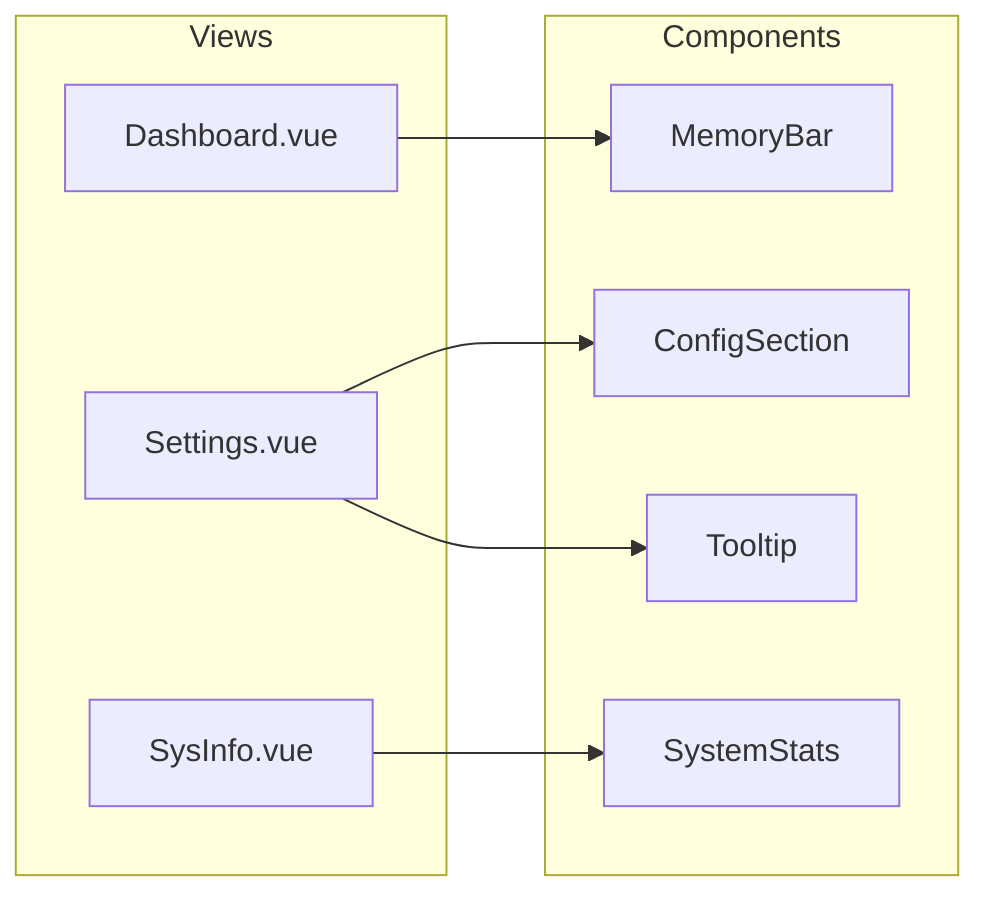

# Shared Components

Four reusable UI components used across the Betty frontend. All components live in `src/frontend/src/components/`.

**Related**: [[frontend/overview]] | [[frontend/views]] | [[frontend/benchmark-store]]

## Component Usage Map



## ConfigSection

Renders a labeled group of form controls. Supports boolean toggles, select dropdowns, text inputs, and number inputs based on each item's `type` field.

**File**: `src/frontend/src/components/ConfigSection.vue`
**Used by**: [[frontend/views]] > `Settings.vue` (4 instances — General, Server Params, Environment Exports, Model Configs)

### Props

| Prop | Type | Required | Default | Description |
|------|------|----------|---------|-------------|
| `title` | `string` | Yes | — | Section heading (displayed uppercase) |
| `items` | `Array` | Yes | — | Array of `{ key, label, type }` objects. `type` can be `boolean`, `select`, `number`, or `text` |
| `modelValue` | `Object` | Yes | — | Reactive config object. Keys in `items` must match keys here |
| `modelOptions` | `Array` | No | `[]` | Dropdown options for items where `key === 'model'`. Each option can be a string or `{ path, size, mtime }` object |
| `queueOptions` | `Array` | No | `['1x', '4x', '8x']` | Dropdown options for items where `key === 'CUDA_SCALE_LAUNCH_QUEUES'` |
| `p2pOptions` | `Array` | No | `['off', 'on']` | Dropdown options for items where `key === 'GGML_CUDA_P2P'` |

### Emits

| Event | Payload | Description |
|-------|---------|-------------|
| `update:modelValue` | `Object` | New config object (shallow copy with one key changed). Supports `v-model` binding |

### Slots

None.

### Usage example

```vue
<config-section
  title="General"
  :items="[
    { key: 'max_sys_mem', label: 'Max System Memory (%)', type: 'number' },
    { key: 'jinja', label: 'Jinja Template Mode', type: 'boolean' },
    { key: 'model', label: 'Model', type: 'select' },
  ]"
  :model-options="modelOptions"
  v-model="visualConfigs"
/>
```

## MemoryBar

Compact memory usage indicator with a color-coded progress bar.

**File**: `src/frontend/src/components/MemoryBar.vue`
**Used by**: [[frontend/views]] > `Dashboard.vue`

### Props

| Prop | Type | Required | Default | Description |
|------|------|----------|---------|-------------|
| `store` | `Object` | Yes | — | Benchmark store instance. Reads `store.systemMemory` (`usedGB`, `totalGB`, `percentUsed`) |

### Emits

None.

### Slots

None.

### Behaviour

- Bar color: green (≤70%), yellow (>70%), red (>90%)
- Shows `used / total GB` and percentage used

## SystemStats

Detailed system resource display — memory, CPU (with per-core breakdown), and GPU stats (temperature, core utilization, VRAM).

**File**: `src/frontend/src/components/SystemStats.vue`
**Used by**: [[frontend/views]] > `SysInfo.vue`

### Props

| Prop | Type | Required | Default | Description |
|------|------|----------|---------|-------------|
| `store` | `Object` | Yes | — | Benchmark store instance. Reads `store.systemMemory` (memory, `cpuUsage`, `cpuCores`, `gpuStats`) |

### Emits

None.

### Slots

None.

### Behaviour

- **Memory**: progress bar with used/total GB and percentage
- **CPU**: overall usage bar, plus per-core grid (5-column layout) when `cpuCores` is populated
- **GPU**: per-GPU section showing name, temperature, core utilization bar, and VRAM bar
- All bars use the same color thresholds: green (≤70%), yellow (>70%), red (>90%)
- GPU section is hidden when `gpuStats` is empty or null

## Tooltip

Wraps any element and shows a floating tooltip on hover or focus. The tooltip is mounted to `<body>` to avoid overflow clipping.

**File**: `src/frontend/src/components/Tooltip.vue`
**Used by**: [[frontend/views]] > `Settings.vue` (wraps parameter labels that have a `tooltip` string)

### Props

| Prop | Type | Required | Default | Description |
|------|------|----------|---------|-------------|
| `text` | `string` | No | `''` | Tooltip text. If empty, no tooltip is shown |

### Emits

None.

### Slots

| Slot | Description |
|------|-------------|
| default (required) | The element to wrap. Tooltip triggers on `mouseenter`/`mouseleave` and `focus`/`blur` |

### Usage example

```vue
<Tooltip :text="param.tooltip">
  <span>{{ param.label }}</span>
</Tooltip>
```

### Behaviour

- Creates a `#tooltip-root` container on `<body>` on first hover
- Positions the tooltip below the trigger element, centered horizontally
- Cleans up the DOM element on unmount and on mouse leave
- Pointer events are disabled on the tooltip so it does not interfere with interaction
