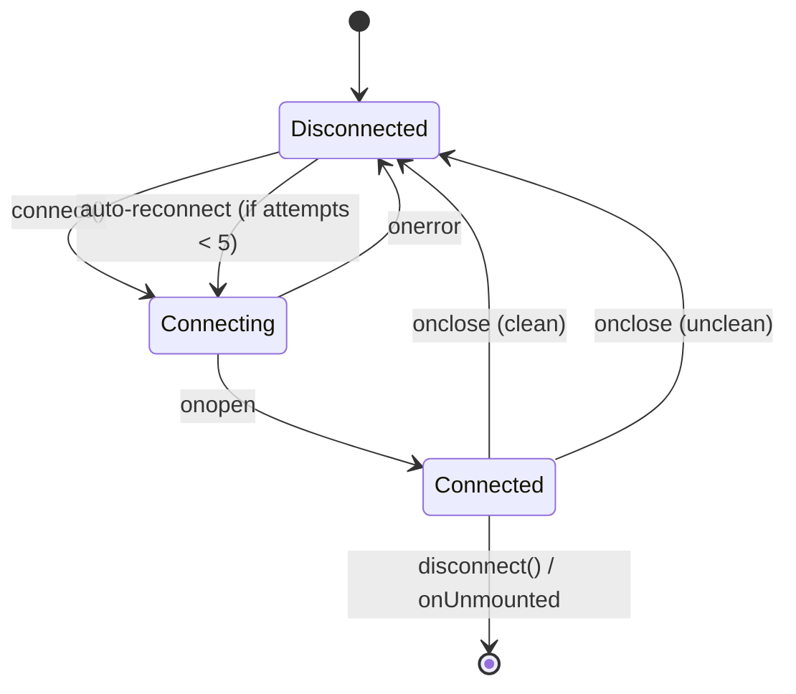

# WebSocket Composable (`useWebSocket`)

**Tags:** `frontend`, `vue`, `composable`, `websocket`, `real-time`, `streaming`, `connection`

## Overview

The `useWebSocket` composable (`src/frontend/src/composables/useWebSocket.js`) manages the WebSocket connection to the Betty backend. It handles connection lifecycle, reconnection, message sending, and event dispatching.

## Initialization

```js
const { connect, sendPrompt, on } = useWebSocket(url, authToken);
```

| Parameter | Type | Description |
|---|---|---|
| `url` | `string \| null` | WebSocket URL (auto-resolved if null) |
| `authToken` | `string \| (() => string) \| null` | JWT token or getter function |

## URL Resolution

1. Explicit `url` parameter
2. `VITE_BACKEND_URL` env variable
3. Development: `ws://localhost:3001/ws`
4. Production: Same-origin WebSocket URL

If an auth token is provided, it's appended as a query parameter: `?token=<jwt>`.

## API

### `connect(): void`

Establish the WebSocket connection. Handles reconnection with exponential backoff.

### `disconnect(): void`

Close the connection and cancel any pending reconnection.

### `sendPrompt(content: string): boolean`

Send a `prompt` message to the backend. Returns `true` if sent successfully.

### `stopResponse(): void`

Send a `stop` message to abort the current response.

### `deleteMessage(index, role, content): void`

Send a `delete-message` command to remove a message from context.

### `newSession(): void`

Send a `new-session` command to start a fresh Pi session.

### `on(event: string, callback: Function): void`

Register an event handler for a specific event type.

### `off(event: string): void`

Remove an event handler.

## Events

| Event | Payload | Description |
|---|---|---|
| `message` | `{ role, content }` | Complete message |
| `stream` | `{ content }` | Text delta chunk |
| `status` | `{ status }` | Session status |
| `error` | `{ message }` | Error from server |
| `session-started` | `{ sessionId }` | New session created |
| `tool-call` | `{ toolName, toolCallId }` | Tool invoked |
| `tool-result` | `{ toolName, toolCallId, result, isError }` | Tool finished |
| `auth-ok` | `{ user }` | Auth confirmed |

## Reconnection

| Setting | Value |
|---|---|
| Max attempts | 5 |
| Backoff | `min(1000 * 2^attempt, 10000)` ms |
| Trigger | Unclean close only |

## Return Value

```js
{
  isConnected: readonly,
  isConnecting: readonly,
  lastError: readonly,
  sessionId: readonly,
  wsUser: readonly,
  connect,
  disconnect,
  sendPrompt,
  stopResponse,
  deleteMessage,
  newSession,
  on,
  off,
}
```

## Lifecycle



## Cleanup

Automatically disconnects when the owning component is unmounted via `onUnmounted()`.

## Related

- [[App Component]] — Primary consumer of useWebSocket
- [[Auth Composable]] — Provides the auth token
- [[Server]] — Backend WebSocket handler
- [[PiSession]] — Backend session that WebSocket communicates with
