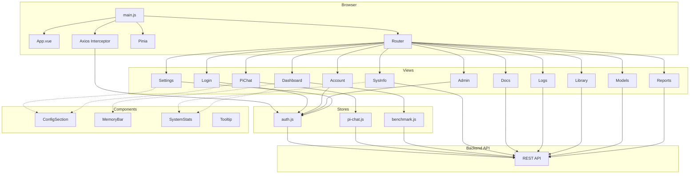

# Frontend Overview

tags: [frontend, vue, overview, developer]

## Tech Stack

| Layer | Package | Version |
|-------|---------|---------|
| Framework | [Vue 3](https://vuejs.org/) | ^3.5.0 |
| State management | [Pinia](https://pinia.vuejs.org/) | ^2.3.0 |
| Routing | [Vue Router](https://router.vuejs.org/) | ^4.5.0 |
| Styling | [Tailwind CSS](https://tailwindcss.com/) | ^4.0.0 |
| HTTP client | [Axios](https://axios-http.com/) | ^1.7.0 |
| Build tool | [Vite](https://vitejs.dev/) | ^6.1.0 |
| Markdown | [marked](https://marked.js.org/) | ^18.0.5 |
| Sanitization | [DOMPurify](https://purify.io/) | ^3.4.11 |

## Project Structure

```
src/frontend/src/
├── App.vue                 # Root component
├── main.js                 # App entry — bootstraps Vue, Pinia, Router, Axios
├── styles/                 # Global CSS (Tailwind entry point)
├── router/
│   └── index.js            # Route definitions + navigation guards
├── views/                  # Page-level components (16 views)
├── stores/                 # Pinia stores (3 stores)
└── components/             # Shared UI components (4 components)
```

### Views (`src/views/`)

16 page-level components, one per route:

| View | Route | Description |
|------|-------|-------------|
| `PiChat.vue` | `/` | Default landing page — Pi chat interface |
| `Login.vue` | `/login` | Sign-in page (guest-only) |
| `Admin.vue` | `/admin` | Admin dashboard |
| `Dashboard.vue` | `/benchmark` | Benchmark results |
| `Settings.vue` | `/settings` | Application settings |
| `Reports.vue` | `/reports` | Reports view |
| `Models.vue` | `/models` | Model management |
| `Docs.vue` | `/docs` | Documentation viewer |
| `Library.vue` | `/library` | Research library |
| `Logs.vue` | `/logs` | System logs |
| `SysInfo.vue` | `/sys-info` | System information |
| `Account.vue` | `/account` | User account settings |
| `ChatTemplates.vue` | — | Chat template management (sub-view) |
| `LibraryImportExport.vue` | — | Library import/export (sub-view) |
| `MmprojModels.vue` | — | MMProj models (sub-view) |
| `Users.vue` | — | User management (sub-view) |

See [[frontend/views]] for full view documentation.

### Stores (`src/stores/`)

3 Pinia stores manage application state:

- **[[frontend/auth-store]]** (`auth.js`) — Authentication state, session management, role checks
- **[[frontend/benchmark-store]]** (`benchmark.js`) — Benchmark data, results, and metrics
- **[[frontend/pi-chat-store]]** (`pi-chat.js`) — Chat messages, conversation state, streaming

### Components (`src/components/`)

4 shared UI components used across views:

- `ConfigSection.vue` — Configurable settings sections
- `MemoryBar.vue` — Memory usage visualization
- `SystemStats.vue` — System statistics display
- `Tooltip.vue` — Reusable tooltip wrapper

See [[frontend/components]] for full component documentation.

## Routing

The router uses HTML5 history mode (`createWebHistory`) and defines 13 top-level routes. All routes except `/login` require authentication.

### Route Metadata

Each route supports `meta` fields for access control:

- `title` — Page title (defaults to route name)
- `requiresAuth` — Redirect to `/login` if not authenticated
- `guest` — Redirect to `/admin` if already logged in
- `requiredRole` — Minimum role level (`viewer` < `operator` < `admin`)

### Navigation Guard

A `beforeEach` guard handles:

1. **Session restoration** — If a token exists but no user is loaded, calls `auth.restoreSession()`
2. **Guest routes** — Redirects logged-in users away from `/login`
3. **Auth-required routes** — Redirects unauthenticated users to `/login` with a `redirect` query param
4. **Role-based access** — Compares user role against `requiredRole` using a hierarchy (`admin: 3`, `operator: 2`, `viewer: 1`)

## API Configuration

The frontend communicates with the backend API via the `VITE_API_URL` environment variable.

```js
const API_BASE = import.meta.env.VITE_API_URL || ''
```

If `VITE_API_URL` is not set, requests default to the same origin (empty base URL). This variable is used by views and stores that make direct API calls:

- `Reports.vue`, `Library.vue`, `LibraryImportExport.vue`, `Docs.vue`, `Logs.vue`, `PiChat.vue`
- `stores/benchmark.js`, `stores/pi-chat.js`

### Axios 401 Interceptor

An Axios response interceptor (set up in `main.js`) catches `401` responses and automatically:

1. Clears the auth session via `auth.logout()`
2. Redirects to `/login` with the current path as a `redirect` query parameter

This ensures expired or invalid tokens are handled gracefully without manual error handling in each view.

### Session Restore

On app startup, `main.js` checks if a token exists without a loaded user and calls `auth.restoreSession()` to re-establish the session before mounting the app.

## Architecture



## Development

```bash
cd src/frontend
npm install
npm run dev      # Start dev server (Vite)
npm run build    # Production build
npm run preview  # Preview production build
```

Set `VITE_API_URL` in `.env` to point the frontend at a different backend:

```env
VITE_API_URL=http://localhost:3000/api
```
