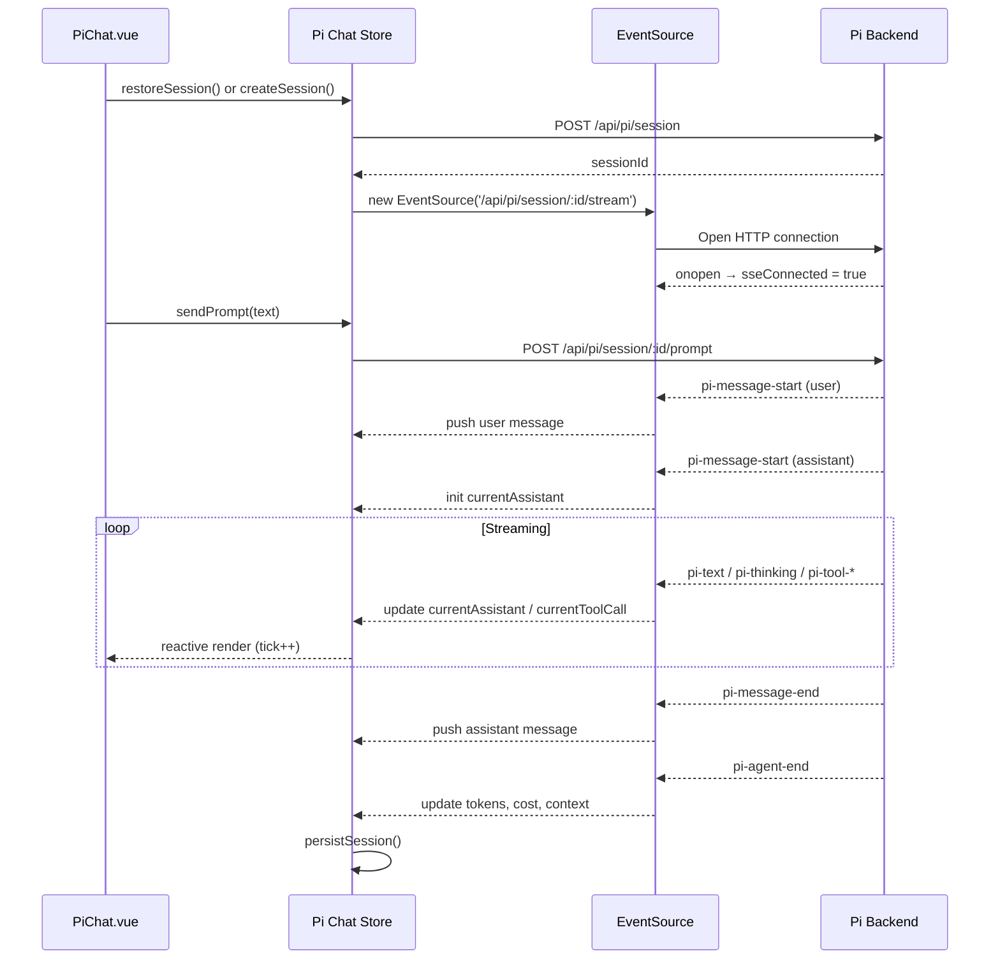
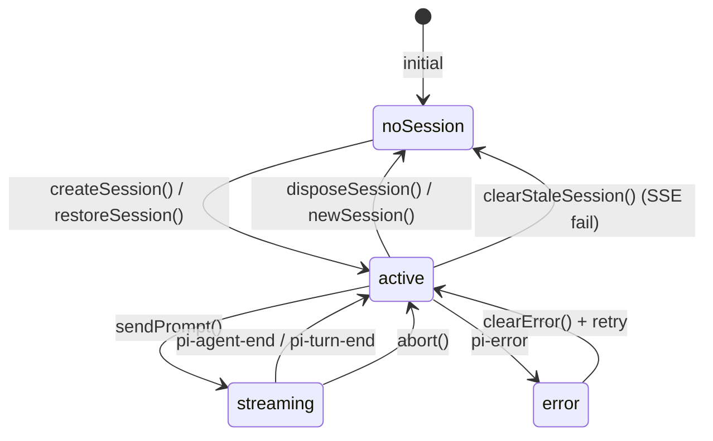

# Pi Chat Store

Pinia store for the Pi chat interface. Manages conversation sessions, SSE streaming, message history, tool calls, and session persistence via `localStorage`.

**File**: `src/frontend/src/stores/pi-chat.js`

**Related**: [[frontend/overview]] | [[frontend/views]] | [[frontend/auth-store]] | [[frontend/benchmark-store]]

## State

All reactive state properties.

### Session

| Property | Type | Default | Description |
|----------|------|---------|-------------|
| `sessionId` | `string \| null` | `null` | Active session identifier |
| `isStreaming` | `boolean` | `false` | Whether the model is currently generating a response |
| `sseConnected` | `boolean` | `false` | Whether the SSE stream is currently open |
| `error` | `string \| null` | `null` | Last error message from any API call |

### Messages

| Property | Type | Default | Description |
|----------|------|---------|-------------|
| `messages` | `array` | `[]` | Conversation history — array of `{ id, role, content }` objects |
| `currentAssistant` | `object \| null` | `null` | The assistant message currently being built via SSE |
| `currentToolCall` | `object \| null` | `null` | The tool call currently being built via SSE |

### Model Info

| Property | Type | Default | Description |
|----------|------|---------|-------------|
| `model` | `string \| null` | `null` | Model name for the current session |
| `thinking` | `string` | `'off'` | Thinking mode: `'off'`, `'enabled'`, etc. |

### Usage Metrics

| Property | Type | Default | Description |
|----------|------|---------|-------------|
| `tokens` | `object` | `{ input: 0, output: 0, total: 0 }` | Token usage counters |
| `cost` | `number` | `0` | Accumulated session cost |
| `contextWindow` | `number` | `0` | Total context window size in tokens |
| `contextPercent` | `number \| null` | `null` | Context window usage percentage |

### Skills

| Property | Type | Default | Description |
|----------|------|---------|-------------|
| `skills` | `array` | `[]` | Available Pi skills from the backend |

### Internal

| Property | Type | Default | Description |
|----------|------|---------|-------------|
| `tick` | `number` | `0` | Incremented on every SSE mutation to force computed reactivity |

### Message Object Shape

Each entry in `messages`:

| Field | Type | Description |
|-------|------|-------------|
| `id` | `string` | Unique identifier (e.g. `'msg-1719000000000'`) |
| `role` | `string` | `'user'` or `'assistant'` |
| `content` | `string` | Message text |
| `thinking` | `string` | Thinking trace (assistant messages only, may be empty) |
| `toolCalls` | `array` | Tool calls made during this message (assistant only) |

### Tool Call Object Shape

Each entry in an assistant message's `toolCalls`:

| Field | Type | Description |
|-------|------|-------------|
| `id` | `string` | Tool call identifier |
| `name` | `string` | Tool name |
| `params` | `object` | Tool parameters |
| `output` | `string` | Tool output |
| `success` | `boolean \| null` | Whether the tool call succeeded |
| `expanded` | `boolean` | UI state — whether the tool call is expanded in the view |

## Getters

Computed properties derived from state.

| Getter | Returns | Description |
|--------|---------|-------------|
| `hasSession` | `boolean` | `true` when `sessionId` is set |
| `messageCount` | `number` | Number of messages in the conversation |
| `lastAssistantMessage` | `object \| null` | Most recent assistant message, or `null` |

## Actions

### Session Lifecycle

#### `createSession()`

Posts to `POST /api/pi/session`. On success, sets `sessionId`, clears `messages` and metrics, persists to `localStorage`, opens the SSE connection, and fetches skills. Returns `true` on success.

#### `restoreSession()`

Restores a persisted session from `localStorage`. Validates the session is still alive by waiting for SSE `onopen` (up to 3 seconds). If the session is stale (SSE fails), clears the stale data and creates a fresh session. Returns `true` on success.

#### `clearStaleSession()`

Resets all session-related state and clears `localStorage`. Called internally when a restored session is found to be expired.

#### `newSession()`

Disconnects SSE, clears `localStorage`, resets all state, then calls `createSession()` to start fresh.

#### `disposeSession()`

Disconnects SSE, deletes the session via `DELETE /api/pi/session/:id`, clears `localStorage`, and resets all state.

### Messaging

#### `sendPrompt(text)`

Posts the user's message to `POST /api/pi/session/:id/prompt`. Returns `true` on success. The response is streamed back via SSE.

#### `abort()`

Posts to `POST /api/pi/session/:id/abort`. Stops the current generation and sets `isStreaming` to `false`. Returns `true` on success.

### SSE Connection

#### `connectSSE()`

Opens an `EventSource` to `GET /api/pi/session/:id/stream`. Authentication token is passed as a query parameter (`?token=...`) since `EventSource` does not support custom headers.

**Event handlers:**

| SSE Event | State Updated | Notes |
|-----------|--------------|-------|
| `pi-status` | `model`, `thinking`, `isStreaming`, `contextWindow` | Session metadata update |
| `pi-message-start` | `messages` (user), `currentAssistant` (assistant) | User messages are pushed directly. Assistant messages are initialized as a draft. |
| `pi-text` | `currentAssistant.content`, `tick` | Appends text delta to the current assistant draft |
| `pi-thinking` | `currentAssistant.thinking`, `tick` | Appends thinking delta to the current assistant draft |
| `pi-tool-start` | `currentToolCall`, `currentAssistant.toolCalls`, `tick` | Initializes a new tool call and attaches it to the current assistant message |
| `pi-tool-update` | `currentToolCall.output`, `tick` | Updates tool output incrementally |
| `pi-tool-end` | `currentToolCall.output`, `currentToolCall.success`, `tick` | Finalizes the tool call |
| `pi-message-end` | `messages`, `currentAssistant`, `tick` | Pushes the completed assistant message to `messages` |
| `pi-agent-start` | `isStreaming` | Sets to `true` |
| `pi-agent-end` | `isStreaming`, `tokens`, `cost`, `contextWindow`, `contextPercent` | Finalizes the turn with usage metrics |
| `pi-turn-end` | `isStreaming` | Sets to `false` |
| `pi-error` | `error`, `isStreaming` | Sets error message, stops streaming |
| `pi-heartbeat` | (none) | Connection alive signal |

#### `disconnectSSE()`

Closes the `EventSource`, clears the internal `_sse` reference, and resets `sseConnected`.

### Skills

#### `fetchSkills()`

Fetches available skills from `GET /api/pi/skills`. Updates the `skills` array. Fails silently on error.

### Utilities

#### `clearError()`

Resets `error` to `null`.

## Session Persistence

The store persists session state to `localStorage` under the key `pi-chat-session`:

- `sessionId`, `messages`, `model`, `thinking`, `tokens`, `cost`, `contextWindow`, `contextPercent`

Persistence occurs:

1. After `createSession()` succeeds
2. After each user message is received via SSE (`pi-message-start`)
3. After each assistant message completes (`pi-message-end`)
4. After each agent turn ends (`pi-agent-end`)

On app load, `restoreSession()` attempts to restore the persisted session and validates it is still active via SSE.

## Chat Flow Diagram

## Session State Diagram

## Authentication

All API calls use the `betty-token` from `localStorage`. REST calls use the standard `Authorization: Bearer` header via Axios. SSE connections pass the token as a `?token=` query parameter since `EventSource` does not support custom headers.

See [[frontend/auth-store]] for token management.

## Internal Properties

These properties are not part of the reactive state but are used internally:

| Property | Type | Purpose |
|----------|------|---------|
| `_sse` | `EventSource \| null` | Reference to the active SSE connection |

## Conventions

- All async actions catch errors and store the message in `this.error`.
- Actions that modify server state return `true`/`false`.
- Session state is persisted to `localStorage` after each significant mutation.
- The `tick` counter is incremented on every SSE mutation to force Vue computed properties to re-evaluate.
- `fetchSkills()` fails silently — skills are non-critical to the chat flow.
