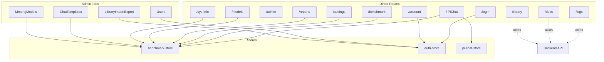

# Frontend Views

tags: [frontend, vue, views, developer]

All Vue views in the Betty frontend, their routes, stores, and API dependencies.

See also: [[frontend/overview]], [[frontend/benchmark-store]], [[frontend/auth-store]], [[frontend/pi-chat-store]], [[frontend/components]].

## View Summary

| Route | Component | Description | Auth Required | Role Required |
|---|---|---|---|---|
| `/login` | Login | Sign-in and registration form | No (guest only) | — |
| `/` | PiChat | AI agent chat interface (Pi SDK) | Yes | viewer |
| `/admin` | Admin | Tabbed container for all benchmark views | Yes | viewer |
| `/benchmark` | Dashboard | Live benchmark monitoring and control | Yes | viewer |
| `/settings` | Settings | Build config, profiles, service management | Yes | operator |
| `/reports` | Reports | Saved benchmark reports, config inspection | Yes | viewer |
| `/models` | Models | Search and download GGUF models from HuggingFace | Yes | operator |
| `/docs` | Docs | Browse project documentation (docs/) | Yes | viewer |
| `/library` | Library | Browse research library (~/.betty/library/) | Yes | viewer |
| `/logs` | Logs | Live service logs (llama.service, betty.service) | Yes | viewer |
| `/sys-info` | SysInfo | CPU, GPU, memory system stats | Yes | viewer |
| `/account` | Account | Change password | Yes | viewer |
| `/users` | Users | User CRUD (inside Admin tab) | Yes | admin |

### Views Embedded in Admin Tab Only

These views are not standalone routes. They are loaded as tabs inside Admin view.

| Tab Key | Component | Description |
|---|---|---|
| `chatTemplates` | ChatTemplates | Download and manage chat template JSON files |
| `mmprojModels` | MmprojModels | Download and manage mmproj (multimodal projector) models |
| `libraryImportExport` | LibraryImportExport | Export/import the research library as tar.gz |

## View-to-Store Relationships

## View Details

### Login

**Route:** `/login` &nbsp;|&nbsp; **Auth:** guest only &nbsp;|&nbsp; **Store:** [[frontend/auth-store]]

Sign-in and registration form. Redirects to `/admin` if the user is already logged in.

- Two modes: login (username + password) and register (username + password + role selection)
- First user registered becomes admin automatically
- On success, redirects to `/admin`

**API calls:** `POST /api/auth/login`, `POST /api/auth/register`

---

### PiChat

**Route:** `/` &nbsp;|&nbsp; **Auth:** required &nbsp;|&nbsp; **Stores:** [[frontend/pi-chat-store]], [[frontend/benchmark-store]]

Full-featured AI agent chat interface powered by the Pi SDK.

**Key features:**

- Real-time streaming via SSE (Server-Sent Events)
- Markdown rendering with `marked` + DOMPurify sanitization
- Slash command autocomplete (`/settings`, `/new`, `/model`, `/export`, `/import`, `/share`, etc.)
- Tool call display with expandable input/output panels
- Thinking block display (collapsible)
- Context window usage indicator with color-coded warnings
- Token count and cost tracking
- Session management (restore, create new, abort streaming)
- System status polling (via benchmark-store)

**API calls:** SSE stream to `/api/pi/session/...`, `DELETE /api/pi/session/:id`

---

### Admin

**Route:** `/admin` &nbsp;|&nbsp; **Auth:** required &nbsp;|&nbsp; **Store:** none

Tabbed container that lazy-loads all benchmark-related views. Uses `defineAsyncComponent` for code splitting.

**Tabs:** Benchmark, Models, Chat Templates, MMPROJ Models, Settings, Reports, Logs, Sys Info, Users, Library (Import/Export).

---

### Dashboard

**Route:** `/benchmark` &nbsp;|&nbsp; **Auth:** required &nbsp;|&nbsp; **Store:** [[frontend/benchmark-store]]

Primary benchmark monitoring view. Real-time status, metrics, and controls.

**Key features:**

- Status card: test run ID, process alive/dead, SSE connection state
- Metrics card: avg gen tokens/s, avg prompt tokens/s, total runs, memory bar
- Live results table with sortable entries
- Start/stop benchmark controls
- Save results as a named report
- Live log viewer with auto-scroll, clear, and maximize
- Details modal: view prompt/response messages per test run
- CPU cores modal: per-core usage bars with GPU stats
- Controls modal: environment variables (JSON), current launch command
- SSE connection for real-time updates, 5-second polling backup

**API calls:** All via benchmark-store — `GET /api/status`, `GET /api/configs`, `GET /api/results`, `GET /api/service/status`, `GET /api/launch-command`, `GET /api/system`, `POST /api/benchmark/start`, `POST /api/benchmark/stop`, `POST /api/report/save`, SSE `/api/benchmark/stream`

---

### Settings

**Route:** `/settings` &nbsp;|&nbsp; **Auth:** required &nbsp;|&nbsp; **Store:** [[frontend/benchmark-store]]

Configure llama.cpp builds, manage profiles, and control services.

**Key features:**

- Three-column layout: Actions panel, Profile panels, Build/Editor
- Actions: Kill Port, Start/Stop llama.service, Edit Service, Update Betty, Delete Build, Delete Llama
- Config Profiles: save/load/delete named config snapshots
- Service Profiles: save/load/delete named service configurations with view modal
- Build llama.cpp: save configs, trigger build, view build logs with progress bar
- Build Options tab: build cores, skip build, ccache, LTO, CUDA options (flash attention, graphs, NCCL, peer copy, custom arch, FP16, etc.)
- Run Options tab: model directory, model selection, context length, batch size, u-batch, GPU layers, cache RAM, temperature, top-p, top-k, min-p, split params, spec params, export configs, server params (host, port, parallel, flash attn, reasoning, rope scaling, jinja template, mmproj model)
- Service edit modal: execStart command, environment variables, restart policy
- Chat template and mmproj model dropdown selectors

**API calls:** All via benchmark-store — `GET/PUT /api/configs`, `GET /api/models-dir`, `GET /api/models`, `POST /api/build`, `POST /api/profile/save`, `POST /api/profile/load`, `POST /api/profile/delete`, `GET /api/profiles`, service profile endpoints, `GET/PUT /api/service/config`, `POST /api/service/start/stop`, `POST /api/kill-port`, `POST /api/delete-build`, `POST /api/delete-llama`, `POST /api/update`, `GET /api/chat-templates`, `GET /api/mmproj-models`

---

### Reports

**Route:** `/reports` &nbsp;|&nbsp; **Auth:** required &nbsp;|&nbsp; **Store:** [[frontend/benchmark-store]]

Browse, inspect, and manage saved benchmark reports.

**Key features:**

- Left panel: list of saved reports with modification dates
- Right panel: selected report detail with summary metrics (total runs, avg gen/prompt tok/s, best gen tok/s)
- Sortable results table (by run ID, prompt/s, gen/s, time, memory)
- Raw markdown view toggle
- Config modal per test run: test parameters, model parameters, server parameters, split/GPU parameters, environment variables, CMake build flags
- Reproduce commands: copy build command and launch command to clipboard
- Install as systemd service directly from a report's test run config

**API calls:** `GET /api/reports`, `GET /api/report/:name`, `DELETE /api/report/:name`, `GET /api/report/:name/configs/:testRunId`, `GET /api/report/:name/commands/:testRunId`, `POST /api/service/install`

---

### Models

**Route:** `/models` &nbsp;|&nbsp; **Auth:** required &nbsp;|&nbsp; **Store:** [[frontend/benchmark-store]]

Search for and download GGUF models from HuggingFace, manage local model files.

**Key features:**

- Search tab: search HuggingFace models by name, filter by GGUF format, view model cards with likes/downloads/tags/date
- Model details modal: description, stats, tags, pipeline tag, HuggingFace link
- GGUF file picker: list available .gguf files for the selected model
- Custom filename option for downloads
- Download progress bar with file size tracking
- Downloads tab: list local models grouped by directory, show file sizes, delete local files

**API calls:** `GET /api/models-dir`, `GET /api/models`, `POST /api/hf/search`, `GET /api/hf/model/:id/files`, `POST /api/hf/download/:id` (with SSE progress), `DELETE /api/model/:path`

---

### Docs

**Route:** `/docs` &nbsp;|&nbsp; **Auth:** required &nbsp;|&nbsp; **Store:** none (direct axios)

Browse project documentation from the `docs/` directory.

**Key features:**

- Sidebar: list of all .md documents with titles, refresh button
- Index view: table of documents with title, description, and tags
- Doc view: rendered markdown with full prose styling
- Internal link navigation: clicking .md links loads the document in-place
- Auto-refresh every 60 seconds

**API calls:** `GET /api/docs`, `GET /api/docs/:filename`

---

### Library

**Route:** `/library` &nbsp;|&nbsp; **Auth:** required &nbsp;|&nbsp; **Store:** none (direct axios)

Browse the research library at `~/.betty/library/`.

**Key features:**

- Sidebar: topic list with titles and dates, refresh button
- Tag filter: filter topics by tag
- Index view: table of topics with title, summary, and tags
- Topic view: rendered index.md + optional full report
- Auto-refresh every 60 seconds

**API calls:** `GET /api/library`, `GET /api/library/tags`, `GET /api/library/:slug`

---

### Logs

**Route:** `/logs` &nbsp;|&nbsp; **Auth:** required &nbsp;|&nbsp; **Store:** none (direct axios)

View live service logs for llama.service and betty.service.

**Key features:**

- Tabbed view: llama.service logs and betty.service logs
- Manual refresh button
- Auto-scroll toggle per tab
- Auto-refresh every 5 seconds
- Monospace log display with error styling

**API calls:** `GET /api/logs` (llama.service), `GET /api/logs/betty` (betty.service)

---

### SysInfo

**Route:** `/sys-info` &nbsp;|&nbsp; **Auth:** required &nbsp;|&nbsp; **Store:** [[frontend/benchmark-store]]

System information display.

**Key features:**

- Renders the SystemStats component component with CPU cores, GPU stats, and memory usage
- Polls system status every 5 seconds

**API calls:** `GET /api/system` (via benchmark-store)

---

### Account

**Route:** `/account` &nbsp;|&nbsp; **Auth:** required &nbsp;|&nbsp; **Store:** [[frontend/auth-store]]

Change the current user's password.

**Key features:**

- Current password, new password, and confirm password fields
- Validation: new password must be at least 8 characters, must match confirmation
- Success/error toast messages

**API calls:** `PUT /api/auth/password`

---

### Users

**Route:** embedded in Admin tab &nbsp;|&nbsp; **Auth:** required (admin) &nbsp;|&nbsp; **Store:** [[frontend/auth-store]]

User management — create, edit, and delete users.

**Key features:**

- User table: username, role badge (admin/operator/viewer), created date
- Create user modal: username, password, role selection
- Edit user modal: change role, optional password reset
- Delete user confirmation (cannot delete own account)

**API calls:** `GET /api/users`, `POST /api/users`, `PUT /api/users/:username`, `DELETE /api/users/:username`

---

### ChatTemplates

**Route:** embedded in Admin tab &nbsp;|&nbsp; **Auth:** required &nbsp;|&nbsp; **Store:** [[frontend/benchmark-store]]

Download and manage chat template JSON files.

**Key features:**

- Download form: URL input, optional filename, download button with progress bar
- Saved templates list: filename, file size, modification date, delete button

**API calls:** `GET /api/chat-templates`, `POST /api/chat-template/download`, `DELETE /api/chat-template/:filename`

---

### MmprojModels

**Route:** embedded in Admin tab &nbsp;|&nbsp; **Auth:** required &nbsp;|&nbsp; **Store:** [[frontend/benchmark-store]]

Download and manage mmproj (multimodal projector) model files.

**Key features:**

- Download form: URL input, optional filename, download button with progress bar
- Saved models list: filename, file size, modification date, delete button
- Identical UI pattern to ChatTemplates

**API calls:** `GET /api/mmproj-models`, `POST /api/mmproj/download`, `DELETE /api/mmproj/:filename`

---

### LibraryImportExport

**Route:** embedded in Admin tab (labeled "Library") &nbsp;|&nbsp; **Auth:** required &nbsp;|&nbsp; **Store:** [[frontend/auth-store]]

Export and import the research library as a compressed archive.

**Key features:**

- Export: downloads `~/.betty/library/` as `betty-library-export.tar.gz`
- Import: upload a `.tar.gz` file, extracts with SSE progress streaming
- Warning: import overwrites existing files with the same name
- Progress bar showing file count during extraction

**API calls:** `GET /api/library/export`, `POST /api/library/import` (SSE response)
