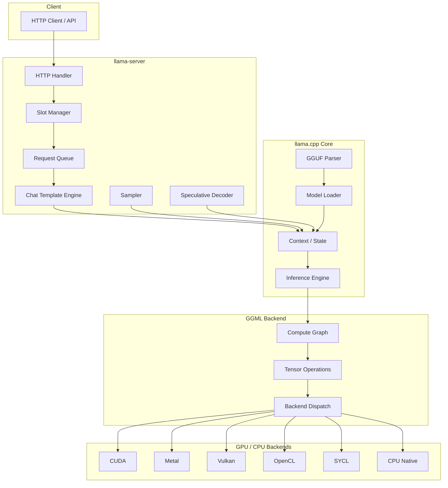
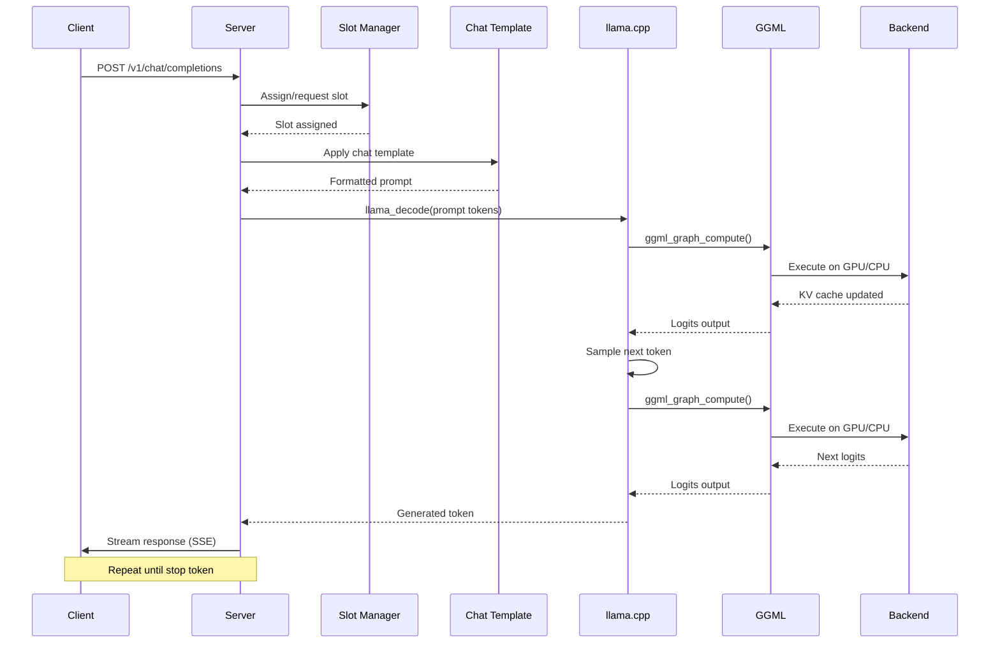

# llama.cpp Architecture

System design, data flow, and component relationships.

**Tags**: `architecture`, `design`, `components`, `data-flow`, `ggml`, `llama`

---

## High-Level Architecture



---

## Component Overview

### 1. HTTP Server (`tools/server/`)

The OpenAI-compatible HTTP server handles client requests, manages slots, and coordinates inference.

**Key files**:
- `server.cpp` — Main server logic, request handling, slot management
- `server.h` — Server configuration and state
- `utils.cpp` — Utility functions, JSON handling

**Responsibilities**:
- Parse HTTP requests (completions, embeddings, chat)
- Manage concurrent slots (parallel conversations)
- Apply chat templates
- Handle streaming responses
- Manage API keys and authentication

### 2. llama.cpp Core (`src/`)

The core inference library. Handles model loading, context management, and token generation.

**Key files**:
- `llama.cpp` / `llama.h` — Main API: context creation, decoding, sampling
- `llama-model.cpp` — Model loading and parsing
- `llama-grammar.cpp` — Grammar-based constraint parsing
- `llama-sampling.cpp` — Sampling strategies (temp, top_k, top_p, etc.)

**Responsibilities**:
- Load GGUF model files
- Manage KV cache
- Execute forward pass
- Provide sampling APIs
- Handle speculative decoding

### 3. GGML Backend (`ggml/`)

The tensor computation library. Provides backend-agnostic tensor operations.

**Key files**:
- `ggml.c` / `ggml.h` — Tensor definitions, compute graph
- `ggml-backend.c` — Backend abstraction layer
- `ggml-cpu.c` — CPU backend implementation
- `ggml-cuda.c` — CUDA backend implementation

**Responsibilities**:
- Define tensor operations (matmul, conv, norm, etc.)
- Build and optimize compute graphs
- Dispatch to appropriate backend
- Manage memory allocation

### 4. Common Utilities (`common/`)

Shared utilities used across all tools.

**Key files**:
- `common.h` / `common.cpp` — Common parameter structs, model loading
- `arg.h` / `arg.cpp` — CLI argument parsing, environment variables
- `sampling.h` / `sampling.cpp` — Sampling chain implementation
- `console.h` / `console.cpp` — Terminal output utilities

---

## Data Flow: Completion Request



---

## Slot Management

Slots are the core abstraction for concurrent conversations:

```
Server
├── Slot 0: User A, context [token1, token2, ...tokenN]
├── Slot 1: User B, context [token1, token2, ...tokenM]
├── Slot 2: User C, context [token1, token2, ...tokenK]
└── Slot 3: (idle, available)
```

Each slot maintains:
- **KV cache**: Key-value pairs for attention
- **Context**: Current conversation tokens
- **State**: Active, idle, waiting, processing

### Continuous Batching

When `--cont-batching` is enabled:
1. Slots in **prefill** (processing prompt) and **decode** (generating) phases are interleaved
2. A slot blocked on prefill doesn't block other slots from decoding
3. Maximizes GPU utilization across concurrent requests

---

## Memory Layout

```
┌─────────────────────────────────────────────────┐
│                    System RAM                    │
│  ┌─────────────┐  ┌──────────────────────────┐  │
│  │  Model Weights│  │      KV Cache           │  │
│  │  (mmap or    │  │  (per-slot, per-layer)   │  │
│  │   loaded)    │  │                          │  │
│  └─────────────┘  └──────────────────────────┘  │
└─────────────────────────────────────────────────┘
         │ n_gpu_layers > 0
         ▼
┌─────────────────────────────────────────────────┐
│                    GPU VRAM                      │
│  ┌─────────────┐  ┌──────────────────────────┐  │
│  │  Model Weights│  │      KV Cache           │  │
│  │  (offloaded) │  │  (GPU-resident)          │  │
│  └─────────────┘  └──────────────────────────┘  │
└─────────────────────────────────────────────────┘
```

### Memory Components

| Component | Location | Size Factor |
|-----------|----------|-------------|
| Model weights | CPU/GPU (based on `--n-gpu-layers`) | Model size × quantization |
| KV cache | CPU/GPU | `n_ctx × n_layer × n_head × head_size × 2` |
| Compute buffers | GPU | Proportional to batch size |
| Token embeddings | GPU | `n_vocab × n_embd` |

---

## Backend Dispatch

GGML dispatches tensor operations to the best available backend:

```
Tensor Operation Request
        │
        ▼
  Backend Selector
        │
        ├── CUDA available? → CUDA backend
        ├── Metal available? → Metal backend
        ├── Vulkan available? → Vulkan backend
        ├── OpenCL available? → OpenCL backend
        ├── SYCL available? → SYCL backend
        └── Default → CPU backend
```

### Tensor Split (Multi-GPU)

When `--tensor-split` is configured:
1. Model layers are partitioned across GPUs
2. Each GPU holds a subset of layer weights
3. Inter-GPU communication via peer-to-peer memory or host bounce buffer

---

## Build System Architecture

```
CMakeLists.txt (root)
    ├── ggml/CMakeLists.txt
    │   ├── ggml-cpu/
    │   ├── ggml-cuda/
    │   ├── ggml-metal/
    │   ├── ggml-vulkan/
    │   ├── ggml-opencl/
    │   └── ggml-sycl/
    ├── src/ (llama.cpp core)
    ├── common/ (shared utilities)
    └── tools/
        ├── server/
        ├── main/ (llama-cli)
        └── ...
```

---

## See Also

- [[llama-cpp/build-options/cmake-overview\|CMake Overview]] — Build configuration
- [[llama-cpp/server-flags/slot-management\|Slot Management]] — Slot details
- [[llama-cpp/server-flags/gpu-and-backends\|GPU & Backends]] — GPU offload details
