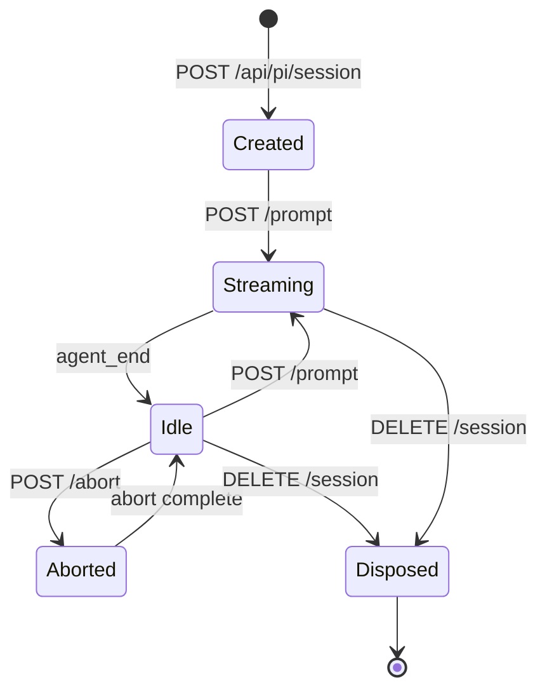

# Pi Chat

The Pi Chat tab provides an AI agent chat interface powered by the Pi SDK. The agent can read files, run commands, edit code, and execute skills — all within the Betty web UI.

See also: [[index]] • [[architecture]]

## Overview

Pi Chat integrates the Pi SDK (`@earendil-works/pi-coding-agent`) to provide a full-featured AI agent with:

- **Streaming responses** — Real-time token streaming via Server-Sent Events
- **Tool execution** — File read/write, bash commands, code editing
- **Thinking display** — Collapsible reasoning blocks
- **Slash commands** — 20+ built-in commands for session management
- **Skill integration** — Access to project skills via `/skill:name`
- **Session management** — Create, dispose, and switch sessions
- **Cost tracking** — Token usage and cost display

## Interface

### Message Area

- **User messages** — Right-aligned, blue background
- **Assistant messages** — Left-aligned with markdown rendering
- **Thinking blocks** — Collapsible details showing agent reasoning
- **Tool calls** — Collapsible panels showing tool name, input parameters, and output
- **Streaming cursor** — Animated indicator while the agent is generating

### Input Area

- **Textarea** — Auto-resizing, supports multi-line with Shift+Enter
- **Send button** — Submit message (or press Enter)
- **Abort button** — Stop current generation (appears during streaming)
- **Slash command menu** — Autocomplete dropdown when typing `/` at line start

### Status Footer

| Element | Description |
|---------|-------------|
| **New Session** | Create a fresh agent session |
| **Model name** | Current model (provider/model-id) |
| **Streaming indicator** | Pulsing dot when generating |
| **Token counts** | Input/output token usage |
| **Cost** | Dollar amount for the session |
| **Context usage** | Percentage of context window used |
| **Connection status** | Green/red dot for SSE connection |

## Slash Commands

Type `/` at the start of a line to trigger autocomplete. Navigate with ↑↓, select with Enter or Tab, cancel with Escape.

| Command | Description |
|---------|-------------|
| `/settings` | Open settings menu |
| `/model` | Select model |
| `/scoped-models` | Enable/disable models for Ctrl+P cycling |
| `/export` | Export session (HTML or JSONL) |
| `/import` | Import and resume a session from JSONL |
| `/share` | Share session as a GitHub gist |
| `/copy` | Copy last agent message |
| `/name` | Set session display name |
| `/session` | Show session info and stats |
| `/changelog` | Show changelog entries |
| `/hotkeys` | Show keyboard shortcuts |
| `/fork` | Fork from a previous message |
| `/clone` | Duplicate current session |
| `/tree` | Navigate session tree |
| `/trust` | Save project trust decision |
| `/login` | Configure provider auth |
| `/logout` | Remove provider auth |
| `/new` | Start a new session |
| `/compact` | Compact session context |
| `/resume` | Resume a different session |
| `/reload` | Reload extensions, skills, prompts |
| `/quit` | Quit pi |

### Skill Commands

Type `/skill:` to access project skills:

```
/skill:project-docs    → Create project documentation
/skill:testing-debugging → Run tests and debug
/skill:research        → Execute structured research
```

## API Endpoints

| Method | Endpoint | Description |
|--------|----------|-------------|
| `POST` | `/api/pi/session` | Create a new agent session |
| `GET` | `/api/pi/session/:id/stream` | SSE stream for session events |
| `POST` | `/api/pi/session/:id/prompt` | Send a prompt to the agent |
| `POST` | `/api/pi/session/:id/abort` | Abort current operation |
| `DELETE` | `/api/pi/session/:id` | Dispose session |
| `GET` | `/api/pi/skills` | List available skills |

## SSE Events

| Event | Description |
|-------|-------------|
| `pi-status` | Session status (model, thinking level, streaming state) |
| `pi-message-start` | New message begins (user or assistant) |
| `pi-text` | Text delta (streaming content) |
| `pi-thinking` | Thinking delta (streaming reasoning) |
| `pi-tool-start` | Tool execution begins |
| `pi-tool-update` | Tool execution progress |
| `pi-tool-end` | Tool execution completes |
| `pi-message-end` | Message completes |
| `pi-agent-start` | Agent turn begins |
| `pi-agent-end` | Agent turn ends (includes token usage and cost) |
| `pi-turn-start` | Turn begins |
| `pi-turn-end` | Turn ends |
| `pi-error` | Error occurred |
| `pi-heartbeat` | Keep-alive |

## Session Lifecycle



## Configuration

Pi Chat uses the Pi SDK's default configuration from the `.agents/` directory. Model providers, authentication, and skills are configured through the Pi SDK's standard mechanisms.

## Cross-References

- [[architecture]] — Pi Chat data flow and component relationships
- [[api-reference]] — Complete API endpoint documentation
