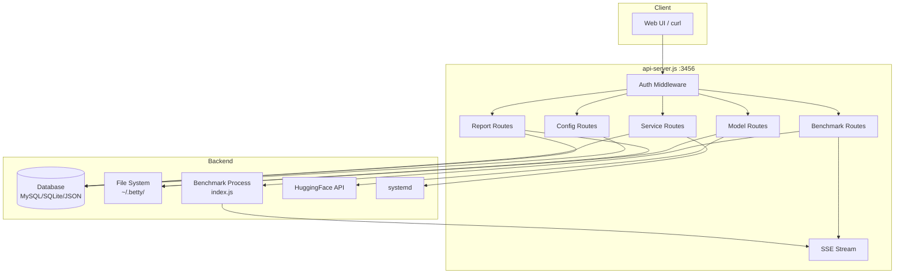

# API Usage

Complete API reference with curl examples. All endpoints are relative to `http://localhost:3456` (or your configured `API_PORT`).

## Authentication

### Login

```bash
curl -X POST http://localhost:3456/api/auth/login \
  -H "Content-Type: application/json" \
  -d '{"username":"admin","password":"admin"}'

# Response:
# {
#   "success": true,
#   "data": {
#     "token": "eyJhbGciOiJIUzI1NiIsInR5cCI6IkpXVCJ9...",
#     "user": {"id": 1, "username": "admin", "role": "admin"}
#   }
# }
```

### Register

```bash
curl -X POST http://localhost:3456/api/auth/register \
  -H "Content-Type: application/json" \
  -d '{"username":"operator1","password":"securepass123","role":"operator"}'

# First user becomes admin automatically.
# Subsequent users default to "viewer" unless role is specified.
# Roles: admin, operator, viewer
```

### Token Usage

Include the JWT token in the `Authorization` header:

```bash
export TOKEN="eyJhbGciOiJIUzI1NiIsInR5cCI6IkpXVCJ9..."

# For SSE endpoints, use query parameter instead (EventSource limitation):
curl "http://localhost:3456/api/stream?token=${TOKEN}"
```

### Current User

```bash
curl -H "Authorization: Bearer $TOKEN" \
  http://localhost:3456/api/auth/me

# Response: {"success":true,"data":{"id":1,"username":"admin","role":"admin"}}
```

### Change Password

```bash
curl -X PUT http://localhost:3456/api/auth/password \
  -H "Authorization: Bearer $TOKEN" \
  -H "Content-Type: application/json" \
  -d '{"currentPassword":"oldpass","newPassword":"newpass123"}'
```

### User Management (Admin Only)

```bash
# List users
curl -H "Authorization: Bearer $TOKEN" \
  http://localhost:3456/api/auth/users

# Update user role
curl -X PUT http://localhost:3456/api/auth/users/operator1 \
  -H "Authorization: Bearer $TOKEN" \
  -H "Content-Type: application/json" \
  -d '{"role":"admin"}'

# Delete user
curl -X DELETE http://localhost:3456/api/auth/users/operator1 \
  -H "Authorization: Bearer $TOKEN"
```

## Config CRUD

### Get Config

```bash
curl -H "Authorization: Bearer $TOKEN" \
  http://localhost:3456/api/configs

# Returns full config object with:
# - export_configs, max_sys_mem, llama_port, llama_host
# - model, gpu_selection, split_params, spec_params
# - build_make_params, cuda_configs, model_configs
# - server_params, benchmark_messages, test_params
```

### Save Config

```bash
# PUT replaces the entire config
curl -X PUT http://localhost:3456/api/configs \
  -H "Authorization: Bearer $TOKEN" \
  -H "Content-Type: application/json" \
  -d @config.json

# Response: {"success":true,"message":"Config saved"}
```

## Benchmark Control

### Start Benchmark

```bash
curl -X POST http://localhost:3456/api/run \
  -H "Authorization: Bearer $TOKEN" \
  -H "Content-Type: application/json" \
  -d '{}'

# With custom env vars:
curl -X POST http://localhost:3456/api/run \
  -H "Authorization: Bearer $TOKEN" \
  -H "Content-Type: application/json" \
  -d '{"env":{"CUDA_VISIBLE_DEVICES":"0,1"}}'

# Response: {"success":true,"message":"Benchmark started"}
# 409 if benchmark is already running
```

### Stop Benchmark

```bash
curl -X POST http://localhost:3456/api/stop \
  -H "Authorization: Bearer $TOKEN"

# Response: {"success":true,"message":"Benchmark stopping..."}
```

### Status

```bash
curl -H "Authorization: Bearer $TOKEN" \
  http://localhost:3456/api/status

# Response:
# {
#   "success": true,
#   "status": "testing",     # idle | building | testing | error | stopped
#   "testRun": 5,
#   "liveResults": [...],
#   "processAlive": true,
#   "buildStatus": "success"  # idle | building | success | error
# }
```

### Current Launch Command

```bash
curl -H "Authorization: Bearer $TOKEN" \
  http://localhost:3456/api/launch-command

# Returns reconstructed llama-server command from current config
```

## SSE Streaming

Connect to the SSE stream for real-time benchmark updates:

```bash
curl -N "http://localhost:3456/api/stream?token=${TOKEN}"
```

### SSE Events

| Event | Description |
|-------|-------------|
| `status` | Benchmark status update (idle, building, testing, error, stopped) |
| `log` | stdout/stderr output from the benchmark process |
| `results` | Updated live results array |
| `message-start` | A new chat message is being sent |
| `message-complete` | Chat response received with timing |
| `test-run-complete` | All messages for a test run finished |
| `heartbeat` | Connection keepalive (every 15s) |

### Event Data Examples

```
event: status
data: {"status":"testing","testRun":3,"liveResults":[...],"processAlive":true}

event: log
data: {"type":"stdout","text":"[3/12] Starting test run: ctx=131072, batch=384...","status":"testing","testRun":3,"liveResults":[]}

event: message-start
data: {"testRunId":3,"messageIndex":1,"prompt":"Develop a design doc..."}

event: message-complete
data: {"testRunId":3,"messageIndex":1,"prompt":"...","response":"...","promptTokens":150,"generatedTokens":800,"totalTimeMs":12000}

event: results
data: {"liveResults":[{"testRunId":3,"avgGenTokensPerSec":45.2,"avgPromptTokensPerSec":120.5,"totalGenTokens":3200,"totalPromptTokens":600,"totalTimeMs":48000,"avgMemUsed":6.2,"avgMemTotal":24.0}]}

event: test-run-complete
data: {"testRunId":3,"messages":[...],"processAlive":true}

event: heartbeat
data: {"ts":1719000000000}
```

## Model Management

### Local Models

```bash
# Models directory
curl -H "Authorization: Bearer $TOKEN" \
  http://localhost:3456/api/models-dir

# List models
curl -H "Authorization: Bearer $TOKEN" \
  http://localhost:3456/api/models

# Delete model
curl -X DELETE http://localhost:3456/api/model/model.gguf \
  -H "Authorization: Bearer $TOKEN"
```

### HuggingFace

```bash
# Search
curl -H "Authorization: Bearer $TOKEN" \
  "http://localhost:3456/api/hf/search?q=llama-3&limit=20&sort=downloads&direction=-1"

# Model details
curl -H "Authorization: Bearer $TOKEN" \
  "http://localhost:3456/api/hf/model/bartowski/Llama-3-8B-Instruct-GGUF"

# List files
curl -H "Authorization: Bearer $TOKEN" \
  "http://localhost:3456/api/hf/model/bartowski/Llama-3-8B-Instruct-GGUF/files"

# Download (SSE)
curl -N http://localhost:3456/api/hf/download \
  -H "Authorization: Bearer $TOKEN" \
  -H "Content-Type: application/json" \
  -d '{"modelId":"bartowski/Llama-3-8B-Instruct-GGUF","filename":"model.gguf"}'

# Progress
curl -H "Authorization: Bearer $TOKEN" \
  "http://localhost:3456/api/hf/download/bartowski_Llama-3-8B-Instruct-GGUF"

# Active downloads
curl -H "Authorization: Bearer $TOKEN" \
  http://localhost:3456/api/hf/active-downloads

# Cancel download
curl -X DELETE "http://localhost:3456/api/hf/download/active/bartowski_Llama-3-8B-Instruct-GGUF" \
  -H "Authorization: Bearer $TOKEN"

# List downloads
curl -H "Authorization: Bearer $TOKEN" \
  http://localhost:3456/api/hf/downloads

# Delete download
curl -X DELETE "http://localhost:3456/api/hf/download/bartowski_Llama-3-8B-Instruct-GGUF" \
  -H "Authorization: Bearer $TOKEN"
```

## Profiles

```bash
# List profiles
curl -H "Authorization: Bearer $TOKEN" \
  http://localhost:3456/api/profiles

# Get profile
curl -H "Authorization: Bearer $TOKEN" \
  http://localhost:3456/api/profile/my-profile

# Save profile
curl -X POST http://localhost:3456/api/profile \
  -H "Authorization: Bearer $TOKEN" \
  -H "Content-Type: application/json" \
  -d '{"name":"my-profile","data":{...}}'

# Load profile (writes to active config)
curl -X POST http://localhost:3456/api/profile/my-profile/load \
  -H "Authorization: Bearer $TOKEN"

# Delete profile
curl -X DELETE http://localhost:3456/api/profile/my-profile \
  -H "Authorization: Bearer $TOKEN"
```

## Reports

```bash
# List reports
curl -H "Authorization: Bearer $TOKEN" \
  http://localhost:3456/api/reports

# Get report
curl -H "Authorization: Bearer $TOKEN" \
  http://localhost:3456/api/report/2024-06-20-llama-3-8b

# Save report
curl -X POST http://localhost:3456/api/save-report \
  -H "Authorization: Bearer $TOKEN" \
  -H "Content-Type: application/json" \
  -d '{"name":"2024-06-20-llama-3-8b"}'

# Per-run config
curl -H "Authorization: Bearer $TOKEN" \
  http://localhost:3456/api/report/2024-06-20-llama-3-8b/configs/3

# Build + launch commands
curl -H "Authorization: Bearer $TOKEN" \
  http://localhost:3456/api/report/2024-06-20-llama-3-8b/commands/3

# Markdown results
curl -H "Authorization: Bearer $TOKEN" \
  http://localhost:3456/api/results

# Delete report
curl -X DELETE http://localhost:3456/api/report/2024-06-20-llama-3-8b \
  -H "Authorization: Bearer $TOKEN"
```

## Service Management (Linux Only)

```bash
# Install from report
curl -X POST http://localhost:3456/api/service/install \
  -H "Authorization: Bearer $TOKEN" \
  -H "Content-Type: application/json" \
  -d '{"reportName":"2024-06-20-llama-3-8b","testRunId":3}'

# Start
curl -X POST http://localhost:3456/api/service/start \
  -H "Authorization: Bearer $TOKEN"

# Stop
curl -X POST http://localhost:3456/api/service/stop \
  -H "Authorization: Bearer $TOKEN"

# Status
curl -H "Authorization: Bearer $TOKEN" \
  http://localhost:3456/api/service/status

# Config
curl -H "Authorization: Bearer $TOKEN" \
  http://localhost:3456/api/service/config

# Update
curl -X POST http://localhost:3456/api/service/update \
  -H "Authorization: Bearer $TOKEN" \
  -H "Content-Type: application/json" \
  -d '{"execStart":"...","envVars":{...},"restart":"always","restartSec":10}'

# Kill port
curl -X POST http://localhost:3456/api/kill-port \
  -H "Authorization: Bearer $TOKEN"
```

## Service Profiles

```bash
# List
curl -H "Authorization: Bearer $TOKEN" \
  http://localhost:3456/api/service-profiles

# Get
curl -H "Authorization: Bearer $TOKEN" \
  http://localhost:3456/api/service-profile/production

# Save
curl -X POST http://localhost:3456/api/service-profile \
  -H "Authorization: Bearer $TOKEN" \
  -H "Content-Type: application/json" \
  -d '{"name":"production","data":{"execStart":"...","envVars":{...},"restart":"always","restartSec":10}}'

# Load
curl -X POST http://localhost:3456/api/service-profile/production/load \
  -H "Authorization: Bearer $TOKEN"

# Delete
curl -X DELETE http://localhost:3456/api/service-profile/production \
  -H "Authorization: Bearer $TOKEN"
```

## Build

```bash
# Build llama.cpp (SSE)
curl -N "http://localhost:3456/api/build?token=${TOKEN}" \
  -X POST

# SSE events: build-log with PROGRESS, STATUS, ERROR, and log lines

# Delete build directory
curl -X DELETE http://localhost:3456/api/build/delete \
  -H "Authorization: Bearer $TOKEN"

# Delete llama.cpp repo
curl -X DELETE http://localhost:3456/api/build/llama/delete \
  -H "Authorization: Bearer $TOKEN"
```

## System Status

```bash
curl -H "Authorization: Bearer $TOKEN" \
  http://localhost:3456/api/system-status

# Response:
# {
#   "success": true,
#   "data": {
#     "totalGB": 63.0,
#     "usedGB": 12.5,
#     "availableGB": 50.5,
#     "percentUsed": 20,
#     "cpuUsage": 45,
#     "cpuCores": [{"name":"cpu0","usage":60},...],
#     "gpuStats": [
#       {"index":0,"name":"NVIDIA RTX 4090","utilization":85,"memoryUsedMB":18000,"memoryTotalMB":24576,"temperature":72,"memoryUsedPercent":73}
#     ]
#   }
# }
```

## Health Check

```bash
curl http://localhost:3456/api/health

# Response: {"status":"ok","uptime":3600.5}
```

## Benchmark Messages

```bash
curl -H "Authorization: Bearer $TOKEN" \
  http://localhost:3456/api/messages

# Response:
# {
#   "success": true,
#   "data": [
#     {
#       "testRunId": 1,
#       "messages": [
#         {"messageIndex":1,"prompt":"...","response":"...","promptTokens":150,"generatedTokens":800,"totalTimeMs":12000}
#       ]
#     }
#   ]
# }
```

## API Architecture



## Authorization Roles

| Role | Permissions |
|------|-------------|
| **admin** | Full access — all endpoints |
| **operator** | Run benchmarks, save/load profiles, save reports, download models, manage services |
| **viewer** | Read-only — view configs, status, reports, models, profiles |

Public endpoints (no auth required): `POST /api/auth/login`, `POST /api/auth/register`, `GET /api/health`, `GET /api/docs`

## Related Pages

- [[qa/getting-started]] — Initial setup
- [[qa/benchmark-workflow]] — Full benchmark lifecycle
- [[qa/model-management]] — Model download and management
- [[qa/profile-workflow]] — Configuration profiles
- [[qa/report-workflow]] — Report management
- [[qa/service-management]] — Systemd service deployment
