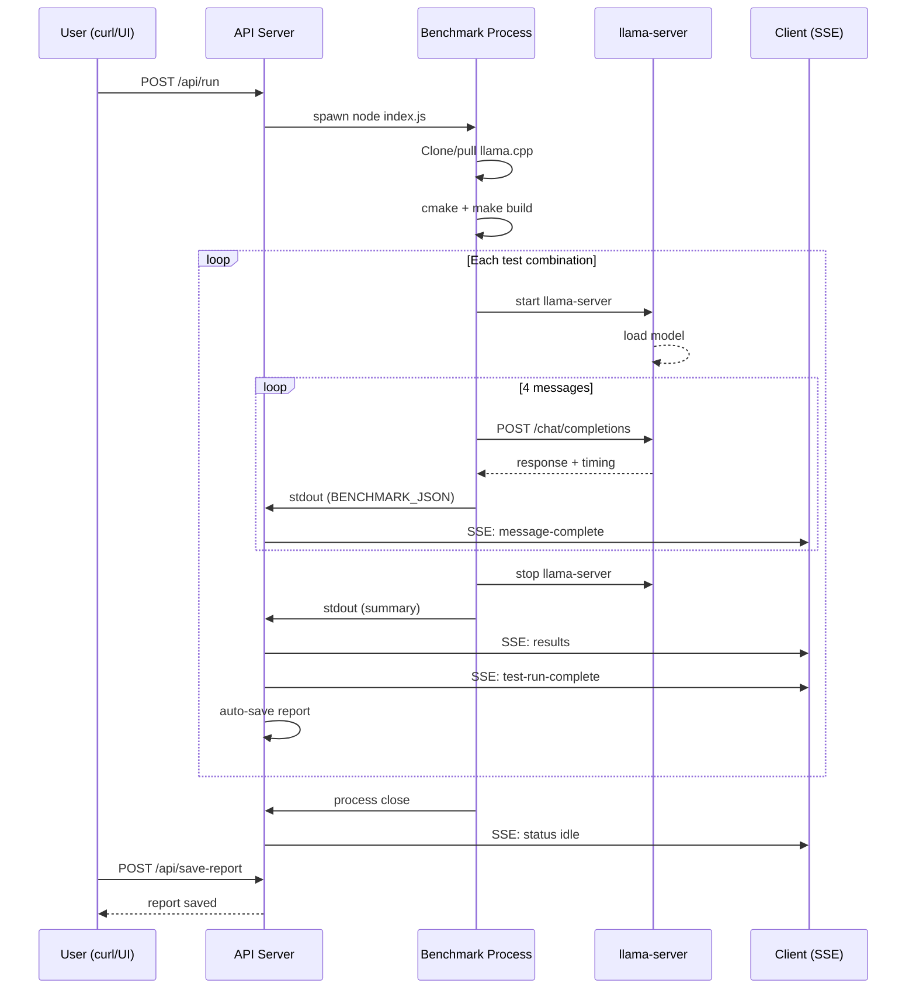

# Benchmark Workflow

End-to-end guide for running a benchmark with Betty.

## Overview

A benchmark runs through these phases:

1. **Build** — Clone/pull llama.cpp, compile with your build flags
2. **Test** — Iterate through parameter combinations, running llama-server for each
3. **Report** — Collect results into a structured report

Each test run sends 4 sequential chat messages to accumulate context, measuring tokens/sec at each step.

## Phase 1: Configure Test Parameters

Set the grid of parameters to test. Betty performs a **grid search** across:

- **Context length** — multiplicative progression (e.g., 32768 → 65536 → 131072 → 262144)
- **Batch size** — additive progression (e.g., 128 → 256 → 384 → ...)
- **U-batch size** — additive progression (paired with batch size, always ≤ batch)
- **Cache RAM** — additive progression (e.g., 4096 → 5120 → 6144 → ...)
- **GPU layer offload** — additive progression (e.g., 999 → 999 → ...)

```bash
# Fetch current config
curl -H "Authorization: Bearer $TOKEN" \
  http://localhost:3456/api/configs > current-config.json

# Edit test_params in current-config.json, then save:
curl -X PUT http://localhost:3456/api/configs \
  -H "Authorization: Bearer $TOKEN" \
  -H "Content-Type: application/json" \
  -d @current-config.json
```

Key test parameters:

```json
{
  "test_params": {
    "context_length": 32768,
    "context_length_multiplier": 2,
    "context_length_max": 262144,
    "gpu_layer_offload": 999,
    "gpu_layer_offload_step": 0,
    "gpu_layer_off_max": 999,
    "batch_size": 128,
    "batch_size_step": 128,
    "batch_size_max": 16384,
    "u_batch_size": 64,
    "u_batch_size_step": 64,
    "u_batch_size_max": 4096,
    "cache_ram": 4096,
    "cache_ram_step": 1024,
    "cache_ram_max": 4096
  }
}
```

See [[configuration-reference]] for the full schema.

## Phase 2: Start the Benchmark

```bash
# Start benchmark (uses current config)
curl -X POST http://localhost:3456/api/run \
  -H "Authorization: Bearer $TOKEN" \
  -H "Content-Type: application/json" \
  -d '{}'

# Response: {"success":true,"message":"Benchmark started"}
```

The benchmark spawns `node index.js` which:

1. Stops any existing `llama.service` systemd unit
2. Kills any running `llama-server` processes
3. Clones or pulls `llama.cpp`
4. Builds with your CMake flags
5. Iterates through each parameter combination

## Phase 3: Monitor Progress via SSE

Connect to the SSE stream for real-time updates:

```bash
curl -N http://localhost:3456/api/stream \
  -H "Authorization: Bearer $TOKEN"
```

SSE events:

```
event: status
data: {"status":"building","testRun":0,"liveResults":[],"processAlive":true}

event: log
data: {"type":"stdout","text":"Running cmake build configuration...","status":"building","testRun":0,"liveResults":[]}

event: status
data: {"status":"testing","testRun":3,"liveResults":[...],"processAlive":true}

event: results
data: {"liveResults":[{"testRunId":3,"avgGenTokensPerSec":45.2,"avgPromptTokensPerSec":120.5,...}]}

event: message-start
data: {"testRunId":3,"messageIndex":1,"prompt":"Develop a design doc..."}

event: message-complete
data: {"testRunId":3,"messageIndex":1,"prompt":"...","response":"...","promptTokens":150,"generatedTokens":800,"totalTimeMs":12000}

event: test-run-complete
data: {"testRunId":3,"messages":[...],"processAlive":true}

event: heartbeat
data: {"ts":1719000000000}
```

Or poll the status endpoint:

```bash
curl -H "Authorization: Bearer $TOKEN" \
  http://localhost:3456/api/status

# Response:
# {
#   "success": true,
#   "status": "testing",
#   "testRun": 5,
#   "liveResults": [...],
#   "processAlive": true,
#   "buildStatus": "success"
# }
```

## Phase 4: View Live Results

```bash
# Get current results (markdown format)
curl -H "Authorization: Bearer $TOKEN" \
  http://localhost:3456/api/results

# Get benchmark messages (prompts + responses per test run)
curl -H "Authorization: Bearer $TOKEN" \
  http://localhost:3456/api/messages

# Get current launch command
curl -H "Authorization: Bearer $TOKEN" \
  http://localhost:3456/api/launch-command

# Get system stats (memory, CPU, GPU)
curl -H "Authorization: Bearer $TOKEN" \
  http://localhost:3456/api/system-status
```

## Phase 5: Stop the Benchmark

```bash
curl -X POST http://localhost:3456/api/stop \
  -H "Authorization: Bearer $TOKEN"

# Response: {"success":true,"message":"Benchmark stopping..."}
```

Sends SIGTERM, then SIGKILL after 5 seconds if still running.

## Phase 6: Save the Report

Reports are auto-saved after each test run, but you can explicitly save:

```bash
# Save with custom name
curl -X POST http://localhost:3456/api/save-report \
  -H "Authorization: Bearer $TOKEN" \
  -H "Content-Type: application/json" \
  -d '{"name":"2024-06-20-llama-3-8b"}'

# Save with auto-generated name (date-model)
curl -X POST http://localhost:3456/api/save-report \
  -H "Authorization: Bearer $TOKEN" \
  -H "Content-Type: application/json" \
  -d '{}'

# List all reports
curl -H "Authorization: Bearer $TOKEN" \
  http://localhost:3456/api/reports

# View a specific report
curl -H "Authorization: Bearer $TOKEN" \
  http://localhost:3456/api/report/2024-06-20-llama-3-8b
```

See [[qa/report-workflow]] for report management.

## Phase 7: Install as Systemd Service

Deploy the best-performing test run as a persistent service:

```bash
# Install service from a report's test run
curl -X POST http://localhost:3456/api/service/install \
  -H "Authorization: Bearer $TOKEN" \
  -H "Content-Type: application/json" \
  -d '{"reportName":"2024-06-20-llama-3-8b","testRunId":3}'

# Verify service status
curl -H "Authorization: Bearer $TOKEN" \
  http://localhost:3456/api/service/status

# Response: {"success":true,"active":true}
```

See [[qa/service-management]] for full service lifecycle.

## Benchmark Sequence Diagram



## Related Pages

- [[qa/getting-started]] — Initial setup
- [[qa/profile-workflow]] — Save config as profile for reuse
- [[qa/report-workflow]] — Manage benchmark reports
- [[qa/service-management]] — Deploy as systemd service
- [[qa/api-usage]] — Full API reference
