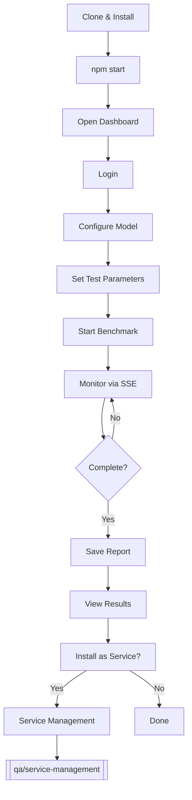

# Getting Started

Quick start guide for setting up Betty, the llama.cpp benchmark tool.

## Prerequisites

- **Node.js** 18+ and npm
- **CUDA Toolkit** 12.6+ (for GPU acceleration)
- **NVIDIA GPU** (recommended: RTX 3090 or better)
- **Git**
- **cmake** and build tools (`build-essential`)
- **Linux** (systemd features require Linux)

## Installation

```bash
# Clone the repository
git clone https://github.com/your-org/betty.git
cd betty

# Install dependencies and build
npm start
```

The `npm start` script runs the full setup:

1. Installs Node.js dependencies
2. Builds the SvelteKit frontend
3. Starts the API server on port `3456`

## First Run

After starting, open the dashboard:

```
http://localhost:3456
```

On first launch, Betty:

- Creates `~/.betty/` for config storage
- Initializes the database (MySQL → SQLite → JSON fallback)
- Generates a JWT secret for authentication
- Creates a default `admin` user (password from `ADMIN_PASSWORD` env var, defaults to `admin`)

### Authentication

```bash
# Login to get a JWT token
curl -X POST http://localhost:3456/api/auth/login \
  -H "Content-Type: application/json" \
  -d '{"username":"admin","password":"admin"}'

# Response:
# {"success":true,"data":{"token":"eyJ...","user":{"id":1,"username":"admin","role":"admin"}}}
```

Use the token in subsequent requests:

```bash
export TOKEN="eyJ..."
curl -H "Authorization: Bearer $TOKEN" http://localhost:3456/api/configs
```

## Configure Your Model

Set the model path in the config. Models are stored in `~/.betty/models/`:

```bash
# Get current config
curl -H "Authorization: Bearer $TOKEN" http://localhost:3456/api/configs

# Update the model path (PUT replaces entire config)
curl -X PUT http://localhost:3456/api/configs \
  -H "Authorization: Bearer $TOKEN" \
  -H "Content-Type: application/json" \
  -d '{
    "model": "your-model.gguf",
    "llama_port": 11434,
    "llama_host": "localhost",
    "test_params": {
      "context_length": 32768,
      "context_length_multiplier": 2,
      "context_length_max": 262144,
      "batch_size": 128,
      "batch_size_step": 128,
      "batch_size_max": 16384,
      "u_batch_size": 64,
      "u_batch_size_step": 64,
      "u_batch_size_max": 4096,
      "cache_ram": 4096,
      "cache_ram_step": 1024,
      "cache_ram_max": 4096,
      "gpu_layer_offload": 999,
      "gpu_layer_offload_step": 0,
      "gpu_layer_off_max": 999
    }
  }'
```

See [[qa/model-management]] for downloading models from HuggingFace.

## Start Your First Benchmark

```bash
# Start benchmark
curl -X POST http://localhost:3456/api/run \
  -H "Authorization: Bearer $TOKEN" \
  -H "Content-Type: application/json" \
  -d '{}'

# Check status
curl -H "Authorization: Bearer $TOKEN" http://localhost:3456/api/status

# Monitor via SSE
curl -H "Authorization: Bearer $TOKEN" http://localhost:3456/api/stream
```

The benchmark:

1. **Builds** llama.cpp (clones repo if needed)
2. **Tests** each parameter combination
3. Sends results via SSE to connected clients

See [[qa/benchmark-workflow]] for the full workflow.

## Verify Results

After the benchmark completes:

```bash
# Get latest results
curl -H "Authorization: Bearer $TOKEN" http://localhost:3456/api/results

# Save results as a report
curl -X POST http://localhost:3456/api/save-report \
  -H "Authorization: Bearer $TOKEN" \
  -H "Content-Type: application/json" \
  -d '{"name":"my-first-benchmark"}'

# List all reports
curl -H "Authorization: Bearer $TOKEN" http://localhost:3456/api/reports
```

See [[qa/report-workflow]] for managing reports.

## Setup Flow



## Next Steps

- [[qa/benchmark-workflow]] — Full benchmark lifecycle
- [[qa/model-management]] — Download and manage models
- [[qa/profile-workflow]] — Save and load configurations
- [[qa/report-workflow]] — Save, view, and export reports
- [[qa/service-management]] — Deploy as a systemd service
- [[qa/api-usage]] — Complete API reference with curl examples
