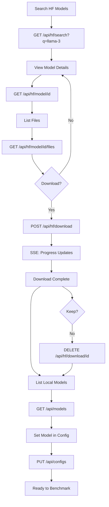

# Model Management

Search, download, and manage GGUF models for benchmarking.

## Local Models

Models are stored in `~/.betty/models/`. Betty scans this directory recursively for `.gguf`, `.bin`, and `.safetensors` files.

### List Local Models

```bash
# Get models directory path
curl -H "Authorization: Bearer $TOKEN" \
  http://localhost:3456/api/models-dir

# Response: {"success":true,"data":"/home/user/.betty/models"}

# List all model files
curl -H "Authorization: Bearer $TOKEN" \
  http://localhost:3456/api/models

# Response:
# {
#   "success": true,
#   "data": [
#     {"path": "llama-3-8b.Q4_K_M.gguf", "size": 4938956288, "mtime": 1719000000000},
#     {"path": "subdir/mixtral-8x7b.Q5_K_M.gguf", "size": 12000000000, "mtime": 1719100000000}
#   ]
# }

# List models in a specific directory
curl -H "Authorization: Bearer $TOKEN" \
  "http://localhost:3456/api/models?directory=/custom/path"
```

### Delete a Local Model

```bash
curl -X DELETE http://localhost:3456/api/model/llama-3-8b.Q4_K_M.gguf \
  -H "Authorization: Bearer $TOKEN"

# Response: {"success":true,"message":"Deleted llama-3-8b.Q4_K_M.gguf"}
```

Path is relative to `~/.betty/models/`. Use URL encoding for paths with special characters.

## HuggingFace Integration

Betty proxies HuggingFace API calls, so you don't need to manage HF tokens separately.

### Search Models

```bash
# Search for models
curl -H "Authorization: Bearer $TOKEN" \
  "http://localhost:3456/api/hf/search?q=llama-3&limit=10&sort=downloads&direction=-1"

# Search with filter (e.g., GGUF format)
curl -H "Authorization: Bearer $TOKEN" \
  "http://localhost:3456/api/hf/search?q=llama-3&limit=20&filter=gguf"

# Response:
# {
#   "success": true,
#   "data": [
#     {
#       "id": "bartowski/Llama-3-8B-Instruct-GGUF",
#       "downloads": 500000,
#       "tags": ["gguf", "llama"],
#       "pipeline_tag": "text-generation"
#     },
#     ...
#   ]
# }
```

### Get Model Details

```bash
curl -H "Authorization: Bearer $TOKEN" \
  "http://localhost:3456/api/hf/model/bartowski/Llama-3-8B-Instruct-GGUF"

# Response includes: id, tags, pipeline_tag, safetensors info, etc.
```

### List Model Files

```bash
curl -H "Authorization: Bearer $TOKEN" \
  "http://localhost:3456/api/hf/model/bartowski/Llama-3-8B-Instruct-GGUF/files"

# Response:
# {
#   "success": true,
#   "data": [
#     {"type": "file", "oid": "...", "size": 4938956288, "path": "Llama-3-8B-Instruct-Q4_K_M.gguf"},
#     {"type": "file", "oid": "...", "size": 5500000000, "path": "Llama-3-8B-Instruct-Q5_K_M.gguf"}
#   ]
# }
```

### Download a Model

Downloads use SSE for progress streaming:

```bash
# Download (auto-selects first .gguf file)
curl -N http://localhost:3456/api/hf/download \
  -H "Authorization: Bearer $TOKEN" \
  -H "Content-Type: application/json" \
  -d '{"modelId":"bartowski/Llama-3-8B-Instruct-GGUF"}'

# Download specific file
curl -N http://localhost:3456/api/hf/download \
  -H "Authorization: Bearer $TOKEN" \
  -H "Content-Type: application/json" \
  -d '{"modelId":"bartowski/Llama-3-8B-Instruct-GGUF","filename":"Llama-3-8B-Instruct-Q4_K_M.gguf"}'

# SSE events:
# event: hf-download
# data: PROGRESS:15:740884531
#
# event: hf-download
# data: PROGRESS:30:1481769062
#
# event: hf-download
# data: STATUS:Download complete
#
# event: hf-download
# data: FILE:/home/user/.betty/models/bartowski_Llama-3-8B-Instruct-GGUF/Llama-3-8B-Instruct-Q4_K_M.gguf
```

### Check Download Progress

```bash
curl -H "Authorization: Bearer $TOKEN" \
  "http://localhost:3456/api/hf/download/bartowski_Llama-3-8B-Instruct-GGUF"

# Response:
# {
#   "success": true,
#   "data": {
#     "status": "downloading",
#     "progress": 45,
#     "total": 4938956288,
#     "downloaded": 2222530329,
#     "filename": "Llama-3-8B-Instruct-Q4_K_M.gguf",
#     "filePath": "/home/user/.betty/models/..."
#   }
# }
```

### List Active Downloads

```bash
curl -H "Authorization: Bearer $TOKEN" \
  http://localhost:3456/api/hf/active-downloads

# Response:
# {"success":true,"data":[{"modelId":"...","status":"downloading","progress":45,...}]}
```

### Cancel a Download

```bash
curl -X DELETE "http://localhost:3456/api/hf/download/active/bartowski_Llama-3-8B-Instruct-GGUF" \
  -H "Authorization: Bearer $TOKEN"

# Response: {"success":true,"message":"Cancelled download for bartowski_Llama-3-8B-Instruct-GGUF"}
```

### List Downloaded Models

```bash
curl -H "Authorization: Bearer $TOKEN" \
  http://localhost:3456/api/hf/downloads

# Response:
# {
#   "success": true,
#   "data": [
#     {
#       "modelId": "bartowski_Llama-3-8B-Instruct-GGUF",
#       "files": [
#         {"name": "Llama-3-8B-Instruct-Q4_K_M.gguf", "size": 4938956288, "modified": "2024-..."}
#       ]
#     }
#   ]
# }
```

### Delete a Downloaded Model

```bash
curl -X DELETE "http://localhost:3456/api/hf/download/bartowski_Llama-3-8B-Instruct-GGUF" \
  -H "Authorization: Bearer $TOKEN"

# Response: {"success":true,"message":"Deleted bartowski_Llama-3-8B-Instruct-GGUF"}
```

## Setting the Active Model

After downloading, set the model in your config:

```bash
# Get current config
curl -H "Authorization: Bearer $TOKEN" \
  http://localhost:3456/api/configs > config.json

# Edit config.json: set "model" to the filename (relative to ~/.betty/models/)
# Then save:
curl -X PUT http://localhost:3456/api/configs \
  -H "Authorization: Bearer $TOKEN" \
  -H "Content-Type: application/json" \
  -d @config.json
```

## Model Management Flow



## Related Pages

- [[qa/getting-started]] — Initial setup
- [[qa/benchmark-workflow]] — Run benchmarks with your model
- [[qa/profile-workflow]] — Save model config as a profile
- [[qa/api-usage]] — Full API reference
