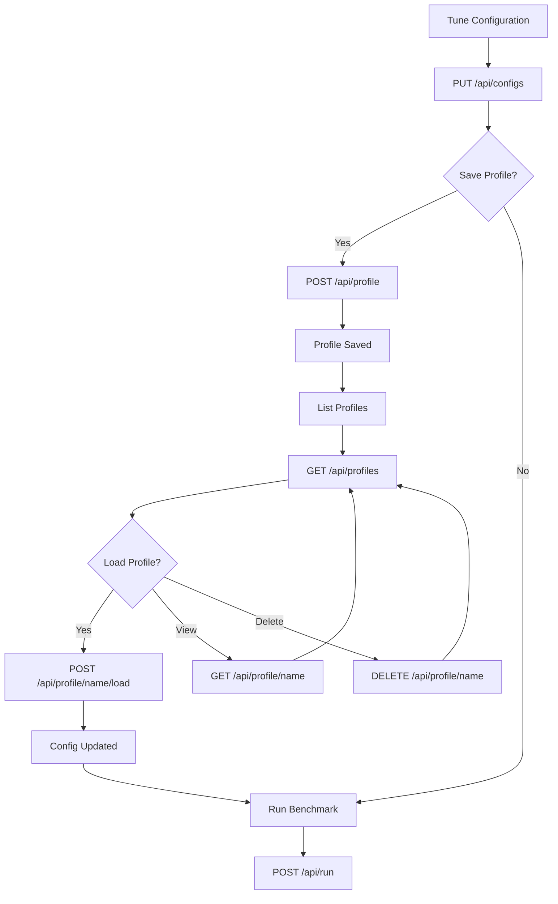

# Profile Workflow

Save, load, and manage benchmark configuration profiles for quick reuse.

## What Are Profiles?

A profile is a snapshot of your entire benchmark configuration. Save a profile when you've tuned settings for a specific model or use case, then load it later without reconfiguring manually.

Profiles are stored in the database (SQLite/MySQL) with JSON fallback to `~/.betty/profiles/`.

## Save a Profile

Save the current config as a named profile:

```bash
# Get current config
curl -H "Authorization: Bearer $TOKEN" \
  http://localhost:3456/api/configs > current-config.json

# Save as profile
curl -X POST http://localhost:3456/api/profile \
  -H "Authorization: Bearer $TOKEN" \
  -H "Content-Type: application/json" \
  -d '{
    "name": "llama-3-8b-aggressive",
    "data": {
      "model": "llama-3-8b.Q4_K_M.gguf",
      "llama_port": 11434,
      "test_params": {
        "context_length": 32768,
        "context_length_multiplier": 2,
        "context_length_max": 262144,
        "batch_size": 128,
        "batch_size_step": 128,
        "batch_size_max": 16384,
        "u_batch_size": 64,
        "u_batch_size_step": 64,
        "u_batch_size_max": 4096,
        "cache_ram": 4096,
        "cache_ram_step": 1024,
        "cache_ram_max": 4096,
        "gpu_layer_offload": 999,
        "gpu_layer_offload_step": 0,
        "gpu_layer_off_max": 999
      },
      "model_configs": {
        "temp": 0.6,
        "top_p": 0.95,
        "min_p": 0,
        "top_k": 20
      }
    }
  }'

# Response: {"success":true,"message":"Profile saved"}
```

Tip: pipe the current config directly:

```bash
curl -s -H "Authorization: Bearer $TOKEN" \
  http://localhost:3456/api/configs | \
  jq -r '.data' | \
  jq -n --argjson data "$(cat)" --arg name "my-profile" \
    '{"name":$name,"data":$data}' | \
  curl -X POST http://localhost:3456/api/profile \
    -H "Authorization: Bearer $TOKEN" \
    -H "Content-Type: application/json" \
    -d @-
```

## List Profiles

```bash
curl -H "Authorization: Bearer $TOKEN" \
  http://localhost:3456/api/profiles

# Response:
# {
#   "success": true,
#   "data": [
#     {"name": "llama-3-8b-aggressive", "filename": "llama-3-8b-aggressive.json", "created": "2024-...", "modified": "2024-..."},
#     {"name": "llama-3-8b-conservative", "filename": "llama-3-8b-conservative.json", "created": "2024-...", "modified": "2024-..."},
#     {"name": "mixtral-8x7b-default", "filename": "mixtral-8x7b-default.json", "created": "2024-...", "modified": "2024-..."}
#   ]
# }
```

## Get a Profile

```bash
curl -H "Authorization: Bearer $TOKEN" \
  http://localhost:3456/api/profile/llama-3-8b-aggressive

# Response:
# {
#   "success": true,
#   "data": {
#     "model": "llama-3-8b.Q4_K_M.gguf",
#     "llama_port": 11434,
#     "test_params": {...},
#     "model_configs": {...},
#     ...
#   }
# }
```

## Load a Profile

Loading a profile writes its config to the active configuration, replacing the current settings:

```bash
curl -X POST http://localhost:3456/api/profile/llama-3-8b-aggressive/load \
  -H "Authorization: Bearer $TOKEN"

# Response:
# {
#   "success": true,
#   "message": "Profile \"llama-3-8b-aggressive\" loaded",
#   "data": { ... full config ... }
# }
```

After loading, verify:

```bash
curl -H "Authorization: Bearer $TOKEN" \
  http://localhost:3456/api/configs
```

## Delete a Profile

```bash
curl -X DELETE http://localhost:3456/api/profile/llama-3-8b-conservative \
  -H "Authorization: Bearer $TOKEN"

# Response: {"success":true,"message":"Profile deleted"}
```

## Common Workflow

```bash
# 1. Tune your config for a model
curl -X PUT http://localhost:3456/api/configs \
  -H "Authorization: Bearer $TOKEN" \
  -H "Content-Type: application/json" \
  -d @tuned-config.json

# 2. Save as a profile
curl -s -H "Authorization: Bearer $TOKEN" \
  http://localhost:3456/api/configs | \
  jq -r '.data' | \
  jq -n --argjson data "$(cat)" \
    '{"name":"my-tuned-config","data":$data}' | \
  curl -X POST http://localhost:3456/api/profile \
    -H "Authorization: Bearer $TOKEN" \
    -H "Content-Type: application/json" \
    -d @-

# 3. Switch to a different model — load its profile
curl -X POST http://localhost:3456/api/profile/mixtral-profile/load \
  -H "Authorization: Bearer $TOKEN"

# 4. Run benchmark with the loaded config
curl -X POST http://localhost:3456/api/run \
  -H "Authorization: Bearer $TOKEN" \
  -H "Content-Type: application/json" \
  -d '{}'
```

## Profile Workflow Diagram



## Related Pages

- [[qa/getting-started]] — Initial setup
- [[qa/benchmark-workflow]] — Run benchmarks
- [[qa/model-management]] — Download and manage models
- [[qa/api-usage]] — Full API reference
